# Chesnavich Model

## Introduction 

For a long time it was believed that dissociation of molecules can only
happen in two ways. Firstly, the original molecule can dissociate into
smaller molecules and this is sometimes referred to as dissociation via
the molecular channel. In order to dissociate, the system has to pass
over a potential barrier representing the energy needed to break
existing bonds and form new ones. Quantitative results on dissociation
rates (or reaction rates in general) can be obtained via transition
state theory. Alternatively an individual atom, called free radical, can
escape from a molecule without forming new bonds and thus without
passing over a potential barrier . This is sometimes
referred to as dissociation via the radical channel. Dissociation via
both channels is well understood.

Recently, however, van Zee et al.  reported having
experimentally observed dissociation of formaldehyde (H$_2$CO) with CO
in low rotational levels at an energy where dissociation through the
molecular channel should have rather resulted in high rotational states
of CO. The two proposed explanations for this behaviour are that either
at least one of the vibrational modes of the transition state is quite
anharmonic or there have to be two distinct molecular channels.

Townsend et al.  discovered in their study of
formaldehyde (H$_2$CO) a new form of dissociation that appears not to be
associated with the molecular or the radical channel. In the process, an
H atom separates from the molecule following the radical channel, but
instead of dissociating it spends a considerable amount of time near the
molecule and eventually abstracting the remaining H atom from the
molecule to form H$_2$. This type of dissociation is called *roaming*
due to the nature of behaviour of the escaping H atom. No potential
barrier or dynamical transition state is known to be involved in
roaming.

The discovery of roaming stimulated extensive studies of formaldehyde
photodissociation and roaming has since been accepted as the cause for
the phenomenon observed by van Zee et al. .

Bowman and Shelper  have studied the dynamics of H$_2$CO
and CH$_3$CHO to find evidence that roaming is more connected to the
radical rather than the molecular channel. At the same time, roaming was
observed at energies below the radical threshold.

In recent years dynamical systems theory has made an impact in chemistry
by providing the means to understand the classical phase space
structures that underlie reaction type dynamics
. This concerns the phase
space geometry that governs transport across a saddle equilibrium point
referred to as the molecular channel above. These ideas make precise the
notion of a *transition state* which forms the basis of computing
reaction rates from *Transition State Theory* which can be considered to
be the most important approach to compute reaction rates in chemistry
.

It is shown that surfaces of constant energy contain for energies above
the saddle an invariant manifold with the topology of a sphere. This
sphere is unstable. More precisely it is a normally hyperbolic invariant
manifold (NHIM) which is of codimension 2 in the energy surface. The
NHIM can be identified with the transition state: it forms an unstable
invariant subsystem located between reactants and products. What is
crucial for the computation of reaction rates is that the NHIM is
spanned by the hemispheres of another higher dimensional sphere which is
of codimension 1 in the energy surface and which is referred to as a
*dividing surface*. It divides the energy surface into a reactants
region and a products region in such a way that trajectories extending
from reactants to products have exactly one intersection with one of the
hemispheres and trajectories extending from products to reactants have
exactly one intersection with the other hemisphere. The construction of
such a *recrossing-free* dividing surface is crucial for Transition
State Theory where reaction rates are computed from the flux through a
dividing surface which is computationally much cheaper than sampling
trajectories.

For the global dynamics, the NHIM is significant because of its stable
and unstable manifolds. The latter have the topology of spherical
cylinders or 'tubes' which are of codimension 1 in the energy surface
and hence have sufficient dimensionality to act as separatrices. In fact
the stable and unstable manifolds separate the reactive trajectories
from the non-reactive ones. The geometry of the stable and unstable
manifolds and their location and intersections in the reactants and
products regions carry the full information about the transition process
including, e.g., state specific reactivity .
In the case of two degrees of freedom the NHIM is the Lyapunov periodic
orbit associated with the saddle equilibrium point and the approach
reduces the *periodic orbit dividing surface* (PODS) introduced earlier
by Pechukas and Pollak and others
.

Explaining the roaming phenomenon poses a new challenge to dynamical
systems theory. The first attempts to use methods from dynamical systems
theory related to ones underlying transition state theory to explain
roaming can be found in the work of Mauguière et al.  in
which they identified the region of the classical phase space where
roaming occurs with the aid of numerous invariant phase space structures
for Chesnavich's CH$_4^+$ dissociation model . They
also introduced a classification of trajectories present in the system
and matched them with the experimentally observed behaviour. The
definition of roaming was formulated using the number of turning points
in the radial direction in the roaming region. In light of a gap time
analysis of Mauguière et al. in , the definition was
refined by means of the number of crossings of a dividing surface
constructed in the roaming region. This refined definition is the best
dynamical description of roaming to date.

In , Mauguière et al. studied the model of formaldehyde
to find unstable periodic orbits in the roaming region. The homoclinic
tangle of one such orbit was shown to be responsible for transport
between two potential wells in a process that is closely linked to
roaming. The periodic orbit involved do not arise as the Lyapunov
periodic orbits associated with a saddle equilibrium points and the
situation is hence different from the usual setting of transition state
theory built on a potential saddle. Yet a recrossing free dividing
surface can be constructed from such a periodic orbit. Such dividing
surfaces may be other than spherical. It was shown in  and
 that a spherical dividing surface near an index-$1$
critical point may bifurcate into a torus. In  a toric
dividing surface was constructed near an index-$2$ critical point.

The authors of  found that the local geometry of the
energy surface in an O$_3$ model may be toric and constructed a toric
dividing surface using two unstable periodic orbits.

Even more recently, Huston et al.  report that they have
found a correlation between the distribution of internal energies of CO
and H$_2$ with the molecular channel and roaming. Particularly at lower
energies, roaming trajectories have significantly more energy in H$_2$.
With increasing energy the differences decrease. Their definition of
roaming is slightly different though, it involves rotation of H$_2$
around CO at a 'slowly varying and elongated distance'. The precise
definition involves technical conditions on H$_2$ vibrational energy,
time spent at a certain minimal distance from CO with low kinetic energy
and large H-H bond length.

Because there is no single generally accepted definition of roaming,
there is a clear need for a deeper understanding of the mechanisms
behind dissociations.

In this work we present a detailed study of dissociation in the CH$_4^+$
model by . We discuss all types of dynamics present in this model and explain their connection to the underlying phase space
geometry and invariant structures. We construct various surfaces of
section and from the dynamics on these surfaces we deduce the role of
invariant manifolds in slow dissociation and ultimately show a certain
structure of heteroclinic tangles that causes roaming.

From the point of view of transition state theory we address two
interesting problems. Firstly, it is not very well understood what
happens in case reactants and products are divided by multiple
transition states in series, which is a problem we address in this work.
Secondly, we study the role of the local energy surface geometry in
interactions of multiple transition states.

In the study we employ surfaces of section, all of which satisfy the
Birkhoff condition  of being bounded by invariant
manifolds. Using the surfaces of section we can observe dynamical
behaviour such as roaming, but to understand the role of the local
energy surface geometry and its implications to roaming, we generalise
the Conley-McGehee representation
 and study the dynamics on the
energy surface in full $3$ dimensions.

The chapter is organized as follows. In
Sec. [sec:2](#sec:setup) we
introduce the Chesnavich's CH$_4^+$ model. In
Sec. (#sec:dynamics)
we discuss various periodic orbits and their role in setting up the
problem of transport of phase space volumes between different phase
space regions. In Sec. [sec:3](#sec:observations) we study the dynamics of the Chesnavich
model by looking at trajectories from various perspectives. This section
is followed by relating the dynamics to roaming in
Sec. [sec:4](#sec:discussion). The invariant manifolds that govern the
dynamics and in particular roaming are discussed from a global
perspective in Sec. (#sec:representation). Conclusions are given in
Sec. (#sec:conclusions)

# Development of the Problem: Chesnavich's CH$_4^+$ dissociation model 

Like  and , we use the model for the
$\text{CH}_4^+ \rightarrow \text{CH}_3^+ + \text{H}$ dissociation
introduced by Chesnavich . The system is a
$2$-degree-of-freedom "phenomenological model" that is intended for the
study of multiple transition states. In this model, only one H atom is
free and the CH$_3^+$ molecule is considered to be a rigid complex.

It is a planar system and we study it in a centre of mass frame in polar
coordinates $(r,\theta_1, \theta_2, p_r , p_1, p_2)$, where $r$ is the
distance of the free H atom to the centre of mass (magnitude of the
Jacobi vector), $\theta_1$ is the angle between a fixed axis through the
centre of mass and the Jacobi vector between CH$_3^+$ and H, and
$\theta_2$ is the angle representing the orientation of CH$_3^+$ with
respect to the fixed axis.

In these coordinates the kinetic energy has the form

$$T = \frac{1}{2 m} \left( p_r^2 + \frac{1}{r^2} p_2^2 \right) + \frac{1}{2 I} p_1^2,$$

where $m$ is the reduced mass of the system, and $I$ is the moment of
inertia of the rigid body CH$_3^+$. The system has a rotational $SO(2)$
symmetry, which can be reduced giving a family of systems parametrised
by the (conserved) angular momentum.

This reduction can be obtained from the following canonical
transformation:

$$\theta_1 = \theta + \psi, \quad \theta_2 = \psi, \quad p_1 = p_\theta, \quad p_2 = p_\psi - p_\theta.$$

Then $p_\psi = p_1 + p_2=:\lambda$ is the total angular momentum and it
is conserved. It follows that 

$$\begin{aligned}
  H(r,\theta,p_r, p_\theta;\lambda) &= \frac{1}{2 m} p_r^2 + \frac{1}{2 I} p_\theta^2  + \frac{1}{2 m r^2} (p_\theta - \lambda)^2  + U(r,\theta) \\
  &= \frac{1}{2 m} p_r^2 + \frac{1}{2} \left(\frac{1}{I} + \frac{1}{m r^2} \right) p_\theta^2  - \frac{\lambda}{m r^2} p_\theta + \frac{\lambda^2}{2 m r^2} + U(r,\theta),
  \end{aligned}$$ 
  
where $U(r,\theta)$ is the potential energy from
 that we will discuss later in Section [subsec:1](#subsec:ch4potential). In the last expression the term
$\frac{\lambda}{m r^2} p_\theta$ gives rise to a Coriolis force in the
equations of motion.

As explained by , systems exhibiting roaming have a
potential well for a small radius, representing the stable molecule, and
with increasing distance between the dissociated components converges
monotonously to a certain base energy, which we can assume to be $0$.
This is unlike the traditional bimolecular reactions that involve flux
over a potential saddle. As shown in , under certain
conditions the potential $U$ admits two unstable periodic orbits that
are not associated with any potential which, however, form the
transition state to dissociation. We will find these orbits and use them
to construct a toric dividing surface from them.

The argument for the existence of the periodic orbits is as follows. The
dependence of the potential $U(r,\theta)$ on $\theta$ is due to the
interaction between the anisotropic rigid molecule and the free atom.
When $r$ is sufficiently large, the potential $U(r,\theta)$ is
essentially independent of $\theta$. This is because for sufficiently
large distances, the orientation of the CH$_3^+$ molecule does
essentially not influence the interaction with the free atom. Let us
therefore assume for a moment that $r$ is sufficiently large, so that
$U$ is rotationally symmetric and we can drop $\theta$ in the argument
of $U$. The system reduced by the rotational symmetry then has the
effective potential

$$V_{red}(r;\lambda)=\frac{(p_\theta-\lambda)^2}{2 m r^2} + U(r),$$

where $p_\theta$ becomes a constant of motion. The reduced system admits
a relative equilibrium, provided $U(r)$ is monotonous, $U(r)<0$ and
$U\in o(r^{-2})$ as $r\rightarrow\infty$. Potentials of most chemical
reactions, including
$\text{CH}_4^+ \rightarrow \text{CH}_3^+ + \text{H}$, meet this
condition. The relative equilibrium is given by $r=r_{p_\theta}$,
$p_r=0$, where $r_{p_\theta}$ is the solution of

$$\dot {p}_r = -\frac{\partial H}{\partial r} = \frac{1}{m r^3} (p_\theta - \lambda )^2 - \frac{\mathrm{d} U}{\mathrm{d} r} = 0.$$

For the class of potentials $U= -c r^{-(2+\epsilon)}$ with
$c,\epsilon>0$, the relative equilibrium is unstable (Fig. [fig:1](#fig:centrifugalTS) ). This follows from the reduced
$1$-degree-of-freedom Hamiltonian having a saddle at this equilibrium as
can be seen from computing the Hessian matrix which is diagonal with the
elements 

$$\frac{\partial^2 H}{\partial p_r^2}=\frac{1}{m},$$ 

and

$$\begin{gathered}
   \frac{\partial^2 H}{\partial r^2}=\frac{3}{m r^4} (p_\theta - \lambda )^2 + \frac{\mathrm{d^2} U}{\mathrm{d} r^2} = \frac{3}{r} \frac{\mathrm{d} U}{\mathrm{d} r}+ \frac{\mathrm{d^2} U}{\mathrm{d} r^2}
   \\=c\frac{3(2+\epsilon)}{r^{4+\epsilon}}-c\frac{(3+\epsilon)(2+\epsilon)}{r^{4+\epsilon}}=-c\frac{\epsilon(2+\epsilon)}{r^{4+\epsilon}}.
  \end{gathered}$$

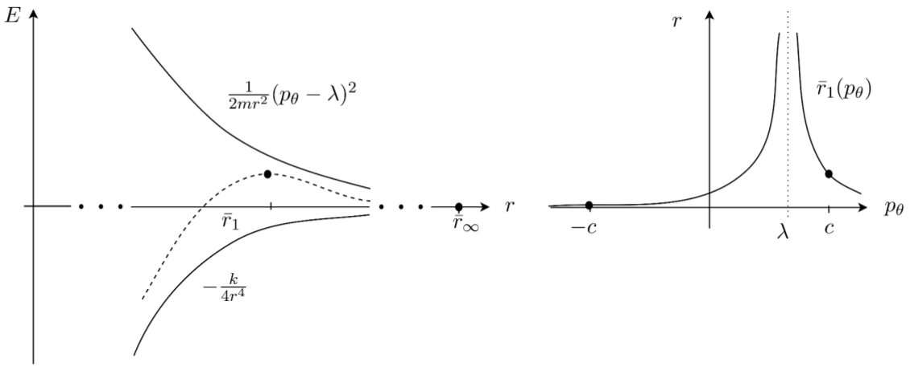

<figcaption style="text-align:center;font-size:14px"><b>fig:1 </b><em>Schematic representation of the dominant long range potential and the "centrifugal term" over $r$ (left), and of $r_1$ over $p_\theta$ (right)</em></figcaption>
 

In the full system, the relative equilibrium is manifested as the
unstable periodic orbits $r=r_{p_\theta}$, $p_r=0$ and $p^\pm_\theta$
such that $(p^+_\theta - \lambda )^2=(p^-_\theta - \lambda )^2$.
Following general results on the persistence of normally hyperbolic
invariant manifolds , these periodic orbit persist if the
rotational symmetry is broken, provided the perturbation is not too big.
Note that according to our assumptions these periodic orbits are not
associated with a local maximum of $U$.

The condition $U\in o(r^{-2})$ as $r\rightarrow\infty$ is reminiscent of
the assumption made by the authors of . However, they
consider a growth restriction near the origin, namely that for all
$\theta$

$$\left(\frac{\lambda^2}{2 m r^2} + U(r,\theta)\right)\in o(r^{-2}) \quad \text{as}\quad r\rightarrow0,$$

and additionally require $\left(\frac{\lambda^2}{2 m r^2}  + U(r,\theta)\right)$ to have at most
one maximum for each $\theta$. We do not impose restrictions on $U$ near $r=0$ and admit several maxima.

### Potential energy 

The potential as suggested by Chesnavich  is the sum

$$U(r,\theta ) = U_{CH} (r) + U_{*} (r,\theta),$$

where $U_{CH}$ is a
radial long range potential and $U_{*}$ a short range "hindered rotor"
potential that represents the anisotropy of the rigid molecule CH$_3^+$
(, ).

The long range potential is defined by

$$U_{CH} (r) =  \frac{D_e}{c_1 - 6} \left( 2 (3-c_2) e^{c_1 (1-x)}  - \left( 4 c_2 - c_1 c_2 + c_1 \right) x^{-6} - (c_1 - 6) c_2 x^{-4} \right),$$

where $x = \frac{r}{r_e}$. The constants $D_e=47$ kcal/mol and $r_e=1.1$
Å represent the C-H dissociation energy and equilibrium bond length
respectively. $c_1=7.37$ and $c_2=1.61$ result in a harmonic oscillator
limit with stretching frequency $3000$ cm$^{-1}$. A graph of $U_{CH}$,
using Chesnavich's choice of coefficients, can be found in Figure
[fig:2](#fig:ChesnavichCH4pR) . As expected for long range
interactions, it is meant to dominate the potential for large values of
$r$ and not be subject to the orientation of CH$_3^+$. Therefore
$U_{CH}$ is independent of the angle and its leading term for large $r$
is $r^{-4}$. Since $U_{CH}$ also dominates the short range potential in
the neighbourhood of $r=0$, Chesnavich suggest a cut-off at $r=0.9$. The
cut-off is not near the region of interest in our study of roaming, nor
does it have any significant implications.

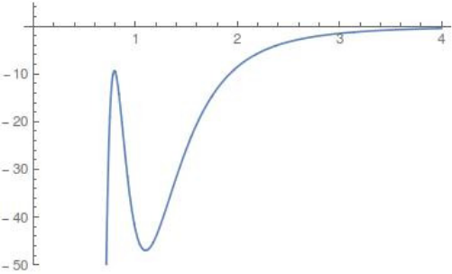
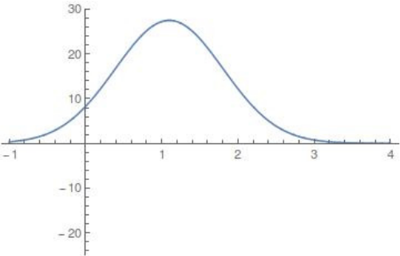

<figcaption style="text-align:center;font-size:14px"><b>fig:2 </b><em>Top: Graph of $U_{CH}$ versus $r$. Bottom: Graph of $U_{0}$ with $a = 1$ versus $r$.</em></figcaption>
 

The short range potential has the form

$$U_{*} (r,\theta) = \frac{U_0(r)}{2} (1 - \cos 2 \theta ),$$

where

$$U_0(r) = U_e e^{-a(r-r_e)^2},$$

is the rotor barrier, which is a
smoothly decreasing function of the distance $r$, and $U_e=55$ kcal/mol
is the barrier height, see Figure
[fig:2](#fig:ChesnavichCH4pR) . The constant $a$ influences the value
of $r$ at which the transition from vibration to rotation occurs. The
transition is referred to as *early* if it occurs at small $r$ and as
*late* otherwise. For comparison, see the late transition for $a=1$,
which we will be using, and the early transition for $a=5$ in Figure
[fig:3](#fig:potentialcontour1) . Note the different proportions of
the potential well (dark blue) with respect to the high potential
islands along the vertical axis.

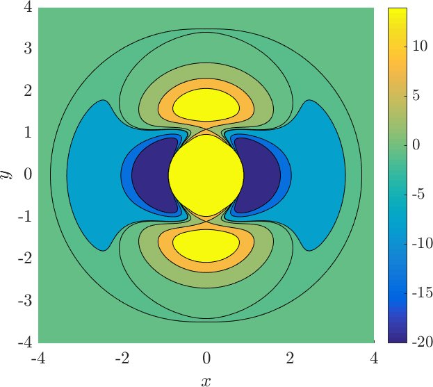
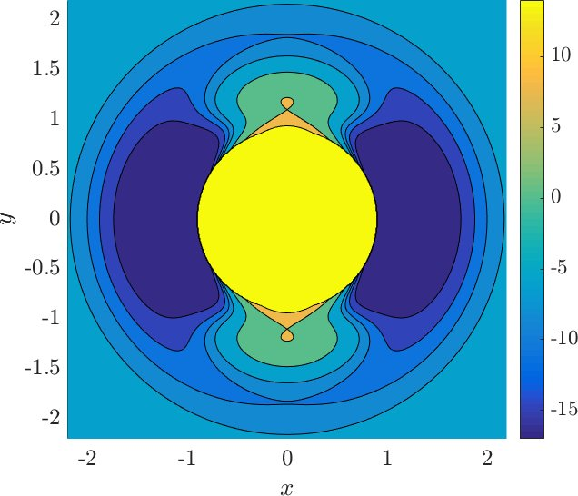

<figcaption style="text-align:center;font-size:14px"><b>fig:3 </b><em>Top: Contour plots of potential for $a = 1$, corresponding to a late transition. Bottom: Contour plots of potential for $a = 5$, corresponding to an early transition.</em></figcaption>
 

Note that the angular dependence $(1 - \cos 2\theta)$ in $U_{*}$ is
$\pi$-periodic and even. These properties induce a reflection symmetry
of $U$ with respect to the $x$ and $y$ axes, because

$$U(r,\theta)=U(r,-\theta),$$

corresponds to the reflection about the
$x$ axis and 

$$U(r,\theta)=U(r,-\theta+\pi),$$ 

corresponds to the
reflection about the $y$ axis.

We follow  and set $a = 1$ for a slow transition from
vibration to rotation. In what follows we also assume $\lambda=0$,
unless stated otherwise. This section introduces features of the
potential relevant to finding periodic orbits, defining dividing
surfaces and formulating roaming in terms of transport between regions
on the energy surface.

## Revealing Phase Space Structures

### Energy levels and Hill regions 

Here we give details about the features of the potential relevant to the
dynamics of the system. Being the most basic characteristic of the
potential, we look at critical points of the potential that give
valuable information about local dynamics and at level sets that tell us
about the accessible area in configuration space.

Due to the reflection symmetry of the potential about the $x$ and $y$
axes introduced above, critical points always come in pairs. We will
denote them by $q_i^\pm$, where $i$ indicates the index of the critical
point and the superscript $+$ stands for the upper half plane
$\theta\in[0,\pi)$, while $-$ stands for the lower. Here we present a
list of critical points:

-   $q_0^\pm$ - two wells at $(r,\theta)=(1.1, 0)$ and $(1.1, \pi)$ with
    $U(q_0^\pm)=E_0\approx -47$,

-   $q_1^\pm$ - two index-$1$ saddles at $(3.45, \frac{\pi}{2})$ and
    $(3.45, \frac{3\pi}{2})$ with $U(q_1^\pm)=E_1\approx -0.63$,

-   $\widetilde{q}_1^\pm$ - two index-$1$ saddles at
    $(1.1, \frac{\pi}{2})$ and $(1.1, \frac{3\pi}{2})$ with
    $U(\widetilde q_1^\pm)=\widetilde{E}_1\approx 8$,

-   $q_2^\pm$ - two index-$2$ saddles at $(1.63, \frac{\pi}{2})$ and
    $(1.63, \frac{3\pi}{2})$ with $U(q_2^\pm)=E_2\approx 22.27$.

The potential wells correspond to the two isomers of CH$_4^+$ with the
free H atom close to the CH$_3^+$ molecule. All index-$1$ saddles are
involved in isomerisation and the two index-$2$ saddles provide us with
interesting geometries of the accessible regions in configuration space.
For zero angular momentum ($\lambda = 0$), the critical phase space
points of $H$ are given by $z_i^\pm = ( q_i^\pm, 0)$ and
$\widetilde{z}_1^\pm = (\widetilde{q}_1^\pm, 0)$.

The critical energies are ordered as

$$E_0 < E_1 < 0 < \widetilde{E}_1 < E_2,$$

and all critical points can
be found in the contour plot in Figure
[fig:3](#fig:potentialcontour1) .

For a given fixed energy $E$, we are interested in the accessible region
in the configuration space which, following the celestial mechanics
literature, we refer to as Hill region , and the geometry of
the energy surface. Since the system as defined in Section (#subsec:system) is
a natural mechanical system $H=T+U$ and the kinetic energy $T$ is always
non-negative, the Hill region consists of all $(r,\theta)$ such that
$U(r,\theta) \leq E$ and is bounded by the equipotential
$U(r,\theta) = E$.

To see what the Hill regions look like, we note that the two wells
$q_0^\pm$ give rise to two topological discs that connect into an
annulus at $E=E_1$ via $q_1^\pm$. With $E\rightarrow0$ the annulus
widens until at $E=0$ it loses compactness and covers the whole plane
except for a disc near the origin. This cut-out disc decomposes at
$E=\widetilde{E}_1$ into three, two areas of high potential around
$q_2^\pm$ and the cut-off of the potential at $r=0.9$ mentioned earlier.
Above $E=E_2$ only the cut-off at $r=0.9$ remains inaccessible.
Topologically this is equivalent to the case with the energy
$0<E<\widetilde{E}_1$.

Hill regions are shown for various energies in Figure
[fig:3](#fig:potentialcontour1) . For comparison, we also include Hill
regions for the case $a=5$ in Figure
[fig:3](#fig:potentialcontour1) , where the transition from vibration
to rotation occurs earlier. Although energy levels remain topologically
equivalent, note the larger potential well and the smaller energy
interval where the boundary of Hill region consists of three circles.

### Periodic orbits 

Next we study the invariant structures that can be found in the system
at various energies. Critical points $z_i^\pm$ described in Section [subsec:2](#subsec:hill) are
the most basic invariant structures at energies $E_i$. In the following
we discuss (non-degenerate) periodic orbits on the $3$-dimensional
energy surface. They create a backbone for the understanding the
dynamical behaviour of our system.

Similarly to critical points, periodic orbits also come in pairs because
of the symmetry of the potential. The periodic orbits are then related
by the discrete rotational symmetry

$$(r,\theta,p_r,p_\theta) \mapsto(r,\theta+\pi,p_r,p_\theta),$$

or the
discrete reflection symmetry

$$(r,\theta,p_r,p_\theta) \mapsto(r,-\theta,p_r,-p_\theta).$$ 

In
contrast to critical points, non-degenerate periodic orbits persist in
energy intervals forming one-parameter families. As periodic orbits
evolve with varying energy, they occasionally bifurcate with other
families of periodic orbits.

Based on the knowledge of Hill regions we gained in Section [subsec:2](#subsec:hill), we
can formulate some expectations about periodic orbits in this system.
For $E\leq E_1$, the system does not admit rotating periodic orbits,
orbits that are periodic in $\theta$ and along which always $p_\theta>0$
or $p_\theta<0$. Rotating orbits project onto the configuration space as
circles with the origin contained in their interior. Instead in the
interval $E_0<E\leq E_1$ we can only expect vibrating, oscillator like,
periodic orbits. Of special interest are periodic orbits that project
onto a line with both ends on an equipotential. In the celestial
mechanics literature these orbits are referred to as periodic *brake
orbits* (the name is due to Ruiz ).

Here we present a list of the important families of periodic orbits
together with a brief description of their evolution. Configuration
space projections of the periodic orbits at $E=2$ are shown in
Fig. [fig:4](#fig:po2) .

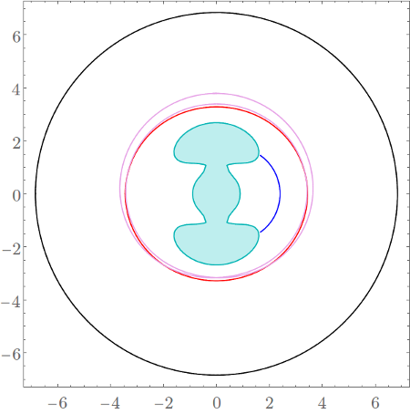

<figcaption style="text-align:center;font-size:14px"><b>fig:4 </b><em>Configuration space projections of $\Gamma^i_\pm$ (blue), $\Gamma^o_\pm$ (black), $\Gamma^a_\pm$ (red) and one orbit of the family $\Gamma^b$ (magenta) at energy $E=2$.</em></figcaption>
 

-   $\Gamma^i$: The family of periodic orbits $\Gamma^i$ is born in a
    saddle-centre bifurcation at energy $E = -.29$. Until a host of
    bifurcations above $E=20$, $\Gamma^i$ consists of hyperbolic brake
    orbits. Around $E=21.47$ the orbits become inverse hyperbolic and at
    $E = 22.27$ they become heteroclinic to $z_2^\pm$ and undergo a
    Morse bifurcation, similar to those described in . At
    higher energies, $\Gamma^i$ consists of rotating orbits that undergo
    further bifurcations. The periodic orbits are by some authors
    referred to as inner or tight periodic orbits. We denote the
    individual orbits by $\Gamma^i_+$ and $\Gamma^i_-$. For
    $E \leq 22.27$ $\Gamma^i_\pm$ is the brake orbit in the potential
    well associated with $z^\pm_0$ and for $E > 22.27$ the subscript
    $\pm$ corresponds to the sign of $p_\theta$ along the rotating
    periodic orbit.

-   $\Gamma^o$: This family of unstable periodic orbits originates at
    $r=\infty$ at $E=0$. With increasing energy the orbits monotonously
    decrease in radius and remain unstable until a bifurcation with
    $\Gamma^a$ and $\Gamma^b$ at $E=6.13$, where $\Gamma^a$ and
    $\Gamma^b$ are described below. These periodic orbits are sometimes
    called outer or orbiting periodic orbits, because these are the
    periodic orbits with the largest radius at the energies where they
    exist. We denote the individual orbits with $p_\theta>0$ and
    $p_\theta<0$ by $\Gamma^o_+$ and $\Gamma^o_-$ respectively.

-   $\Gamma^a$: These periodic orbits are created in a saddle-centre
    bifurcation at $E=-.0602$ as stable, turn unstable at $E=-.009$ and
    remain unstable until a period doubling bifurcation at $2.72$. The
    family disappears in the aforementioned bifurcation with $\Gamma^o$
    and $\Gamma^b$. At all energies, the configuration space projection
    of $\Gamma^a$ is located between those of $\Gamma^i$ and $\Gamma^o$
    and we will refer to the orbits as the middle periodic orbits. We
    denote the individual orbits with $p_\theta>0$ and $p_\theta<0$ by
    $\Gamma^a_+$ and $\Gamma^a_-$ respectively.

-   $\Gamma^b$: The product of a saddle-centre bifurcation at $E=-.0023$
    that quickly becomes inverse hyperbolic. Around $E=2.37$ the orbits
    become elliptic and undergo a reverse period doubling at $E=2.4025$.
    Note that the energetic gap between these two bifurcations is so
    small that they are almost indistinguishable in Figure
    [fig:5](#fig:bifurcationS) . After that $\Gamma^b$ remains stable
    until it collides with $\Gamma^a$ and $\Gamma^o$. For $E<2.4025$ the
    family consists of four periodic orbits with twice the period
    compared to all the previously mentioned ones. The orbits related by
    discrete symmetries mentioned above.

$\Gamma^i$ is important because its orbits lie in the potential well and
have the largest radial coordinate $r$ of all periodic orbits in the
well. $\Gamma^o$ are the outermost periodic orbits and trajectories with
a larger radial coordinate $r$ and $p_r>0$ go to infinity in forward
time, i.e. $r\rightarrow\infty$ as $t\rightarrow\infty$. As mentioned
above, the configuration space projections of $\Gamma^a$ lie between
$\Gamma^i$ and $\Gamma^o$. In fact there are no other periodic orbits
with single period ($2\pi$-periodic in $\theta$) in this region of
configuration space. We use orbits of the family $\Gamma^a$ in Section [subsec:5](#subsec:divide_energy_surface) to define dividing surfaces
and divide phase space into regions. $\Gamma^b$ is needed for a complete
description of the evolution of $\Gamma^o$ and $\Gamma^a$ and its
bifurcations may hint at qualitative changes of structures formed by
invariant manifolds.

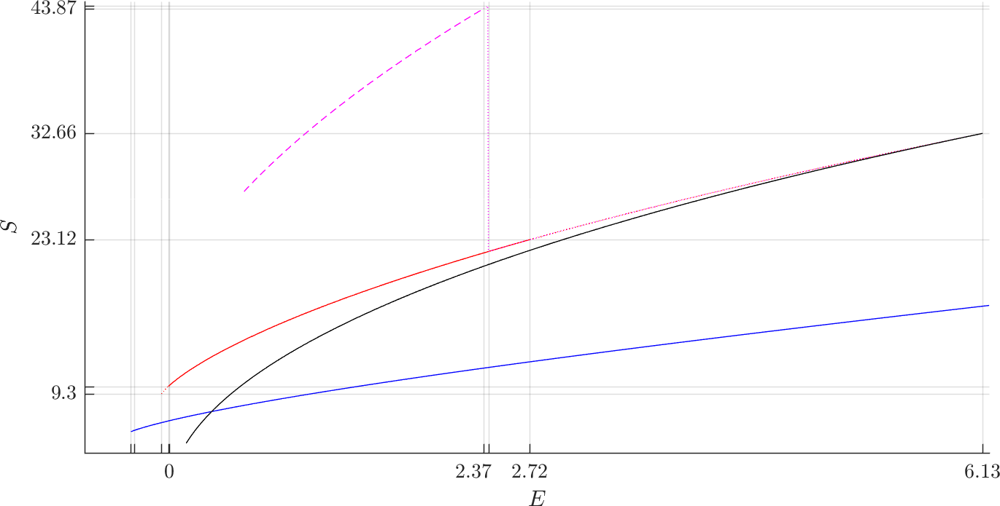

<figcaption style="text-align:center;font-size:14px"><b>fig:5 </b><em>Energy-action ($E,S$) bifurcation diagrams showing $\Gamma^i_\pm$ (blue), $\Gamma^o_\pm$ (black), $\Gamma^a_\pm$ (red) and orbits of the family $\Gamma^b$ (magenta) in the energy-action ($E,S$) plane.</em></figcaption>
 

There are various other periodic orbits, most notably ones corresponding
to stable vibrations of the bound CH$_4^+$ molecule, Lyapunov orbits
associated with $z_1^\pm$ and $\widetilde {z}_1^\pm$ that play a role in
isomerisation and periodic orbits involved in various bifurcations with
the orbits mentioned above. All of these will not play a role in our
further considerations.

With non-zero angular momentum, periodic orbits of a family remain
related by the discrete rotational symmetry, but not by the discrete
reflection symmetry and some other properties are different too. The
inner periodic orbits are no longer brake orbits for $\lambda\neq 0$ and
their projections onto configuration space are topological circles
instead of lines. Similarly rotating orbits of the same family do not
have the same configuration space projection and bifurcate at different
energies. With increasing $|\lambda|$ the differences become more
pronounced.

In Figure [fig:5](#fig:bifurcationS)  we present the evolution of the orbits in
above-mentioned families in the energy-action ($E,S$) plane. We will
explain in Section [subsec:4](#subsec:DS) why flux through a dividing surface associated
with a vibrating periodic orbit is equal to its action, while for
rotating periodic orbits it is equal to twice its action.

Figure [fig:6](#fig:bifurcationR)  shows the evolution of the Greene residue
of orbits in the families. The Greene residue, due to J. M. Greene
 is a quantity characterizing the stability of the orbits. It
is derived from the monodromy matrix, a matrix that describes the
behaviour of solutions in the neighbourhood of a periodic orbit.

<figcaption style="text-align:center;font-size:14px"><b>fig:6 </b><em>Bifurcation diagrams showing $\Gamma^i_\pm$ (blue), $\Gamma^o_\pm$ (black), $\Gamma^a_\pm$ (red) and orbits of the family $\Gamma^b$ (magenta) in the energy-residue ($E,R$) plane.</em></figcaption>
 

The monodromy matrix and the Greene residue are defined as follows. For
a periodic orbit $\Gamma$ with the parametrisation $\gamma(t)$ and
period $T$, let $M(t)$ be the matrix satisfying the variational equation

$$\dot{M}(t)=JD^2 H(\gamma(t))M(t),$$ 

where $J=\begin{pmatrix} 0 & Id\\ -Id & 0\end{pmatrix}$, with the initial
condition

$$M(0)=Id.$$

The monodromy matrix is defined by $M=M(T)$. It
describes how an initial deviation $\delta$ from $\gamma(0)$ changes
after a full period $T$. For $\delta$ sufficiently small the
relationship is

$$\Phi_H^T(\gamma(0)+\delta)=\gamma(T)+M\delta+O(\delta^2),$$

where $\Phi_H^t$ is the Hamiltonian flow.

If $\delta$ is an initial displacement along the periodic orbit
$\delta\parallel J\nabla H$, then by periodicity $\delta$ is preserved
after a full period $T$, i.e. $M\delta=\delta$. A similar argument holds
for an initial displacement perpendicular to the energy surface
$\delta\parallel \nabla H$. Consequently, two of the eigenvalues of $M$
are $\lambda_1=\lambda_2=1$. More details including a reduction of $M$
can be found in .

As the variational equation satisfied by $M(t)$ is Hamiltonian, the
preservation of phase space volume following Liouville's theorem implies
that the determinant $\det M(t)=\det M(0)=1$ for all $t$. Therefore for
the two remaining eigenvalues we have $\lambda_3\lambda_4=1$ and we can
write them as $\lambda$ and $\frac{1}{\lambda}$. $\Gamma$ is hyperbolic
if $\lambda>1$, it is elliptic if $|\lambda|=1$ and it is inverse
hyperbolic if $\lambda<-1$.

The Greene residue of $\Gamma$ is defined as 

$$R=\frac{1}{4}(4-Tr M),$$

where $M$ is the monodromy matrix corresponding to the periodic orbit
$\Gamma$.

Knowing that $\lambda_1=\lambda_2=1$, we can write $R$ as

$$R=\frac{1}{4}\left(2-\lambda-\frac{1}{\lambda}\right).$$ 

By definition
$R<0$ if $\Gamma$ is hyperbolic, $0<R<1$ if it is elliptic and $R>1$ if
it is inverse hyperbolic.

## Implications for Reaction Dynamics 

In this section we discuss dividing surfaces associated with transition
states, the backbone of Transition State Theory. Following
 we define transition states more formally as
follows.

A transition state for a Hamiltonian system is a closed, invariant,
oriented, codimension-$2$ submanifold of the energy surface that can be
spanned by two surfaces of unidirectional flux, whose union divides the
energy surface into two components and has no local recrossings.

The name transition state is due to the fact it is a structure found
between areas of qualitatively different types of motion, a transition
between two types of motion so to say. One can imagine the transition
between types of motion corresponding to physical states like reactants
and products or the transition between rotation and vibration.

In a system with $2$ degrees of freedom, a TS consists of unstable
periodic orbit. Generally a TS is a codimension-$2$ normally hyperbolic
invariant manifold, a manifold on the energy surface invariant under the
Hamiltonian flow, such that instabilities transversal to it dominate the
instabilities tangential to it (, ).

In general, a dividing surface (DS) is a surface that divides the energy
surface into two disjoint components. By a DS associated with a TS we
mean a union of the two surfaces of unidirectional flux that is
constructed as follows.

For a fixed energy $E$, let $(r_\Gamma,\theta_\Gamma)$ be the projection
of the periodic orbit $\Gamma$ onto configuration space, then the DS is
the surface $(r_\Gamma,\theta_\Gamma,p_r,p_\theta)$, where
$(p_r,p_\theta)$ are given implicitly by the energy equation

$$E= \frac{1}{2 m} p_r^2 + \frac{1}{2 I} p_\theta^2  + \frac{1}{2 m r^2} (p_\theta - \lambda)^2+U(r,\theta).$$

This construction also works for stable periodic orbits, but the
resulting DS admits local recrossings. In the following a DS associated
with a TS is always the surface constructed this way.

We will refer to the DSs associated with $\Gamma^i$, $\Gamma^o$ and
$\Gamma^a$ as inner, outer and middle, respectively. For our
investigation, we do not need to distinguish between the DSs associated
to $\Gamma^i_+$ and $\Gamma^i_-$, therefore we always refer to the
former unless explicitly stated otherwise. We are mainly interested in
the influence of local energy surface geometry on the geometry of DSs
and in the dynamics on DSs under the corresponding return map.

The geometry of the DSs is due to the form of the kinetic energy and the
local geometry of the energy surface. It is well known that a DS
associated to a brake periodic orbit is a sphere and the brake periodic
orbit is an equator of this sphere, . The equator divides
the sphere into hemispheres, whereby the flux through the two
hemispheres is equal in size and opposite in direction. Trajectories
passing this sphere from reactants to products intersect one hemisphere
and the other hemisphere is crossed on the way from products to
reactants. The flux through a hemisphere is then by Stokes' theorem
equal to the action of the periodic orbit .

Rotating periodic orbits, on the other hand, such as $\Gamma^o$, give
rise to a DS that is a torus. The two orbits of the same family with
opposite orientation are circles on the torus and divide it into two
annuli with properties identical to the hemispheres. Using Stokes'
theorem we find that the flux across each annulus is given by the sum of
the actions of the two orbits, or simply twice the action of a single
orbit .

Should it be necessary to distinguish the hemispheres or annuli of a DS
by the direction of flux, the outward hemisphere or annulus is the one
intersected by the prototypical dissociating trajectory defined by
$\theta=0$, $p_r>0$, $p_\theta=0$ and/or $\theta=\pi$, $p_r>0$,
$p_\theta=0$. The inward hemisphere or annulus is then intersected by
$\theta=0$, $p_r<0$, $p_\theta=0$ and/or $\theta=\pi$, $p_r<0$,
$p_\theta=0$

### Division of energy surface 

Using the inner and outer DSs we can define regions on the energy
surface and formulate roaming as a transport problem.

The area bounded by the surface $r=0.9$ and the two inner DSs represents
the two isomers of CH$_4^+$. We denote the two regions by $B_1^+$ and
$B_1^-$. The unbounded region beyond the outer DS, denoted $B_3$,
represents the dissociated molecule.

It is therefore in the interaction region between the inner and the
outer DS, denoted $B_2$, where the transition between CH$_4^+$ and
CH$_3^++$H occurs. When in $B_2$, the H atom is no longer in the
proximity of CH$_3^+$, but still bound to the CH$_3^+$ core. This is the
region, where the system exhibits roaming. Contained in $B_2$ are
$\Gamma^a$ and various other periodic orbits that may play a role in
roaming.

Dissociation can in this context be formulated as a problem of transport
of energy surface volume from $B_1$ to $B_3$. Such volume contains
trajectories that originate in the potential well, pass through the
interaction region and never return after crossing the outer DS. Since
each trajectory passing from $B_1$ to $B_2$ crosses the inner DS and
leaves $B_2$ by crossing the outer DS, we may restrict the problem to
the interaction region. Because roaming is a particular form of
dissociation, it too has to be subject to transport from the inner DS to
the outer DS.

It is well known that transport to and from a neighbourhood of a
unstable periodic orbits is governed by its stable and unstable
invariant manifolds. The problem can be reformulated accordingly. This
means, of course, by studying the structure of heteroclinic
intersections of stable and unstable invariant manifolds of $\Gamma^i$
and $\Gamma^o$, as well as with $\Gamma^a$ that, as we will soon see,
sits inside the homoclinic tangle of $\Gamma^o$.

We will denote the invariant manifolds of $\Gamma^i_+$ by
$W_{\Gamma^i_+}$. We will further use a superscript $s$ and $u$ to label
the stable and unstable invariant manifolds and add an extra superscript
$-$ and $+$ for the branches that leave the neighbourhood of
$\Gamma^i_+$ to the CH$_4^+$ side ($r$ smaller) or to the CH$_3^++$H
side ($r$ larger), respectively. $W_{\Gamma^i_+}^{u+}$ therefore denotes
the unstable branch of the invariant manifolds of $\Gamma^i_+$ that
leaves the neighbourhood of $\Gamma^i_+$ to the CH$_3^++$H side.
Invariant manifolds of other TSs will be denoted analogously.

We remark that we may use TST to consider the evolution of periodic
orbits in the energy-action plane shown in Figure
[fig:5](#fig:bifurcationS) in the context of transport of energy
surface volume from $B_1$ to $B_3$. Recall for Section
[subsec:4](#subsec:DS) that the
flux across the outer and middle DSs is twice the action of $\Gamma^o_+$
and $\Gamma^a_+$ respectively. The combined flux through both inner DSs
is twice the action of $\Gamma^i_+$. We see that for $E\leq.32$, the
outer DS has the lowest flux, while for higher energies it is the inner
DS.

### Residence times and rotation numbers 

Before we proceed to the discussion of how invariant manifolds cause
slow dissociations, let us describe some numerical observations of how
the system behaves in certain phase space regions. The observations will
later be explained using invariant manifolds. In the following, we offer
insight into the amount of time needed to dissociate, the locations
where dissociation is fast or slow and how these properties change with
increasing energy. We use this knowledge to establish a link between
invariant manifolds and slow dissociation on which we further elaborate
in Section [sec:4](#sec:discussion) in the context of roaming.

For various energies $0<E<6.13$ where $\Gamma^o$ exists, we investigate
trajectories starting in $B_1^+$, $B_2$ and $B_3$ on the surface
$\theta=0, p_\theta>0$. We study how long it takes trajectories to reach
a terminal condition representing the dissociated state.

In Section [subsec:5](#subsec:divide_energy_surface) we said that we consider the
molecule dissociated as soon as the system enters $B_3$. Naturally, then
the terminal condition should be that trajectories reach the outer DS.
However using the outer DS raises uncertainty of whether a faster
dissociation is a dynamical property or a result of the changing
position of $\Gamma^o_\pm$ with energy. To prevent this uncertainty, we
use a fixed terminal condition. Since for $E\rightarrow0$, the radius of
$\Gamma^o_\pm$ diverges, no fixed terminal condition can represent the
dissociated state for all energies. We decided to define the terminal
condition by $r=15$ that works well for $E\geq0.4$ at the cost of losing
the energy interval $E<0.4$.

In the following we consider residence times and rotation numbers, i.e.
time and change in angle needed for trajectories starting on
$\theta=0, p_\theta>0$ to reach the surface $r=15$ in $B_3$.

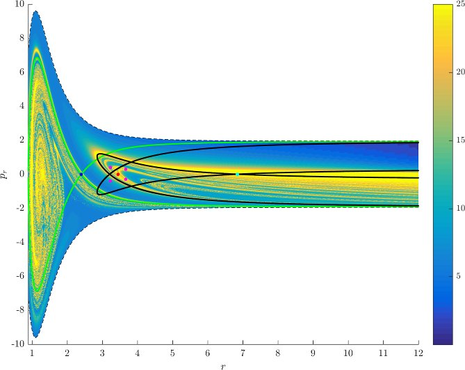
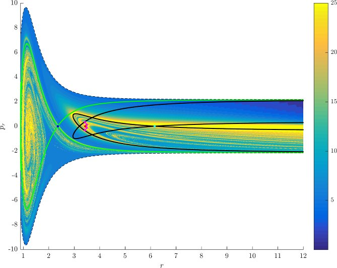

<figcaption style="text-align:center;font-size:14px"><b>fig:7 </b><em>From top to bottom the plots show residence times on the surface of section $\theta=0$, $p_\theta>0$ for energies $E=1,2,2.5,5$. The dots correspond to the periodic orbits $\Gamma^i_+$ (blue), $\Gamma^a_+$ (red), orbits of the family $\Gamma^b$ (magenta) and $\Gamma^o_+$ (cyan). Invariant manifolds of $\Gamma^i_+$ (green) and $\Gamma^o_+$ (black) are also included.</em></figcaption>
 

Figure [fig:7](#fig:rot) shows rotation numbers for selected energies, with marked periodic
orbits and invariant manifolds. As expected, initial conditions with
$p_r>0$ large are the fastest ones to escape. The slowest ones are
located near the periodic orbits and near $p_r=0$ ($p_\theta$ large).

For $E\leq 2.5$, almost all initial conditions in $B_1^+$ were slow to
escape. For higher energies, most of the slow dissociation occurs around
$\Gamma^a_+$ and $\Gamma^o_+$, the slowly dissociating trajectories have
a negative initial $p_r$ very close to zero. This observation is easily
explained by noting that configuration space projections of these
trajectories are almost circular and spend most of the time in the
region where the potential is very flat and almost independent of
$\theta$, thus $\dot {p}_\theta\approx0$.

Chaotic structures that can be seen in $B_1^+$ are the result of lengthy
escape from a potential well. The only known structure responsible for
fractal-like patterns and one closely linked to chaotic dynamics are
invariant manifolds, in this case $W_{\Gamma^i_+}$. Note that at $E=5$,
it seems that $W_{\Gamma^o_+}$ slows the dynamics down considerably more
than $W_{\Gamma^i_+}$.

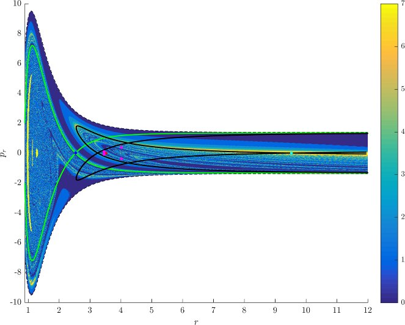
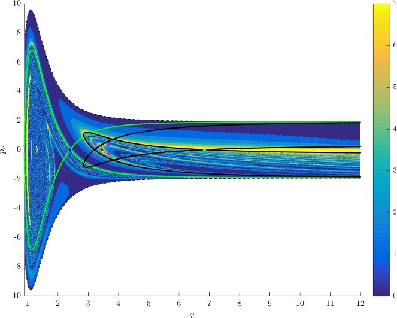

<figcaption style="text-align:center;font-size:14px"><b>fig:8 </b><em>From top to bottom the plots show rotation numbers on the surface of section $\theta=0$, $p_\theta>0$ for energies $E=1,2,2.5,5$. The dots correspond to the periodic orbits $\Gamma^i_+$ (blue), $\Gamma^a_+$ (red), orbits of the family $\Gamma^b$ (magenta) and $\Gamma^o_+$ (cyan). Invariant manifolds of $\Gamma^i_+$ (green) and $\Gamma^o_+$ (black) are also included</em></figcaption>
 

Rotation numbers, i.e. number of completed full rotations upon
dissociation, closely match residence times suggesting that slowly
dissociating trajectories are ones that rotate in $B_2$ and $B_3$ for a
long time. More pronounced, due to the discrete nature of the number of
rotations, are structures inside $B_1^+$, just below $p_r=0$ and in the
neighbourhood of $\Gamma^o_+$ and $W_{\Gamma^o_+}$.

Note in Figure [fig:8](#fig:rot_num) that the fractal like structures recede with
increasing energy and by $E=5$ most of them lie either in $B_1^+$, near
$p_r=0$ as mentioned above and in the proximity of the homoclinic tangle
of $\Gamma^o_+$. The homoclinic tangle seems to tend to a homoclinic
loop as it disappears for $E \rightarrow 6.13$. It is also worth noting
that fast and simple dissociation, i.e. low residence time and low
rotation number, is not only becoming more dominant, but also speeding
up, see Figures [fig:7](#fig:rot) and [fig:8](#fig:rot_num) . Due to the increase in kinetic energy in the
angular degree of freedom, the dissociating trajectories are naturally
not becoming more direct with increasing energy.

#### Residence times on the inner DS 

Similarly to the surface $\theta=0, p_\theta>0$, we can study residence
times and rotation numbers for trajectories starting on a DS. In Section [subsec:5](#subsec:divide_energy_surface) we formulated our problem as a
transport problem from the inner to the outer DS. According to Section [subsec:4](#subsec:DS),
trajectories enter $B_1^+$ through one hemisphere of the inner DS and
leave through the other. Naturally we are interested in the latter
hemisphere.

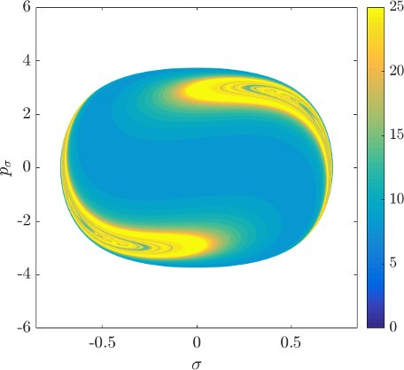

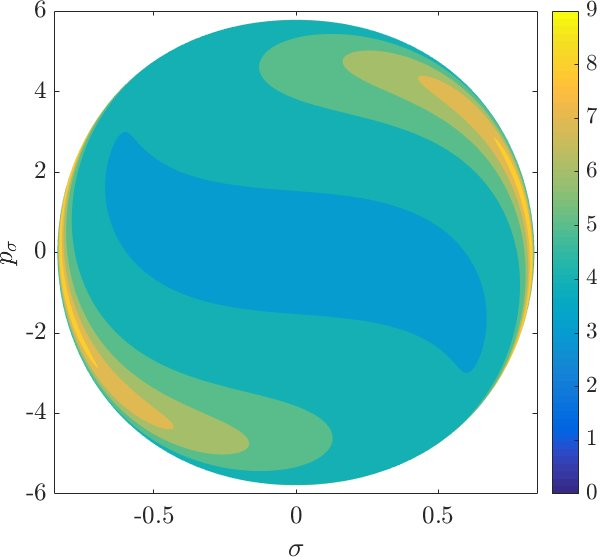

<figcaption style="text-align:center;font-size:14px"><b>fig:9 </b><em>Residence times for initial conditions on the inner DS with outward direction for energies $E=1,2,2.5,5$. Note that the scale for $E=5$ is different, because $9$ is an upper bound for the residence time for initial conditions on the inner DS.</em></figcaption>
 

Although it is not absolutely indispensable for qualitative purposes, we
prefer to work on the DS in canonical coordinates. Due to the
preservation of the canonical $2$-form by the Hamiltonian flow, if we
use canonical coordinates, the map from one surface of section to
another is area preserving. Consequently areas of initial conditions on
the inner DS corresponding slow or fast dissociation can be directly
compared to the areas on the surface of section $\theta=0$,
$p_\theta>0$.

Canonical coordinates are obtained by defining a new radial variable
$\rho(r,\theta)=r-\bar{r}(\theta)$ that is constant along $\Gamma^i_+$,
where the curve $\bar{r}(\theta)$ is the approximation of the
configuration space projection of $\Gamma^i_+$, similarly to
. Due to the symmetry of the system, $\Gamma^i_+$ can be
very well approximated by a quadratic polynomial for every energy. Next
we use the generating function (type 2 in )

$$G(r,\theta,p_\rho,p_\sigma)=(r-\bar{r}(\theta))p_\rho+\theta p_\sigma.$$

From that we obtain 

$$\begin{aligned}
  p_r=\frac{\partial G}{\partial r}&=&p_\rho,\\
  p_\theta=\frac{\partial G}{\partial \theta}&=&p_\sigma-\bar{r}'(\theta) p_\rho,\\
  \end{aligned}$$ 
  
and therefore
$p_\sigma=p_\theta+\bar{r}'(\theta) p_\rho$. The surface of section is
now defined by $\rho=0$, $\dot{\rho}>0$, i.e. the outward hemisphere of
the inner DS corresponding to transport in the direction from $B_1^+$ to
$B_2$.

Figure [fig:9](#fig:disI_rot) shows the distribution of residence times for
initial conditions on the inner DS. We can see that slow dissociation is
specific to two areas of the surface of section. Initial conditions on
the rest of the surface leave $B_2$ quickly. Information from the two
surfaces of section suggests that $W_{\Gamma^o_+}$, and eventually
$W_{\Gamma^a_+}$, intersect the inner DS in the area with long
dissociation times. The areas of slow dissociation are the most
pronounced for low energies, at $E=2.5$ they almost disappear. At $E=5$
we see no sign of slow dissociation, the longest residence time found at
the current resolution ($6000\times6000$ initial conditions) was below
$9$. This suggests that the structure responsible for roaming disappears
at an energy below $2.5$. Note that even the slowest dissociation at
$E=5$ takes as long as the fastest ones at $E=1$ or $E=2$.

In summary we can say that the system exhibits various types of
dissociation ranging from fast and direct, where the H atom escapes
almost radially, to slow that involves H revolving a multitude of times
around CH$_3^+$. Long dissociations seem to occur in fractal-like
structures that are caused by invariant manifolds, proof of which will
be given in Section [subsec:7](#subsec:sec_manifs).

### Reactive Islands 

Let us now have a closer look at manifolds on the two surfaces of
section presented above and establish a link between invariant
structures and slow dissociation. In Section (#subsec:resth0)
we already noted that the homoclinic tangle of $\Gamma^i_+$ is
responsible for a fractal structure of slow dissociation of initial
conditions in $B_1^+$. Furthermore the homoclinic tangle of $\Gamma^o_+$
(and $\Gamma^o_-$) is responsible for slow dissociation in the
interaction region $B_2$, especially at the top half of the energy
interval.

It is important to say that the section $\theta=const$, $p_\theta>0$ is
not very well suited for the study of invariant manifolds. This is
mainly due to the transition from vibration to rotation. The invariant
manifolds $W_{\Gamma^i_+}$ may be nicely visible, but during this
transition the invariant manifolds are not barriers to transport of
surface area on this surface of section. Because parts $W_{\Gamma^i_+}$
rotate with $p_\theta<0$ after the transition, they do not return to the
surface of section. For the same reason there are trajectories that do
not return to the surface of section. The return map associated with
this surface of section is therefore not area preserving. This anomaly
can be seen from odd shapes of invariant manifolds - heteroclinic points
seem to be mapped to infinity.

Apart from the transition of $W_{\Gamma^i_+}$ from vibration to
rotation, invariant manifolds may enter $B_1^\pm$ and be captured
therein for a significant amount of time. Upon leaving $B_1^\pm$ the
direction of rotation is unpredictable and this is true for invariant
manifolds of all TSs. That is all we can say about the section
$\theta=const$, $p_\theta>0$.

The section on the inner DS, just as all other DSs, does not suffer from
these problems, because they do not depend on the direction of rotation.
Moreover, these surfaces are almost everywhere transversal to the flow.

In Figure [fig:10](#fig:sec_disI) we present the intersection of
$W_{\Gamma^o_+}$ with the inner DS at $E=1$ and $E=2$. Since slow
dissociation fades away at higher energies, we do not present the
section at higher energies. In fact, for $E\geq 2.5$ the manifolds
$W_{\Gamma^o_+}$ do not intersect the inner DS and therefore
$W_{\Gamma^i_+}$ and $W_{\Gamma^o_+}$ do not intersect at all. Clearly
then, slow dissociation, and thereby roaming, is induced by the
heteroclinic tangle of $W_{\Gamma^i_+}$ and $W_{\Gamma^o_+}$. This claim
is further supported by what we see in Figures [fig:9](#fig:disI_rot) and [fig:10](#fig:sec_disI) .

When we compare Figures [fig:9](#fig:disI_rot) and [fig:10](#fig:sec_disI) , we clearly see that longer residence times
are prevalent in the same locations where $W_{\Gamma^o_+}^{s-}$
intersects the inner DS. At $E=1$ we can even recognize the structure of
the of the intersection in both figures. As the manifolds
$W_{\Gamma^o_+}^{s-}$ recede with increasing energy, the area of slow
dissociation at $E=2.5$ remains as a relic of the intersection.
Afterall, trajectories close to $W_{\Gamma^o_+}^{s-}$ follow the
manifold and approach $\Gamma^o_+$ before dissociation is completed.

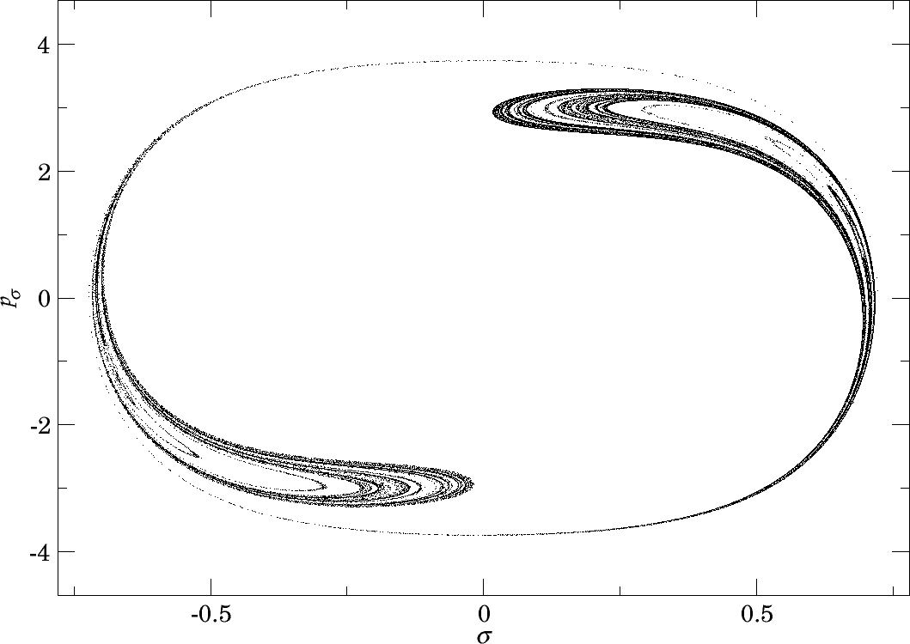

<figcaption style="text-align:center;font-size:14px"><b>fig:10 </b><em>$W_{\Gamma^o_+}^{s-}$ invariant manifolds on the inner DS for $E=1$ (Top) and $E=2$ (Bottom). For energies $E\geq 2.5$ the manifolds $W_{\Gamma^o_+}^{-}$ don't reach the inner DS.</em></figcaption>
 

Note that there was no word of $W_{\Gamma^o_+}^{u-}$. This is mainly due
to the fact that it influences the residence time in backward time,
hence cannot be seen in forward time. Furthermore, $W_{\Gamma^o_+}^{u-}$
first intersects the other hemisphere of the inner DS, spends
considerable time in $B_1^+$ and becomes heavily distorted before
intersecting the outward hemisphere of the inner DS. In backward time,
however, we expect a result symmetric to the one presented here due to
time reversibility of the system.

What really prevents us from making more fundamental conclusions at this
point is the fact that $W_{\Gamma^o_+}^{s-}$ is heavily distorted when
it reaches the inner DS. The reason is very simple - heteroclinic
points. Here we not only mean trajectories on $W_{\Gamma^o_+}^{s-}$ that
tend toward $\Gamma^i_+$, but also to $\Gamma^a_+$. Due to this fact, it
is impossible to tell which area is enclosed by $W_{\Gamma^o_+}^{s-}$
and which is outside of it. For the majority of the area we note that
$\sigma=0$, $p_\rho>0$, $p_\sigma=0$ (equivalent to $\theta=0$, $p_r>0$,
$p_\theta=0$), the prototype of a fast dissociation, must lie inside
$W_{\Gamma^o_+}^{s-}$ to quickly reach the outer DS. The tongues of
$W_{\Gamma^o_+}^{s-}$ visible in Figure
[fig:10](#fig:sec_disI) therefore mostly contain trajectories that do
not dissociate immediately.

This problem is present on both the inner and outer DSs. Sections on
both suffer from the fractal structure that is so characteristic for
homoclinic and heteroclinic tangles. The ideal choice seems to be
$\Gamma^a_+$ because $W_{\Gamma^i_+}^{+}$ and $W_{\Gamma^o_+}^{-}$ reach
the middle DS very quickly. The first image of the manifolds under the
Poincaré map associated with this surface does not display heteroclinic
orbits, all manifolds are mapped to (topological) circles.

Heteroclinic points become visible after applying the return map at
least once, the resulting tongues wind around the previously mentioned
circles. On the downside, $\Gamma^a_+$ is only hyperbolic until $2.72$,
therefore for higher energies the middle DS allows local recrossings. It
can be still used as a surface of section and we can expect to see fewer
heteroclinic points that cause tongues, but we need to keep local
recrossings in mind. In the next section we present a detailed view on
the dynamics on the middle DS.

### Roaming 

In this section we recall possible definitions of roaming used in
previous works. We then elaborate on the observations above and analyse
invariant manifolds on the middle DS with the aim to thoroughly explain
how exactly roaming is linked to the heteroclinic tangles. Based on the
explanation, a natural definition of roaming follows.

Roaming in the chemistry literature refers to a kind of dissociation
that is longer or more complicated than the usual dissociation with a
monotonically increasing reaction coordinate that involves a saddle type
equilibrium. While there is a sufficient amount of observations and
intuitive understanding of what roaming is, an exact definition has not
yet been generally adopted.

Mauguière et al.  proposed a classification of
trajectories based on the number of turning points of trajectories in
the interaction region $B_2$. Later the authors refine their definition
in  based on the number of intersections of a
trajectory with the middle DS. Dissociating trajectories need to cross
the middle DS at least three times before they are classified as
roaming.

Huston et al. , on the other hand, set the criteria such
that roaming trajectories have to spend a certain amount of time at a
minimum radius, have low average kinetic energy and have on average a
certain number of bonds over time.

#### The Roaming mechanism 

Based on intersections of invariant manifolds, we would like to report
on the types of trajectories in this dissociation problem and explain
why the types exist. There is a general accord on the mechanism behind
direct dissociation along the radical and molecular channel. The
framework, that describes how codimension-$1$ invariant manifolds divide
the energy surface in two and thereby separate reactive trajectories
from non-reactive ones, is very well known in reaction dynamics, see
, , , .

Due to the different local geometries of the energy surface, we need to
be careful with the invariant manifolds at this point. TSs that are
brake orbits give rise to spherical DS and their invariant manifolds are
spherical cylinders. TSs that are rotating orbits, just like ones
belonging to the families $\Gamma^o$ and $\Gamma^a$, give rise a toric
DS that is based on two orbits instead of one. Therefore in the
description of transport, invariant manifolds of both orbits have to
make up a toric cylinder together. Invariant manifolds govern transport
of energy surface volume as follows.

In $\text{CH}_4^+ \rightarrow \text{CH}_3^+ + \text{H}$, we cannot
discuss the molecular channel, but the radical channel and roaming is
present. In general, if the H atom has enough kinetic energy to break
bonds with $\text{CH}_3^+$, it escapes. Such a trajectory is contained
in the interior of the invariant cylinder $W_{\Gamma^i_+}^{u+}$, because
it leaves the inner DS to the $\text{CH}_3^++\text{H}$ side. The same is
true for $W_{\Gamma^i_+}^{u+}$.

Since the trajectory corresponding to $\theta=0$, $p_r>0$, $p_\theta=0$
on the inner DS dissociates immediately, a part of $W_{\Gamma^i_+}^{u+}$
reaches the middle and outer DS without returning to the inner DS. A
part of the interior of $W_{\Gamma^i_+}^{u+}$ must therefore be
contained in the invariant toric cylinder made up of
$W_{\Gamma^a_+}^{s-}$ and $W_{\Gamma^a_-}^{s-}$, that we will refer to
as $W_{\Gamma^a}^{s-}$. Other invariant toric cylinders will be denoted
analogously.

Trajectories that have too little energy in the radial degree of freedom
do not reach the middle DS and are therefore not contained in the
invariant cylinder. It does not matter whether $p_\theta>0$ or
$p_\theta<0$. Considering that invariant manifolds are of
codimension-$1$ on the energy surface and that $W_{\Gamma^a_+}^{s-}$ and
$W_{\Gamma^a_-}^{s-}$ never intersect, by the inside of the invariant
toric cylinder $W_{\Gamma^a}^{s-}$ we mean the energy surface volume
enclosed between $W_{\Gamma^a_+}^{s-}$ and $W_{\Gamma^a_-}^{s-}$. As we
shall see, $W_{\Gamma^i_+}^{u+}$ is entirely contained in the invariant
cylinder $W_{\Gamma^a}^{s-}$.

After crossing the middle DS, the interior of the cylinder
$W_{\Gamma^a}^{s-}$ is lead away from the surface by the cylinder
consisting of $W_{\Gamma^a}^{u+}$. The trajectories that dissociate are
further guided by $W_{\Gamma^o}^{s-}$ towards the outer DS and further
away by $W_{\Gamma^o}^{u+}$ to complete dissociation.

All directly dissociating trajectories will be contained in the interior
all of the above mentioned invariant cylinders. Moreover, directly
dissociating trajectories are not contained in the interior of any other
invariant cylinder.

As soon as a trajectory is contained in another cylinder, it is guided
by that cylinder to cross the corresponding DS. Should a trajectory be
contained in $W_{\Gamma^i_+}^{s+}$, it will come back to the inner DS.
In this way isomerisation, i.e. transport of energy surface volume
between $B_1^+$ and $B_1^-$, is possible via the intersection of the
interiors of $W_{\Gamma^i_+}^{u+}$ and $W_{\Gamma^i_-}^{s+}$ or
$W_{\Gamma^i_-}^{u+}$ and $W_{\Gamma^i_+}^{s+}$.

The intersections of the interiors of $W_{\Gamma^a}^{s+}$ and
$W_{\Gamma^a}^{u+}$ or $W_{\Gamma^a}^{s-}$ and $W_{\Gamma^a}^{u-}$, on
the other hand, lead to the recrossing of the middle DS. In case a
trajectory originating in $B_1^\pm$ dissociates after recrossing of the
middle DS, by the definition of Mauguière et al.  it is
a roaming trajectory. From the above it is clear that roaming
trajectories are contained in intersection of the interiors of
$W_{\Gamma^i_\pm}^{u+}$, $W_{\Gamma^a}^{s-}$, $W_{\Gamma^a}^{u+}$,
$W_{\Gamma^a}^{s+}$, $W_{\Gamma^a}^{u-}$ and $W_{\Gamma^o}^{s-}$. It
remains to express the order of intersections of the DSs by a roaming
trajectory with the invariant cylinders above.

In summary the arguments above enable us to say that,

-   directly dissociating trajectories are contained in
    $W_{\Gamma^i_+}^{u+}$ (or $W_{\Gamma^i_-}^{u+}$),
    $W_{\Gamma^a}^{s-}$, $W_{\Gamma^a}^{u+}$, $W_{\Gamma^o}^{s-}$ and no
    other,

-   isomerisation and non-dissociating trajectories are contained in
    $W_{\Gamma^i_\pm}^{u+}$ and $W_{\Gamma^i_\mp}^{s+}$,

-   roaming trajectories are contained in $W_{\Gamma^i_\pm}^{u+}$,
    $W_{\Gamma^a}^{s-}$, $W_{\Gamma^a}^{u+}$, $W_{\Gamma^a}^{s+}$,
    $W_{\Gamma^a}^{u-}$ and $W_{\Gamma^o}^{s-}$.

Note that since a trajectory contained in the cylinder
$W_{\Gamma^a}^{s-}$ is automatically conveyed to $W_{\Gamma^a}^{u+}$
after crossing the middle DS, we may omit mentioning one of the
cylinders. A roaming trajectory could therefore be shortly characterized
by $W_{\Gamma^i_\pm}^{u+}$, $W_{\Gamma^a}^{s+}$ and $W_{\Gamma^o}^{s-}$.

The definition of Mauguière et al. admits nondissociating roaming
trajectories. These are contained in $W_{\Gamma^i_\pm}^{u+}$ and
$W_{\Gamma^a}^{s+}$, but not in $W_{\Gamma^o}^{s-}$.

#### Roaming on the middle DS 

![First and last intersections of invariant manifolds with the outward annulus of the middle DS for $E=1$. $W_{\Gamma^i_+}^{u+}$ (green) forms the boundary of $\gamma^{u+}_{i}$, $W_{\Gamma^o_+}^{s-}$ (red) and $W_{\Gamma^o_-}^{s-}$ (orange) form the boundary of $\gamma^{s-}_{o}$, $W_{\Gamma^o_+}^{u-}$ is black and $W_{\Gamma^o_-}^{u-}$ is grey. $W_{\Gamma^i_+}^{u-}$ copies the shape of $W_{\Gamma^o_+}^{u-}$ inside $\gamma^{u+}_{i}$. Selected initial conditions for roaming with very long residence times are marked with blue crosses.](figures/sos_disA_1.png)

<figcaption style="text-align:center;font-size:14px"><b>fig:11 </b><em>First and last intersections of invariant manifolds with the outward annulus of the middle DS for $E=1$. $W_{\Gamma^i_+}^{u+}$ (green) forms the boundary of $\gamma^{u+}_{i}$, $W_{\Gamma^o_+}^{s-}$ (red) and $W_{\Gamma^o_-}^{s-}$ (orange) form the boundary of $\gamma^{s-}_{o}$, $W_{\Gamma^o_+}^{u-}$ is black and $W_{\Gamma^o_-}^{u-}$ is grey. $W_{\Gamma^i_+}^{u-}$ copies the shape of $W_{\Gamma^o_+}^{u-}$ inside $\gamma^{u+}_{i}$. Selected initial conditions for roaming with very long residence times are marked with blue crosses.</em></figcaption>
 

As mentioned in Section [subsec:7](#subsec:sec_manifs), the middle DS seems to be better suited
for the study of roaming than the inner and outer DSs. More precisely,
we will study dynamics on the outward annulus of the middle DS, i.e. the
annulus crossed by the prototypical dissociating trajectory $\theta=0$,
$p_r>0$, $p_\theta=0$. We may introduce canonical coordinates on this
annulus using a generating function in the same way as we did in Section [subsec:6](#subsec:res_inner_DS), but for for the sake of simplicity we
continue using the coordinates $(\theta,p_\theta)$.

In the following elaboration we need means to precisely express the
order in which invariant cylinders intersect the outward annulus of the
middle DS. Based on the arguments in Section [subsec:8](#subsec:roaming_mech), roaming involves the invariant
cylinders $W_{\Gamma^i_\pm}^{u+}$, $W_{\Gamma^a}^{s+}$ and
$W_{\Gamma^o}^{s-}$. Due to symmetry we have that every statement
regarding $W_{\Gamma^i_+}^{u+}$ also holds for $W_{\Gamma^i_-}^{u+}$.

The dynamics under the return map associated with the surface of section
does not require $W_{\Gamma^a}^{s+}$ for a complete and detailed
description of dynamics. The simple fact that a point on the surface is
mapped by the return map to another point on the surface is enough to
deduce that the corresponding trajectory is contained
$W_{\Gamma^a}^{s+}$ and in fact, all other invariant cylinders made up
of invariant manifolds of $\Gamma^a_\pm$.

Consequently, for a description of roaming on the outward annulus of the
middle DS we only need $W_{\Gamma^i_+}^{u+}$ and $W_{\Gamma^o}^{s-}$.
Every branch of the invariant manifolds intersects the middle DS in a
topological circle. Since it is possible that a branch of invariant
manifold returns to the middle DS, by the first intersection of an
unstable branch of invariant manifold with the outward annulus of the
middle DS we mean that all points on the circle converge in backward
time to the respective TS without reintersecting the outward annulus of
the middle DS. Similarly we define the last intersection of a stable
branch in forward time.

![First and last intersections of invariant manifolds with the outward annulus of the middle DS for $E=2$. $W_{\Gamma^i_+}^{u+}$ (green) forms the boundary of $\gamma^{u+}_{i}$, $W_{\Gamma^o_+}^{s-}$ (red) and $W_{\Gamma^o_-}^{s-}$ (orange) form the boundary of $\gamma^{s-}_{o}$, $W_{\Gamma^o_+}^{u-}$ is black and $W_{\Gamma^o_-}^{u-}$ is grey. $W_{\Gamma^i_+}^{u-}$ copies the shape of $W_{\Gamma^o_+}^{u-}$ inside $\gamma^{u+}_{i}$. Selected initial conditions for roaming with very long residence times are marked with blue crosses.](figures/sos_disA_2.png)

<figcaption style="text-align:center;font-size:14px"><b>fig:12 </b><em>First and last intersections of invariant manifolds with the outward annulus of the middle DS for $E=2$. $W_{\Gamma^i_+}^{u+}$ (green) forms the boundary of $\gamma^{u+}_{i}$, $W_{\Gamma^o_+}^{s-}$ (red) and $W_{\Gamma^o_-}^{s-}$ (orange) form the boundary of $\gamma^{s-}_{o}$, $W_{\Gamma^o_+}^{u-}$ is black and $W_{\Gamma^o_-}^{u-}$ is grey. $W_{\Gamma^i_+}^{u-}$ copies the shape of $W_{\Gamma^o_+}^{u-}$ inside $\gamma^{u+}_{i}$. Selected initial conditions for roaming with very long residence times are marked with blue crosses.</em></figcaption>
 

Denote the interior of the first/last intersection of the invariant
cylinders $W_{\Gamma^i_+}^{u+}$ and $W_{\Gamma^o}^{s-}$ with the outward
annulus of the middle DS by $\gamma^{u+}_{i}$ and $\gamma^{s-}_{o}$,
respectively. Denote the Poincaré return map associated with the outward
annulus of the middle DS by $P$. By our findings all trajectories
originating in $B_1^+$ and all trajectories that cross the inward
annulus of the outer DS reach the middle DS.

By definition we have that 

$$\gamma^{u+}_{i}\cap\gamma^{s-}_{o},$$

contains trajectories that dissociate quickly. This is due to the fact
that $\gamma^{u+}_{i}$ contains trajectories that just escaped from
$B_1^+$ and $\gamma^{s-}_{o}$ contains those that reach the outer DS and
therefore never return to the middle DS. Therefore points in
$\gamma^{u+}_{i}\cap\gamma^{s-}_{o}$ do not have an image under the
return map $P$, in fact the whole of $\gamma^{s-}_{o}$ does not have an
image. This is in accordance with the results on "reactive islands" by
. Figures [fig:11](#fig:roam_init1) , [fig:12](#fig:roam_init2) and [fig:13](#fig:roam_init2_5) show this intersection for various energies together with the first/last intersections of other invariant cylinders.

Note that trajectories passing through
$\gamma^{u+}_{i}\cap\gamma^{s-}_{o}$ reach the outer DS in varying
amounts of time. We can expect the trajectory representing fast
dissociation passing through $\theta=0$, $p_r>0$, $p_\theta=0$ to take
significantly less time than trajectories in the proximity of
$W_{\Gamma^o}^{s-}$, which may take arbitrarily long as they approach
$\Gamma^o_\pm$.

Therefore if roaming was to be only defined by time spent in $B_2$ or in
the neighbourhood of a periodic orbit, we can always find a suitable
trajectory in $\gamma^{u+}_{i}\cap\gamma^{s-}_{o}$ that is monotonous in
$r$. Arguably, such a trajectory does not lead to an intramolecular
hydrogen abstraction that has been reported in the context of roaming.

![First and last intersections of invariant manifolds with the outward annulus of the middle DS for $E=2.5$. $W_{\Gamma^i_+}^{u+}$ (green) forms the boundary of $\gamma^{u+}_{i}$, $W_{\Gamma^o_+}^{s-}$ (red) and $W_{\Gamma^o_-}^{s-}$ (orange) form the boundary of $\gamma^{s-}_{o}$, $W_{\Gamma^o_+}^{u-}$ is black and $W_{\Gamma^o_-}^{u-}$ is grey, $W_{\Gamma^i_+}^{u-}$ is cyan. Roaming is not present because $\gamma^{u+}_{i}\subset \gamma^{s-}_{o}$ and $W_{\Gamma^i_+}^{u+}$ and $W_{\Gamma^o_+}^{s-}$ are disjoint.](figures/sos_disA_2_5.png)

<figcaption style="text-align:center;font-size:14px"><b>fig:13 </b><em>First and last intersections of invariant manifolds with the outward annulus of the middle DS for $E=2.5$. $W_{\Gamma^i_+}^{u+}$ (green) forms the boundary of $\gamma^{u+}_{i}$, $W_{\Gamma^o_+}^{s-}$ (red) and $W_{\Gamma^o_-}^{s-}$ (orange) form the boundary of $\gamma^{s-}_{o}$, $W_{\Gamma^o_+}^{u-}$ is black and $W_{\Gamma^o_-}^{u-}$ is grey, $W_{\Gamma^i_+}^{u-}$ is cyan. Roaming is not present because $\gamma^{u+}_{i}\subset \gamma^{s-}_{o}$ and $W_{\Gamma^i_+}^{u+}$ and $W_{\Gamma^o_+}^{s-}$ are disjoint.</em></figcaption>
 

It remains to explain what happens to
$\gamma^{u+}_{i}\setminus\gamma^{s-}_{o}$. Since trajectories
corresponding to points in $\gamma^{u+}_{i}\setminus\gamma^{s-}_{o}$ do
not dissociate, they return to the outward annulus of the middle DS
unless they are asymptotic to a periodic orbit. The set
$\gamma^{u+}_{i}\setminus\gamma^{s-}_{o}$ has an image under the return
map $P$ and it is $P\gamma^{u+}_{i}$. Note that the corresponding
trajectories are guided to and from the middle DS by the invariant
cylinders $W_{\Gamma^a}^{s-}$, $W_{\Gamma^a}^{u+}$, $W_{\Gamma^a}^{s+}$,
$W_{\Gamma^a}^{u-}$. We remark that based on the understanding of lobe
dynamics (, trajectories that cross the outward annulus of
the middle DS and do not reach the outer DS are repelled by
$\Gamma^o_\pm$ and necessarily pass through the homoclinic tangle of
$\Gamma^o_\pm$.

By the definition of Mauguière et al. , roaming
trajectories cross the middle DS at least three times, which means
crossing the outward annulus at least twice and the inward annulus at
least once. Roaming trajectories must therefore contained in
$P\gamma^{u+}_{i}$. In fact roaming trajectories that cross the outward
annulus of the middle DS precisely $n$ times before dissociating pass
through $$P^{n-1}\gamma^{u+}_{i}\cap \gamma^{s-}_{o}.$$ Since
recrossings of the middle DS are possible due to the homoclinic tangle
of $\Gamma^o_\pm$, roaming requires that the invariant cylinder
$W_{\Gamma^i_+}^{u+}$ conveys trajectories into the homoclinic tangle.
Heteroclinic intersections are therefore necessary.

Arguably, recrossings of the middle DS are inevitable to capture the
process of intramolecular hydrogen abstraction, as reported by
, where the free H atom has to return back to the
$\text{CH}_3^+$ core.

Isomerisation trajectories are also contained in
$\gamma^{u+}_{i}\setminus\gamma^{s-}_{o}$ and are guided by
$W_{\Gamma^i_\pm}^{s+}$ to $B_1^\pm$ and by $W_{\Gamma^i_\pm}^{u+}$ out
of $B_1^\pm$. Trajectories that return to $B_1^+$ pass through the
intersection of $P^n\gamma^{u+}_{i}\cap W_{\Gamma^i_-}^{u+}$, for some
$n$. Trajectories corresponding isomerisation pass through the
intersection of $P^n\gamma^{u+}_{i}$ and the last intersection of
$W_{\Gamma^i_-}^{s+}$ with the outward annulus, for some $n$.

It remains to discuss the first intersection of $W_{\Gamma^o_+}^{u-}$,
$W_{\Gamma^o_-}^{u-}$ and $W_{\Gamma^i_+}^{u-}$ on the surface of
section shown in Figures [fig:11](#fig:roam_init1) , [fig:12](#fig:roam_init2) and [fig:13](#fig:roam_init2_5) . We shall denote the intersections
according to the convention above by $\gamma^{u-}_{o}$ and
$\gamma^{u-}_{i}$, respectively.

The invariant cylinder $W_{\Gamma^o}^{u-}$ guides energy surface volume
from the inward annulus of the outer DS into the interaction region.
Clearly then $\gamma^{s-}_{o}\cap \gamma^{u-}_{o}$ corresponds to
trajectories that intersect the surface of section only once. The part
of the intersection in $\gamma^{u+}_{i}$ passes through $B_1^+$.
$W_{\Gamma^o}^{u-}$ is guided from the inward hemisphere of the inner DS
by $W_{\Gamma^i_+}^{u-}$ and its homoclinic intersections cause tongues.
In the process, $W_{\Gamma^o}^{u-}$ and $W_{\Gamma^i_+}^{u-}$ are
stretched and compressed causing only one to be visible in Figures
 [fig:11](#fig:roam_init1) and [fig:12](#fig:roam_init2) . In Figure [fig:13](#fig:roam_init2_5) $W_{\Gamma^o}^{u-}$ does not enter $B_1^+$
and the two invariant cylinders are visible.

It is important to point out that seemingly $W_{\Gamma^o}^{u-}$ and
$W_{\Gamma^i_+}^{u-}$ intersect, which is impossible. Instead we observe
a discontinuity caused by points on $W_{\Gamma^o}^{u-}$ heteroclinic to
$\Gamma^i_+$. As mentioned above, a part of $W_{\Gamma^o}^{u-}$ passes
through $B_1^+$ and is mapped by $P$ into $\gamma^{u+}_{i}$, the
remainder visible on the surface of section stays in $B_2$ and is mapped
outside of $\gamma^{u+}_{i}$. The points inbetween are not intersections
between $W_{\Gamma^o}^{u-}$ and $W_{\Gamma^i_+}^{u-}$, but between
$W_{\Gamma^o}^{u-}$ and $W_{\Gamma^i_+}^{s\pm}$ and do not have an image
under $P$.

Note that $\gamma^{u-}_{o}$ carries information about roaming in
backward time. Since points in $\gamma^{u-}_{o}$ do not have a preimage
under $P$, all points in $\gamma^{u+}_{i}\cap\gamma^{s-}_{o}$ that are
not in $\gamma^{u-}_{o}$ must have a preimage under $P$. These points
correspond to trajectories that qualify as roaming in backward time.
With increasing energy it becomes difficult to study
$\gamma^{u+}_{i}\setminus\gamma^{s-}_{o}$ due to the fractal structures
of $W_{\Gamma^o}^{u-}$ caused by heteroclinic points. We can, however,
expect proportionally fewer roaming trajectories to enter $B_1^+$
multiple times at $E=2$ than at $E=1$. Instead it is probable to find
roaming trajectories spending the majority of their residence time in
$B_2$ at $E=2$.

# References


