# Influence of Mass and Energy Surface Geometry in Chesnavich's Model

## Introduction

Following recent developments in the understanding of the roaming
mechanism in molecular dynamics
[@Townsend2004; @Bowman2011; @Bowman2014; @Mauguiere2014; @Mauguiere2014b; @Mauguiere2015; @Mauguiere2016; @Bowman2017; @Krajnak2018],
the results of Heazlewood et al. [@Heazlewood08] on roaming being the
dominant mechanism for acetaldehyde photodissociation triggered the
following question: Can some of the standard parameter values in
Chesnavich's CH$_4^+$ model [@Chesnavich1986] be altered so that it
admits roaming as the dominant form of dissociation? It is well known
that roaming plays a minor role in the dissociation of
Formaldehyde[@Townsend2004]. Since acetaldehyde dissociates into
CH$_4+$CO, one of the obvious differences in the dissociation of
Formaldehyde into H$_2+$CO is the mass ratio of the products. Therefore
we investigate the influence of various masses of the free atom on
roaming in Chesnavich's CH$_4^+$ model. Furthermore we consider
different values of parameter $a$, the coupling parameter of the angular
and radial degrees of freedom in Chesnavich's potential, and deduce its
impact on roaming. Physically speaking, $a$ controls the strength of the
short range anisotropy of the CH$_3^+$ molecule and its precise role in
the potential is discussed in Section
(#sec:potential).

Chesnavich's CH$_4^+$ model [@Chesnavich1986] is a phenomenological $2$
degree of freedom model introduced that was introduced to study the
transition from vibrational reactants to rotational products in the
presence of multiple transition states. We use it to study the first
stage of roaming, where a hydrogen atom separates from the rigid
CH$_3^+$ molecule and instead of dissociating, it roams in a region of
nearly constant potential only to return to the molecule without forming
a bond. The process of intramolecular abstraction and subsequent
dissociation requires both H atoms to be mobile and thus requires at
least $4$ degrees of freedom. At the moment no tools for a qualitative
dynamical study that would explain roaming in its entirety in $4$
degrees of freedom have been developed.

### Roaming {#sec:roam}

Roaming was discovered in the study of photodissociation of formaldehyde
[@Townsend2004] (H$_2$CO) and explained the unusual energy distribution
between H$_2$ and CO experimentally observed previously [@vanZee1993].
Since then roaming was reported in a number of other molecules
[@Bowman2017]. Initial states of roaming resemble radical dissociation,
when a single H atom escapes from HCO by breaking a single covalent bond
and immediately dissociates. Instead of dissociating, the free hydrogen
'roams' around a flat monotonic region of the potential near HCO and
returns to the molecule to abstract the remaining hydrogen. Ultimately,
the products of this dissociation are identical to the products of
molecular dissociation. While molecular dissociation requires the system
to pass over a potential saddle, no saddle is involved in roaming.
Consequently the distribution of energy between the products can differ
significantly. Following a study [@Bowman2011] of H$_2$CO and CH$_3$CHO
it was established that regardless of similarity of products, roaming is
actually closer to radical dissociation than to molecular dissociation
and further evidence was published subsequently [@Huston2016].

In light of developments following a phase space approach to chemical
reaction dynamics [@Wigginsetal01; @Uzeretal02; @Waalkens04], we employ
the definition of roaming introduced in Ref. . This definition considers
the number of intersections of a trajectory with a dynamically justified
dividing surface and thereby accounts for the influence of various phase
space structures. The dividing surface is constructed using an unstable
periodic orbit that is not associated with any potential saddle. It was
shown [@Mauguiere2015] how invariant manifolds of unstable periodic
orbits convey trajectories between two potential wells in what is called
a 'shepherding mechanism'. The exact phase space structure, an
intersection of invariant manifolds of unstable periodic orbits,
responsible for roaming was since identified [@Krajnak2018]. The key to
understanding roaming follows from the use of toric surfaces of section
[@MacKay2014; @MacKay2015; @Mauguiere2016] to study invariant manifolds.

## Development of the Problem

We study the system in a polar centre of mass frame, where $r$ is the
distance of the mobile H atom from the centre of mass of the system in Å
and $\theta$ is the angle describing the relative orientation of H
and CH$_3^+$ in radians. The momenta $p_r$ and $p_\theta$ are
cannonically conjugate to $r$ and $\theta$ respectively.

The model we study is defined by the Hamiltonian

$$ H(r,\theta,p_r, p_\theta) = \frac{1}{2 \mu} p_r^2 + \frac{1}{2}p_\theta^2 \left(\frac{1}{I} + \frac{1}{\mu r^2}\right)  + U(r,\theta), $$

where $\mu=\frac{m_{CH_3}m_{H}}{m_{CH_3}+m_{H}}$, with $m_{H}=1.007825$
u and $m_{CH_3}=12.0$ u, is the reduced mass of the system, and
$I=2.373409$ uÅ$^2$ is the moment of inertia of the rigid body CH$_3^+$.
Chesnavich's potential $U(r,\theta)$ has the form 

\begin{equation}
\label{eq:U}
   U(r,\theta ) = U_{CH} (r) + U_{coup} (r,\theta),
\end{equation}

and it is the sum
of radial long range potential $U_{CH}$ and short range "hindered rotor"
potential $U_{coup}$, that represents the anisotropy
[@Chesnavich1986; @Jordan1991] of the rigid molecule CH$_3^+$. We use
the standard definition of $U_{CH}$ and $U_{coup}$ and standard
parameter values as suggested by Chesnavich [@Chesnavich1986] and used
in recent publications [@Mauguiere2014; @Mauguiere2014b; @Krajnak2018],
namely 

\begin{equation}
\label{eq:UCH}
   U_{CH} (r) =  \frac{D_e}{c_1 - 6} \left( 2 (3-c_2) e^{c_1 (1-x)}  - \left( 4 c_2 - c_1 c_2 + c_1 \right) x^{-6} - (c_1 - 6) c_2 x^{-4} \right),
\end{equation}

where $x = \frac{r}{r_e}$, $D_e=47$ kcal/mol, $r_e=1.1$ Å, $c_1=7.37$
and $c_2=1.61$, and 

\begin{equation}
\label{eq:Ucoup}
   U_{coup} (r,\theta) = \frac{U_e e^{-a(r-r_e)^2}}{2} (1 - \cos 2 \theta ),
\end{equation}

where $U_e=55$ kcal/mol. The parameter $a$ (in Å$^{-2}$) influences the
value of $r$ at which the transition from vibration to rotation occurs,
for example $a=1$ represents a late transition
[@Mauguiere2014b; @Mauguiere2014; @Krajnak2018] and $a=4$ an early
transition [@Mauguiere2014b]. In this chapter we shall explore all values
of $a$ that may be relevant to roaming.

The total energy $H(r,\theta,p_r, p_\theta)=E$ is given in kcal/mol with
respect to the dissociation energy $0$.

We introduce the potential in more detail and explain the role of the
parameter $a$ is Section (#sec:potential){reference-type="ref"
reference="sec:potential"}. Subsequently we give an overview of roaming
up to date in Section (#sec:roam), we explain how phase space structures influence
the dynamics in Section (#sec:phase_transport) and focus on how these structures cause
roaming in (#sec:phase_roaming).

To study the dependence of roaming on the mass of the free atom, we
replace the free H atom by a atom of mass $m$, so that the reduced mass
of the system is $\mu_m=\frac{m_{CH_3}m}{m_{CH_3}+m}$ and the
Hamiltonian then is 

\begin{equation}
\label{eq:Hamm}
   H_m(r,\theta,p_r, p_\theta) = \frac{1}{2 \mu_m} p_r^2 + \frac{1}{2}p_\theta^2 \left(\frac{1}{I} + \frac{1}{\mu_m r^2}\right)  + U(r,\theta).
\end{equation}

In this work we consider $m<m_{CH_3}$, since the free atom is usually
the lighter of the two dissociated products. For comparison, the free
atom would have to weight $m=8.57$ to be in the same proportion as in
acetaldehyde.

Since $m$ is only present in the kinetic part of the Hamiltonian
(Equation \eqref{eq:Hamm}), its
influence cannot be seen in configuration space. We explain how
variations in mass of the free atom influence the system, phase space
structures and roaming in different parts of phase space in Sections
(#sec:inner),
(#sec:outer) and
(#sec:small).

The phase space structures that enable us to study dynamics in phase
space are normally hyperbolic invariant manifolds (NHIMs) and the
corresponding stable and unstable invariant manifolds. We build upon the
understanding of the role of NHIMs and invariant manifolds in governing
dynamics as described in Refs. in great detail.

### Role of the coupling parameter ($a$) {#sec:potential}

The potential $U(r,\theta)$ as defined by
Equations \eqref{eq:U}, \eqref{eq:UCH} and \eqref{eq:Ucoup},
has the following characteristics:

-   potential wells near $\theta=0$ and $\theta=\pi$ representing the
    two isomers of CH$_4^+$,

-   areas of high potential near $\theta=\frac{\pi}{2}$ and
    $\theta=\frac{3\pi}{2}$ creating a potential barrier between the two
    wells,

-   an area where the potential is monotonic and nearly constant due to
    $U(r,\theta)\in o(r^{-4})$ as $r\rightarrow\infty$, representing the
    dissociated state.

Note that due to the rotational symmetry $U(r,\theta)=U(r,\theta+\pi)$
and reflectional symmetry $U(r,\theta)=U(r,-\theta)$ of $U$ that follows
from the anisotropic term $U_{coup}$ in Equation \eqref{eq:Ucoup}),
the wells and areas of high potential are symmetric.

All of the characteristics listed above can be derived from the critical
points of $U(r,\theta)$. Table
(#tab:equil) shows critical points of $U$ for
$0\leq\theta<\pi$, while symmetric counterparts exist in
$-\pi\leq\theta<0$. We denote critical points by $q$, the subscript
indicates the index of the saddle and the superscript indicates the half
plane in which the critical point lies: $+$ for $0\leq\theta<\pi$, $-$
for $-\pi\leq\theta<0$.

 |  Energy (kcal mol$^{-1}$) |  $r$ (Å) |  $\theta$ (radians)  |     Significance    |          Label   |
 | --------------------------| ---------| --------------------| ----------------------| ---------------------|
 |           $-47$           |   $1.1$   |        $0$         |     potential well      |      $q_0^+$|
 |            $>0$           |  $<1.1$  |       $\pi/2$    |     isomerisation saddle   |      $q_1^+$|
 |            $>0$           |  $>1.1$  |       $\pi/2$    |        local maximum       |      $q_2^+$|
 |            $<0$           |  $>1.1$  |       $\pi/2$    |     isomerisation saddle |  $\widetilde{q}_1^+$|

![Equilibrium points for potential $U(r, \theta)$. Energy and radial coordinate of $q_1^+$, $q_2^+$ and $\widetilde{q}_1^+$ varies with $a$ and is shown graphically in Figure (#fig:thpi2).]{#tab:equil}

We remark that $q_1^+$ and $q_2^+$ are energetically inaccessible at
energies considered in this work. Four more critical points $q_0^-$,
$q_1^-$, $q_2^-$ and $\widetilde{q}_1^-$ are related to the ones above
by symmetry. The location of the critical points in configuration space
can be seen in Figure (#fig:pot) for $a=1,3,6,8$.

The coupling term $U_{coup}$ through which $a$ influences the potential,
vanishes around $\theta=0$ and $\theta=\pi$ and is maximal around
$\theta=\pm\frac{\pi}{2}$. Therefore variations of $a$ leave most of the
well unaffected, while the potential maxima and associated critical
points vary significantly. Figure
(#fig:thpi2)
illustrates how the potential barrier between the wells recedes with
increasing $a$. The figure also shows how $q_1^+$, $q_2^+$ and
$\widetilde{q}_1^+$ are affected by $a$, note the decrease of energy of
$q_1^+$. When considered in context of the contour plots in Figure
(#fig:pot), for
$a=6$ and larger the wells merge into one from an energetic perspective,
but dynamically remain distinct.

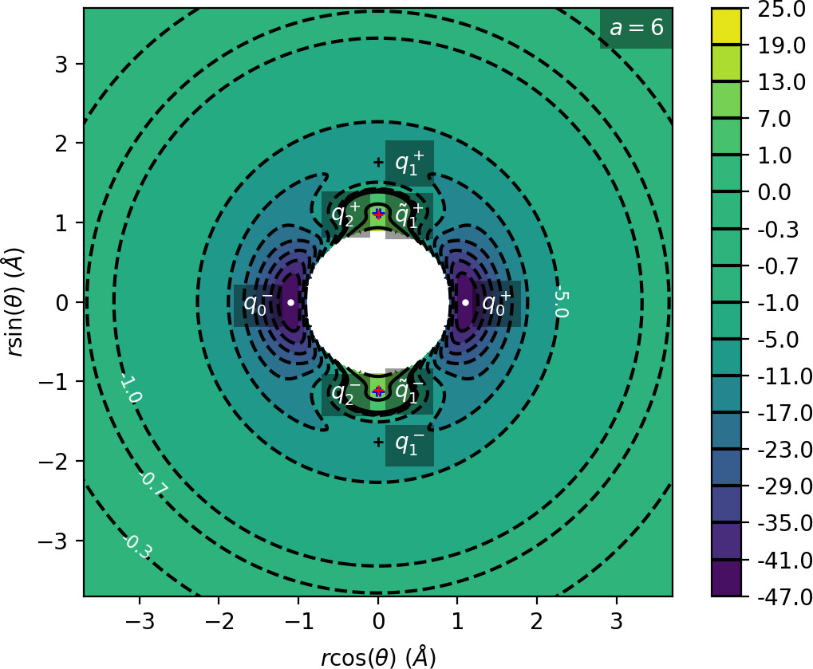
{#fig:pot} 

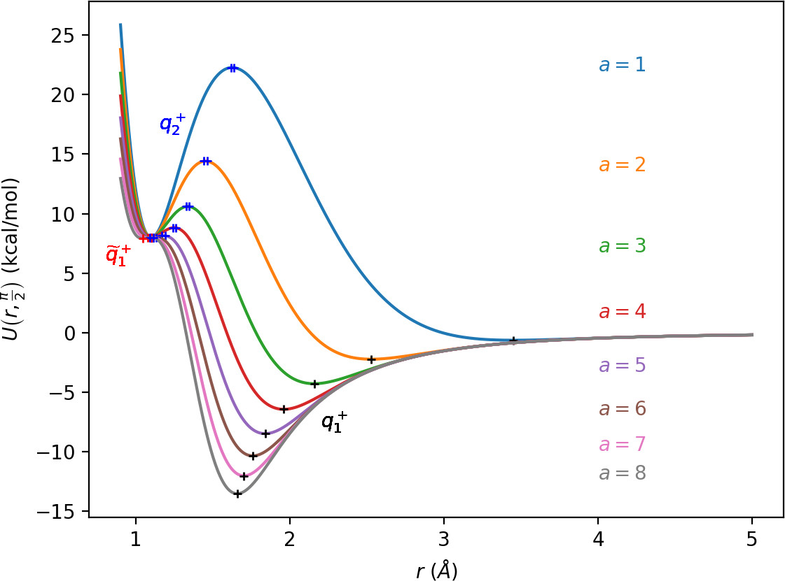{#fig:thpi2}

Due to the exponential decay of the anisotropic term $U_{coup}$ and the
$o(r^{-4})$ decay of $U$ as a whole, the area of flat potential that can
be seen in Figures (#fig:pot) and
(#fig:thpi2)
remains unchanged. In this area $U$ is negative, monotonic in $r$, very
close to zero and certainly has no saddles.

Apart from different values of the potential, the wells also differ from
the area of flat potential dynamically. In the potential well
trajectories vibrate, i.e. oscillate in the angular direction, as they
are bounded by the two areas of high potential. Outside of the wells,
especially in the flat area, the absence of potential barriers enables
unlimited movement in the angular direction that is manifested in
trajectories completing full rotations around the centre of mass. The
transition from one type of dynamics to the other depends heavily on the
size and height of the areas of high potential that is influenced by $a$
as described above.

## Revealing the Phase Space Structures {#sec:phase_transport}

There are three important families of periodic orbits
[@Mauguiere2014; @Mauguiere2014b; @Krajnak2018] in Chesnavich's CH$_4^+$
model. By family of periodic orbits we mean a continuum of periodic
orbits parametrised by energy, so that each family contains two orbits
related by (reflectional) symmetry for a given $E$. We will refer to
these orbits as the inner ($\Gamma^i$), middle ($\Gamma^a$) and outer
($\Gamma^o$) periodic orbit based on the radii of the orbits and their
significance in dissociation. For a given $E$, the middle and outer
families consist of two orbits with the same configuration space
projections but opposite orientation, one with $p_\theta>0$ and one with
$p_\theta<0$, hence clearly distinct in phase space. In a configuration
space projection these orbits rotate counterclockwise and clockwise
respectively. The inner family consists of two orbits, one on the edge
of each potential well. In the following, statements regarding one of
the orbits of a family automatically hold for the other one due to
symmetry. If we only refer to one orbit, we refer to $\Gamma^a$ and
$\Gamma^o$ with $p_\theta>0$ and $\Gamma^i$ oscillating around
$\theta=0$.

Configuration space projections are shown in Figure (#fig:poconfig). Note that none of these families is
associated with a saddle point on the potential energy surface.

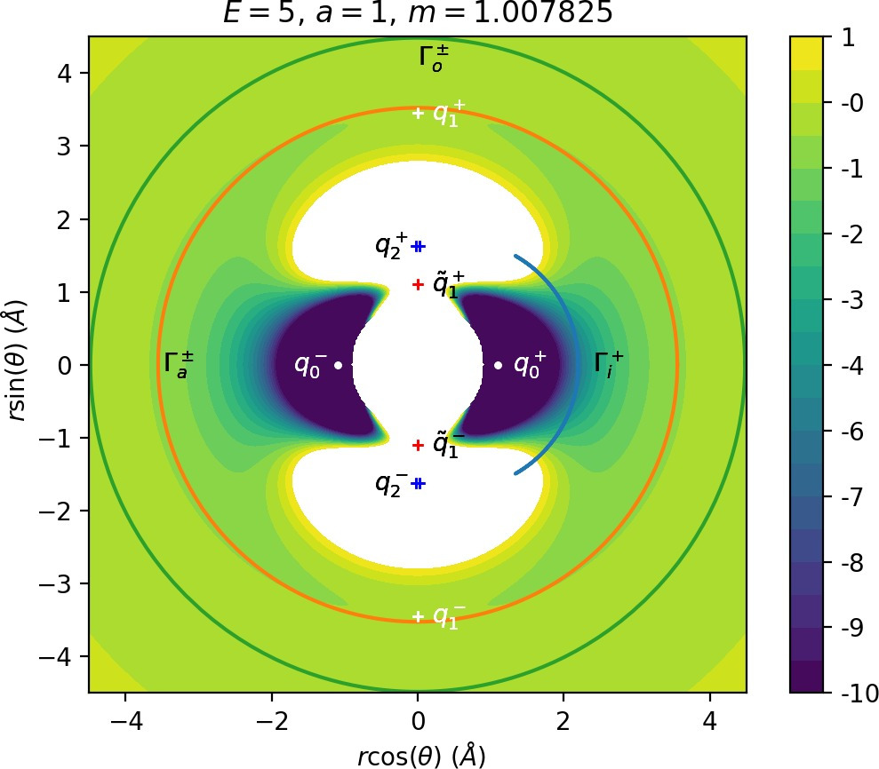
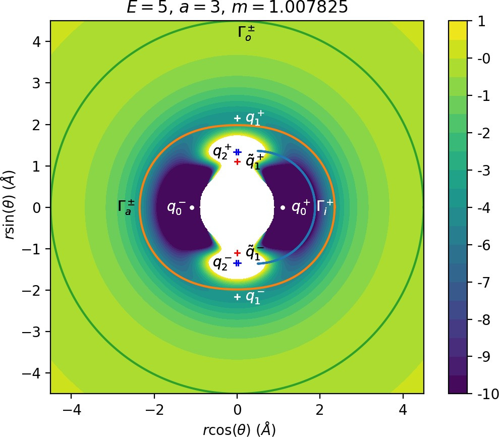
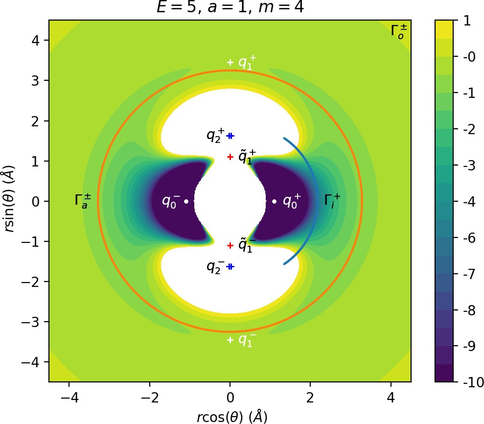
{#fig:poconfig}

The family of outer periodic orbits $\Gamma^o$ is proven [@Krajnak2018]
to exist due to a centrifugal barrier for a class of systems including
the one considered here. It was also shown that the orbits in this
family are unstable. States of the system beyond the outer orbits
correspond to dissociated states CH$_3^++$H. Orbits of this family are
therefore the outer boundary of the roaming region [@Mauguiere2014]. We
prefer to use the more general term interaction region as the phase
space structures responsible for roaming and isomerisation among
trajectories that leave the well, also arbitrate whether incoming
trajectories originating at $r=\infty$ react (reach the well) or not. In
the context of transition state theory, this region is sometimes also
called the collision complex.

The potential wells represent the region where the CH$_4^+$ molecule is
in a stable configuration and orbits of the inner family $\Gamma^i$
naturally delimit this region. All inner periodic orbits are unstable
and form the inner boundary of the interaction region.

Inside the interaction region lies the family of middle orbits, which
are crucial in the definition of roaming. These orbits are unstable for
small positive energies ($E<2.72$ for $a=1$ and $m=m_H$) and stable
after a period doubling bifurcation involving a family denoted sometimes
by FR$12$ [@Mauguiere2014; @Mauguiere2014b] or $\Gamma^b$ [@Krajnak2018]
that is of no further importance. The exact energy of the period
doubling bifurcation varies with $m$ and $a$, but for $m=m_H$ and $a=1$
is at approximately $E=2.72$. The family is also subject to bifurcations
at negative energies, but these are not relevant for roaming.

The definition of roaming as introduced in **Ref.** requires us to construct
a dividing surface in phase space based on the configuration space
projection of $\Gamma^a$. We shall denote the dividing surface
associated with $\Gamma^a$ as DS$^a$. For a given energy $E$, DS$^a$
consists of all points $(r,\theta,p_r, p_\theta)$ on the energy surface
$H_m(r,\theta,p_r, p_\theta)=E$, such that $(r,\theta)$ is a point on
the configuration space projection of $\Gamma^a$.

It is known that a spherical dividing surface may in the neighbourhood
of an index-1 saddle bifurcate into a torus [@MacKay2014; @MacKay2015]
and it was recognised [@Mauguiere2016] that dividing surfaces
constructed using periodic orbits that rotate such as DS$^a$, as opposed
to vibrate, are tori. In addition, if $\Gamma^a$ is unstable, then
DS$^a$ does not admit local recrossings.

Indeed one can see that for every point
$(r_{\Gamma^a},\theta_{\Gamma^a})$ on the configuration space projection
of $\Gamma^a$, the corresponding phase space structure is a circle
implicitly defined by (Equation \eqref{eq:Hamm}) as
$$E-U(r_{\Gamma^a},\theta_{\Gamma^a}) = \frac{1}{2 \mu_m} p_r^2 + \frac{1}{2}p_\theta^2 \left(\frac{1}{I} + \frac{1}{\mu_m r^2}\right).$$

Note that the radius of the circle never vanishes along $\Gamma^a$ as
the kinetic energy never vanishes along $\Gamma^a$.

A trajectory is considered a roaming trajectory if it originates in the
potential well and crosses DS$^a$ at least three times before
dissociating. If a trajectory crosses DS$^a$ an even number of times and
enters either one of the potential wells, it is an isomerisation
trajectory.

Roaming can be reformulated as a transport problem [@Krajnak2018] in the
following manner. Let DS$^i$ and DS$^o$ be defined using $\Gamma^i$ and
$\Gamma^o$ analogously to DS$^a$. It is well known that a dividing
surface associated with a periodic orbit that reaches two
equipotentials, such as $\Gamma^i$, is a sphere. Using reasoning similar
to the above one can see, that because the kinetic energy along
$\Gamma^i$ vanishes when it reaches the equipotentials, DS$^i$ consists
of circles except for the poles which are points, thus a sphere.
$\Gamma^i$, being the equator of this sphere, divides it into two
hemispheres with unidirectional flux - trajectories leaving the well
cross the outward hemisphere while trajectories entering the well cross
the inward hemisphere.

DS$^a$ and DS$^o$ are tori, but they too can be divided into two parts
of unidirectional flux. This can be easily seen on DS$^o$, but a similar
argument applies to DS$^a$. Since $\Gamma^o$ has a constant radius and
$p_r=0$, the two orbits are characterised by $p_\theta^2$ being maximal
for the given energy along the orbit. Any trajectory crossing DS$^o$
must therefore have $p_r\neq0$. All trajectories with $p_r>0$ cross the
outward annulus of DS$^o$ bounded by the two orbits $\Gamma^o$, while
all with $p_r<0$ cross the inward annulus and enter the interaction
region.

Note that because dividing surfaces divide the energy surface into two
separate partitions, the dividing surfaces defined above have the
following roles. Since $\Gamma^i$ lies on the edge of the potential
well, the role of DS$^i$ is to divide the the energy surface region
associated with the potential well from the rest of the energy surface.
Every trajectory that enters or exists the well must cross DS$^i$.
Similarly, DS$^o$ is used to divide the dissociated states from the rest
of the energy surface and every trajectory going from one part of the
energy surface into the other must cross DS$^o$. DS$^a$ divides the the
energy surface interaction region between DS$^i$ and DS$^o$ into two,
but neither of the two partitions bears a relevant meaning. The
definition of roaming is the sole purpose of this surface in this
investigation.

## Implications for Reaction Dynamics

We can formulate dissociation as a problem of transport of trajectories
between dividing surfaces in the following manner. By definition,
trajectories that leave the well must cross the outward hemisphere of
DS$^i$. Trajectories that leave the interaction region (dissociate),
cross the outward annulus of DS$^o$. Dissociation is therefore a
question of how trajectories from the outward hemisphere of DS$^i$ reach
the outward annulus of DS$^o$.

In the process of being transported from DS$^i$ to DS$^o$, dissociating
trajectories originating must cross the outward annulus of DS$^a$.
Roaming trajectories cross the torus DS$^a$ at least three times, first
the outward annulus and then alternately the inward and the outward
annulus. It should be noted that trajectories originating in either of
the wells have to cross the outward annulus of DS$^a$ before they can
reach its inward annulus. Similarly trajectories going from the inward
annulus of DS$^a$ to the outward annulus of DS$^o$ must cross the
outward annulus of DS$^a$. Therefore trajectories that originate in the
well and cross the inward annulus of DS$^a$ before dissociating are
roaming trajectories.

The role of phase space structures in reaction dynamics has been
explained on many occasions [@Wigginsetal01; @Uzeretal02; @Waalkens04].
Dividing surfaces as defined above can be shown to be the surfaces of
minimal flux [@Waalkens04] and therefore sit in the narrowest part of
the bottleneck, be it a sphere such as DS$^i$ or a torus such as DS$^a$
and DS$^o$. Structures that convey trajectories across such a bottleneck
were identified to be stable and unstable invariant manifolds of the
unstable periodic orbit. These invariant manifolds have a cylindrical
structure and form a barrier between trajectories that are lead through
the bottleneck (inside) and those are not (outside).

For each unstable orbit $\Gamma$, there are two branches of stable
invariant manifold, i.e. manifolds consisting of a continuum of
trajectories that are asymptotic to the orbit in forward time, and two
branches of unstable invariant manifold, asymptotic in backward time. We
shall denote the invariant manifolds of $\Gamma$ by $W_{\Gamma}$, we
distinguish stable and unstable by a superscript, $W_{\Gamma}^s$ and
$W_{\Gamma}^u$, and if we refer to an individual branch, we add a $+$ or
$-$ to the superscript to indicate, whether the branch leaves the
neighbourhood of $\Gamma$ to the $r>r_\Gamma$ side ($+$) or to the
$r<r_\Gamma$ side ($-$).

The precise cylindrical structure of the manifold reflects the geometry
of the corresponding periodic orbit in a similar way as it is reflected
by the corresponding dividing surface. Manifolds $W_{\Gamma^i}$ are
spherical cylinders, whereas $W_{\Gamma^a}$ and $W_{\Gamma^o}$ are toric
cylinders. The different geometries can be understood from a phase space
perspective.

For any fixed energy, $\Gamma^i$ is a (topological) circle with its
center, due to symmetry of the system, on the ray $\theta=0$,
$p_r=p_\theta=0$. This property is passed on to all four branches of
$W_{\Gamma^i}$, these too are always centered at/symmetric with respect
to $\theta=0$, $p_r=p_\theta=0$, no matter how heavily they are deformed
by the flow which is smooth.

In contrast, $W_{\Gamma^a}$ and $W_{\Gamma^o}$ are centered at $r=0$,
just like the corresponding orbits $\Gamma^a$ and $\Gamma^o$. This
property is independent of energy.

All of this is a consequence of the local energy surface geometry that
is not uniform throughout the energy surface and can be observed as
qualitatively different forms of dynamics - vibration and rotation.

### Phase space structures responsible for roaming {#sec:phase_roaming}

We study invariant manifolds and their intersections on a surface of
section, namely on an accurate approximation of the outward annulus of
DS$^a$. Both annuli of DS$^a$ are transversal to the flow and are
bounded by $\Gamma^a$. Suppose the configuration space projection of
$\Gamma^a$ can be parametrised using the function $\bar{r}(\theta)$ as
$(\bar{r}(\theta), \theta)$ and define

$$\rho(r,\theta)=r-\bar{r}(\theta).$$
Clearly $\Gamma^a$ is then given by 
$$\rho(r,\theta)=0,$$
and the outward annulus of DS$^a$ is defined by all points $(r,\theta,p_r, p_\theta)$ on the energy surface, such that
$$\rho(r,\theta)=0,\quad \dot{\rho}(r,\theta)>0.$$
Note that $\dot{\rho}(r,\theta)>0$ is not equivalent to $\dot{r}>0$.

Most notably, we are interested in the interaction between
$W_{\Gamma^i}^{u+}$, the manifold guiding trajectories that leave the
potential well into the interaction region, and $W_{\Gamma^o}^{s-}$, the
manifold guiding trajectories out of the interaction region into
dissociated states. Figure
(#fig:middlesec) illustrates intersections of these manifolds
with the outward annulus of DS$^a$.

Note that the section of $W_{\Gamma^i}^{u+}$ with the outward annulus of
DS$^a$ produces a topological circle (further denoted $\gamma^{u+}_{i}$)
centered at $\theta=0$, $p_\theta=0$. Recall from Section
(#sec:phase_transport) that all branches of $W_{\Gamma^i}$ are
centered at/symmetric with respect to $\theta=0$, $p_r=p_\theta=0$. The
shape of $\gamma^{u+}_{i}$ is just a consequence of this fact.

Similarly the section of $W_{\Gamma^o}^{s-}$ with the outward annulus of
DS$^a$ (further denoted $\gamma^{s-}_{o}$) reflects the fact that
$\Gamma^o$ and all branches of $W_{\Gamma^o}$ are centered at $r=0$.
Although $\gamma^{s-}_{o}$ seem like lines, these are two circles
concentric with DS$^a$. For simplicity, we omit one of the
$\gamma^{s-}_{o}$ circles in all following figure and concentrate on the
upper half plane $p_\theta>0$.

All of the figures displaying intersections of invariant manifolds with
the outward annulus of DS$^a$ should be understood as follows. Note that
for the sake of simplicity we take advantage of symmetry of the system
and usually restrict ourselves to $\theta\in[-\pi/2,\pi/2]$,
$p_\theta\geq0$ when considering the outward annulus of DS$^a$.
Consequently, with the exception of Figure
(#fig:middlesec), we only show manifolds corresponding to one
of the orbits of $\Gamma^i$ and one of $\Gamma^o$.

Recall that the interior of $\gamma^{u+}_{i}$ contains trajectories that
leave the well, while $\gamma^{s-}_{o}$ contains dissociating
trajectories which do not return to the surface of section as indicated
in Figure (#fig:middlesec). The intersection must therefore contain
trajectories that lead to immediate dissociation, such as the radial
trajectory $\theta=0$, $p_\theta=0$.

Roaming trajectories do not dissociate immediately, therefore they are
contained $\gamma^{u+}_{i}$, but not in $\gamma^{s-}_{o}$. These
trajectories have too much energy in the angular degree of freedom, i.e.
$|p_\theta|$ is large. The other kind of trajectories contained in
$\gamma^{u+}_{i}\setminus\gamma^{s-}_{o}$ are those that re-enter either
of the wells, these correspond to isomerisation.

If $\gamma^{u+}_{i}$ and $\gamma^{s-}_{o}$ do not intersect, that is,
all of $W_{\Gamma^i}^{u+}$ is contained in $W_{\Gamma^o}^{s-}$, roaming
is not present in the system for the given parameter values. For this
reason the system does not admit [@Krajnak2018] roaming for $E\geq2.5$,
$m=m_H$ and $a=1$.

While it is true that $\gamma^{u+}_{i}\setminus\gamma^{s-}_{o}$ contains
roaming trajectories, it is not true that the area of the intersection
is proportional to the amount of roaming trajectories. Since
$\gamma^{u+}_{i}\setminus\gamma^{s-}_{o}$ tends to grow together with
$\gamma^{u+}_{i}$ and $\gamma^{u+}_{i}$ can only grow at the cost of
$\gamma^{s-}_{o}\setminus\gamma^{u+}_{i}$, the areas
$\gamma^{u+}_{i}\setminus\gamma^{s-}_{o}$ and
$\gamma^{s-}_{o}\setminus\gamma^{u+}_{i}$ behave like complements.
Therefore the amount of roaming is limited by
$\gamma^{s-}_{o}\setminus\gamma^{u+}_{i}$, the area where roaming and
nonreactive trajectories (see Figure
(#fig:middlesec)) cross the outer annulus of DS$^a$ for the
last time before dissociating.

To see how $m$ and $a$ influence roaming, we will study how
$\gamma^{u+}_{i}$ and $\gamma^{s-}_{o}$ change by calculating the areas
$\gamma^{u+}_{i}\setminus\gamma^{s-}_{o}$ and
$\gamma^{s-}_{o}\setminus\gamma^{u+}_{i}$. The size of
$\gamma^{u+}_{i}\setminus\gamma^{s-}_{o}$ is correlated with the maximal
value of $p_\theta$ along $\gamma^{u+}_{i}$ and the minimal $p_\theta$
along $\gamma^{s-}_{o}$. Once we know this area, it is easy to determine
$\gamma^{s-}_{o}\setminus\gamma^{u+}_{i}$ using the actions of the
orbits $\Gamma^i$ and $\Gamma^o$.

The area $\gamma^{u+}_{i}\setminus\gamma^{s-}_{o}$ grows with increasing
$m$. Consequently we arrive at one of the main conclusions of this work,
namely that roaming diminishes for large and small values of $m$ (Figure
(#fig:Wiincr)) with an optimum inbetween. This can be seen for
$a\leq2$, but for larger values of $a$, the optimum may move towards
masses unreasonable for roaming. Disappearance of roaming for large
masses is due to a slowdown in the radial degree of freedom and the
significant variation of position of $\Gamma^o$ with mass. We explain
these two effect separately in Sections
(#sec:inner) and
(#sec:outer). The reason
for the disappearance of roaming for low masses is due to a stronger
coupling of the degrees of freedom in the kinetic part of the
Hamiltonian (Equation \eqref{eq:Hamm}) that we deal with in Section
(#sec:small).

The parameter $a$ influences the transition between vibration and
rotation by controlling the amplitude of the anisotropy in the
potential. As noted in Section (#sec:potential), the larger $a$ is, the more the potential
wells open up in the angular direction allowing easier access of the
wells by trajectories from the interaction region. Instead of promoting
roaming, this favours isomerisation, because at the same time the height
of the potential barrier between the wells decreases as shown in Figure
(#fig:thpi2).
We explain the process in Section (#sec:alpha).

![Intersection of $W_{\Gamma^o}^{s-}$ (orange) and $W_{\Gamma^i}^{u+}$ (blue) with the outward annulus of the DS$^a$ for $E=1$, $m=1.007825$ and $a=1$, indicating where trajectories corresponding to different types of dynamics intersect the surface. Area enclosed by $\gamma^{u+}_{i}$ is crossed by trajectories that are leaving the well, while $\gamma^{s-}_{o}$ leads dissociating trajectories out of the interaction region, $\gamma^{u+}_{i}\setminus\gamma^{s-}_{o}$ contains roaming and isomerisation trajectories, and $\gamma^{s-}_{o}\setminus\gamma^{u+}_{i}$ is crossed by roaming and non-reactive trajectories.](figures/figure4.jpg){#fig:middlesec}

### Simplification of the system and inner orbits {#sec:inner}

The mass of the free atom $m$ is only present in terms of the kinetic
part of the Hamiltonian (Equation \eqref{eq:Hamm}) and therefore cannot be studied from a
configuration space perspective. From the Hamiltonian equations of
motion 

\begin{align*}
   \dot{r} &= \frac{1}{\mu_m} p_r,\\
   \dot{p}_r &= \frac{p_\theta^2}{\mu_mr^3}-\frac{\partial U}{\partial r},\\
   \dot{\theta} &= \left(\frac{1}{\mu_m r^2}+\frac{1}{I}\right)p_\theta, \\
   \dot{p}_\theta &= -\frac{\partial U}{\partial \theta},
\end{align*}

 one can see, that $m$ influences the relation between
momenta $p_r$, $p_\theta$ and velocities $\dot{r}$, $\dot{\theta}$ as
well as the centrifugal contribution in $\dot{p}_r$. All of these are
weakened with increasing $m$.

Provided $m$ is sufficiently large (in practice $m>4$),
$\frac{1}{\mu r^2}$ is small compared to $\frac{1}{I}$ in the
interaction region. For the purposes of the following argument we can
neglect the term $\frac{1}{\mu r^2}$ and consider the Hamiltonian

$$\widetilde{H}_m(r,\theta,p_r, p_\theta) = \frac{1}{2 \mu_m} p_r^2 + \frac{1}{2I}p_\theta^2 + U(r,\theta).$$

The associated equations are 

\begin{align*}
   \dot{r} &= \frac{1}{\mu_m} p_r,\\
   \dot{p}_r &= -\frac{\partial U}{\partial r},\\
   \dot{\theta} &= \frac{1}{I} p_\theta, \\
   \dot{p}_\theta &= -\frac{\partial U}{\partial \theta}.
\end{align*}

The degrees of freedom in the resulting system are
only coupled via $U(r,\theta)$ and the mass parameter $m$ only
influences $\dot{r}$.

Let $m_0<m_1$, $H_{m_0}=H_{m_1}=E$ and $p_\theta$ be such that it
satisfies the fixed energy constraint. Denote by $p_{r_{m_0}}$,
$p_{r_{m_1}}$ the momenta given by the Hamiltonians defined as follows:

\begin{align*}
   p_{r_{m_0}}&=\sqrt{2 \mu_{m_0}\left(E-U(r,\theta)-\frac{p_\theta^2}{2I}\right)},\\
   p_{r_{m_1}}&=\sqrt{2 \mu_{m_1}\left(E-U(r,\theta)-\frac{p_\theta^2}{2I}\right)}.
\end{align*}

Then provided $p_\theta$ is not maximal, by

$$\frac{\mu_{m_0}}{\mu_{m_1}}=\frac{\frac{m_{CH_3}m_0}{m_{CH_3}+m_0}}{\frac{m_{CH_3}m_1}{m_{CH_3}+m_1}}=\frac{m_0m_{CH_3}+m_0m_1}{m_1m_{CH_3}+m_0m_1}<1,$$

we have that

$$\frac{p_{r_{m_1}}}{\mu_{m_1}}=\frac{1}{\mu_{m_1}}\sqrt{2 \mu_{m_1}\left(E-U-\frac{p_\theta^2}{2I}\right)}
   =\sqrt{\frac{\mu_{m_0}}{\mu_{m_1}}}\frac{1}{\mu_{m_0}}\sqrt{2 \mu_{m_0}\left(E-U-\frac{p_\theta^2}{2I}\right)}
   =\sqrt{\frac{\mu_{m_0}}{\mu_{m_1}}}\frac{p_{r_{m_0}}}{\mu_{m_0}}<\frac{p_{r_{m_0}}}{\mu_{m_0}}.$$

For $p_\theta$ maximal we trivially have $p_{r_{m_1}}=p_{r_{m_0}}=0$.
Trajectories therefore slow down in the radial direction with increasing
$m$ for each $r, \theta, p_\theta$ on the energy surface.

Implications for the section of $W_{\Gamma^i}^{u+}$ with the DS$^a$:

-   Slowdown in radial direction, whereby $W_{\Gamma^i}^{u+}$ is more
    likely to hit the potential island.

-   The interaction of $W_{\Gamma^i}^{u+}$ with the potential island is
    the only mechanism to transfer energy between the degrees of
    freedom.

-   A push from the potential island in the radial direction means
    decrease in $p_\theta$ along $W_{\Gamma^i}^{u+}$.

Note that Figures (#fig:Wiincr) and
(#fig:Wiincrdetail) seem to contradict the last point. This is
due to the varying radial position of DS$^a$, when $\Gamma^a$ comes
closer to $\Gamma^i$ as $m$ increases (see Figure
(#fig:poconfig)). The decrease can be observed on surfaces
with constant radius, however $W_{\Gamma^i}^{u+}$ can become tangent to
such surfaces when $m$ is varied.

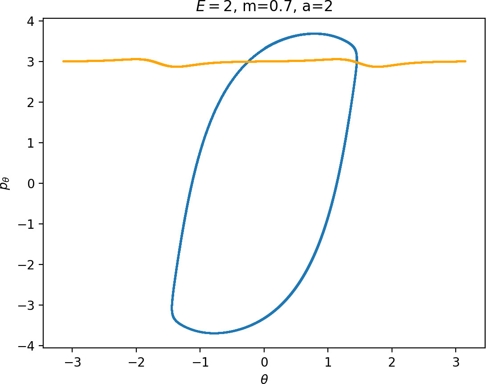 
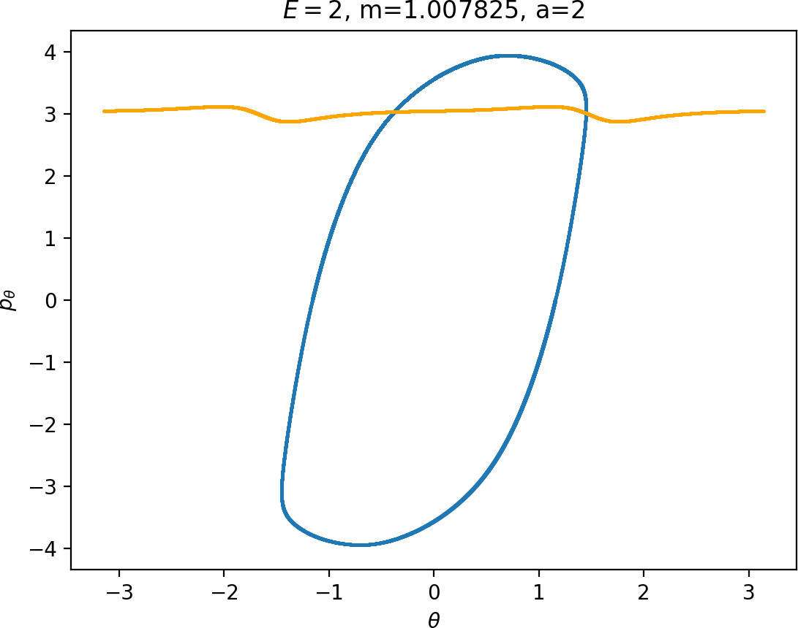

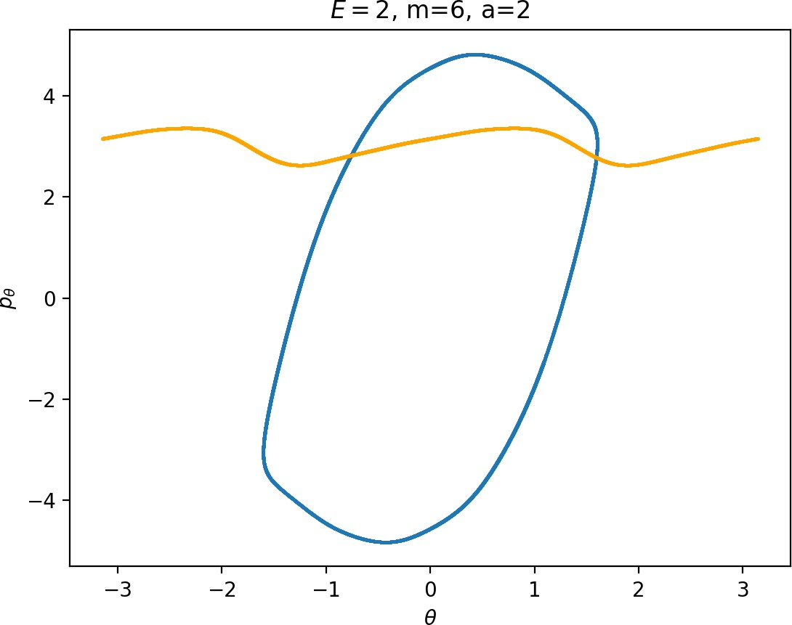{#fig:Wiincr}

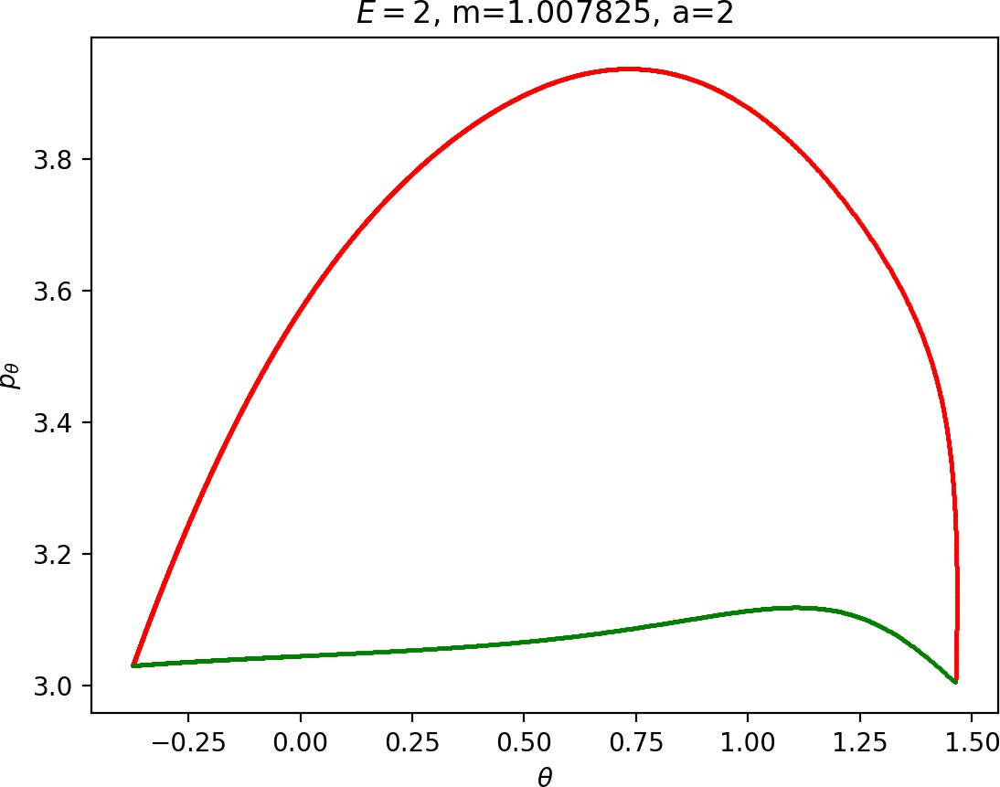

{#fig:Wiincrdetail}

### Reduction of the system and outer orbits {#sec:outer}

If $r$ is sufficiently large, $U$ is rotationally symmetric and
$$V_{red}(r)=\frac{p_\theta^2}{2 m r^2} + U(r),$$
where $p_\theta$ becomes a constant of motion. $U(r)$ is monotonic, $U(r)<0$ and
$U\in o(r^{-2})$ as $r\rightarrow\infty$, therefore the reduced system
admits an equilibrium given by $r=r_{p_\theta}$, $p_r=0$, where $r_{po}$
is the solution of

$$\dot {p}_r = -\frac{\partial H}{\partial r} = \frac{1}{\mu r_{po}^3} p_\theta^2 - U'(r_{po}) = 0,$$

or equivalently

\begin{equation}
\label{eq:pr}
  \frac{p_\theta^2}{\mu r_{po}^2} =r_{po} U'(r_{po}).
\end{equation}

 In the full
system this relative equilibrium is manifested as a periodic orbit with
initial conditions $r=r_{po}$, $\theta=const$, $p_r=0$ and
$p^\pm_\theta$ such that $H(r_{po}, 0, \theta, p^\pm_\theta)=E$.

To understand the influence of $m$ on the periodic orbit, let us first
establish the relationship between $r_{po}$ and $p^\pm_\theta$ and
incorporate the dependence on $\mu_m$ subsequently. Combining
$H(r_{po}, 0, \theta, p^\pm_\theta)=E$, i.e.

\begin{equation}
\label{eq:Epr0}
   E=\frac{(p^\pm_\theta)^2}{2I}+\frac{(p^\pm_\theta)^2}{2\mu_m r_{po}^2}+U(r_{po}),
\end{equation}

with (Equation \eqref{eq:pr})
yields 

$$E=\frac{(p^\pm_\theta)^2}{2I}+\frac{1}{2}r_{po} U'(r_{po})+U(r_{po}).$$

If $\frac{1}{2}r U'(r)+U(r)$ is monotonic in $r$ (for $r$ sufficiently
large), then we find that $r_{po}$ increases or decreases with
$(p^\pm_\theta)^2$. In case of Chesnavich's CH$_4^+$ model,
$\frac{1}{2}r U'(r)+U(r)$ is positive and monotonically decreasing. This
is due to the leading term of $U$ for large $r$ being $-cr^{-4}$, where
$c>0$, while that of $\frac{1}{2}r U'(r)$ must be $2cr^{-4}$. It is
sufficient that $U(r)<0$ and $U\in o(r^{-2})$ as $r\rightarrow\infty$.
Consequently we see that an increase in $(p^\pm_\theta)^2$ must lead to
an increase in $r_{po}$ and vice versa for every fixed energy $E$.

To gain insight on the influence of $m$, we rewrite
(Equation \eqref{eq:pr}) as

$$(p^\pm_\theta)^2 =\mu_m r_{po}^3 U'(r_{po}),$$

and plug it into (Equation \eqref{eq:Epr0}) to obtain

$$E=\frac{\mu_m r_{po}^3 U'(r_{po})}{2I}+\frac{\mu_m r_{po}^3 U'(r_{po})}{2\mu_m r_{po}^2}+U(r_{po})=\frac{\mu_m r_{po}^3 U'(r_{po})}{2I}+\frac{1}{2}r_{po}U'(r_{po})+U(r_{po}).$$

We have already noted that (for $r$ sufficiently large)
$\frac{1}{2}r U'(r)+U(r)$ is positive and monotonically decreasing. As a
function of $r$ (where $r$ is sufficiently large),
$\frac{\mu_m r^3 U'(r)}{2I}$ is also positive and monotonically
decreasing, provided $U\in o(r^{-3})$ which is the case for Chesnavich's
potential. Therefore to maintain a fixed energy $E$ and increase in
$\mu_m$ must be compensated by an increase in $r_{po}$.

We see that $r_{po}$ and $(p^\pm_\theta)^2$ increase with $m$. Note that
the reasoning remains true any potential that is rotationally symmetric,
monotonic and in the class $o(r^{-3})$ for $r$ sufficiently large and
can be extended to systems with non-zero total angular momentum.

Implications for $\gamma^{s-}_{o}$:

-   $\Gamma^o_\pm$ moves away with increasing $m$.

-   $p_\theta$ increases along $\gamma^{s-}_{o}$ with $m$ and it is less
    influenced by the radial degree of freedom.

### Small masses {#sec:small}

As justified in Section (#sec:outer), $r_{po}$ and $(p^\pm_\theta)^2$ increase with
$m$. Therefore for $m<m_H$ we see that $\Gamma^o_\pm$ moves inward and
$p_\theta$ along $\gamma^{s-}_{o}$ decreases. This alone does not
suffice to make conclusions regarding roaming, because we know that
roaming does not exist for atoms with very small masses as suggested by
Figure (#fig:middlesmallm).

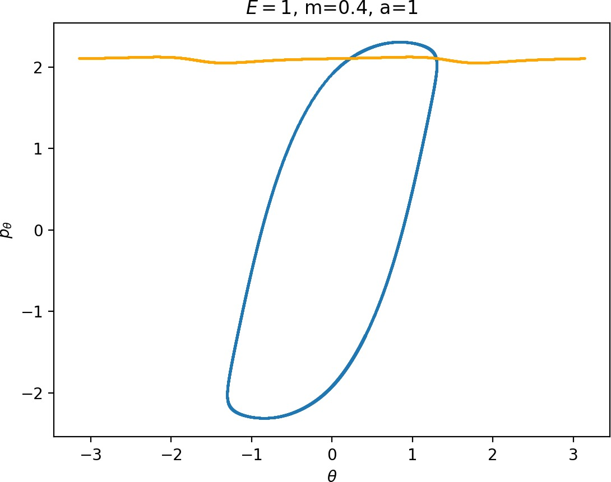
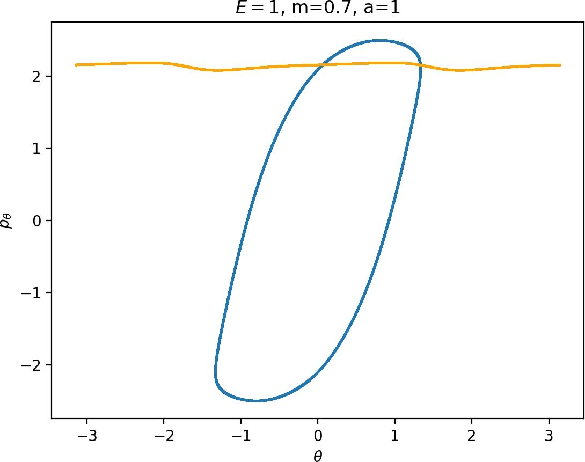
{#fig:middlesmallm}

For $m<m_H$, $p_\theta^2$ has a significant influence on $\dot{p}_r$,
especially in the wells where $r$ is small, and also
$\dot{r} = \frac{1}{m} p_r$ grows faster. This prevents
$W_{\Gamma^i}^{u+}$ from entering areas of high potential near the
potential islands and limits the transfer of energy into the angular
degree of freedom, since the contribution of the potential in the
interaction region is minimal. Although $p_\theta$ along $\Gamma^o$
decreases, fewer and shorter segments of $W_{\Gamma^i}^{u+}$ can gain
sufficient angular momentum to be repelled by the centrifugal barrier
back into the interaction region.

### Influence of the coupling parameter $a$ on roaming {#sec:alpha}

The parameter $a$ influences the strength of coupling of the degrees of
freedom via the potential and thereby it influences [@Chesnavich1986]
how early (e.g. $a=4$) or late (e.g. $a=1$) the transition from
vibration to rotation occurs. An investigation of the differences in
dynamics for $a=1$ and $a=4$ can be found in Ref. . In physical terms,
$a$ controls the anisotropy of the rigid molecule $CH_3^+$.

It turns out that the expansion of the potential wells and the reduction
of potential islands around the index-$2$ saddles with increasing $a$
does have a significant impact on roaming. As can be seen from Figure
(#fig:middleE1aa), the area
$\gamma^{u+}_{i}\setminus\gamma^{s-}_{o}$ increases with $a$. However,
as pointed out in Section (#sec:phase_roaming) if
$\gamma^{u+}_{i}\setminus\gamma^{s-}_{o}$ grows,
$\gamma^{s-}_{o}\setminus\gamma^{u+}_{i}$ must shrink and therefore
larger values of $a$ result all other classes of dynamics diminishing in
favour of isomerisation.

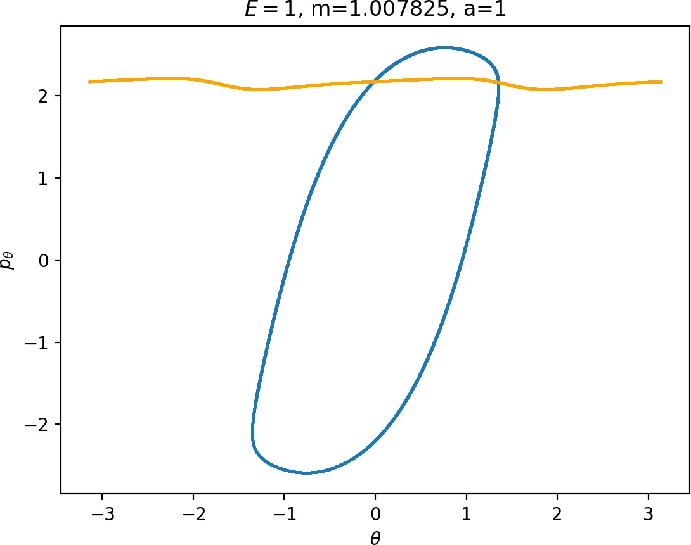
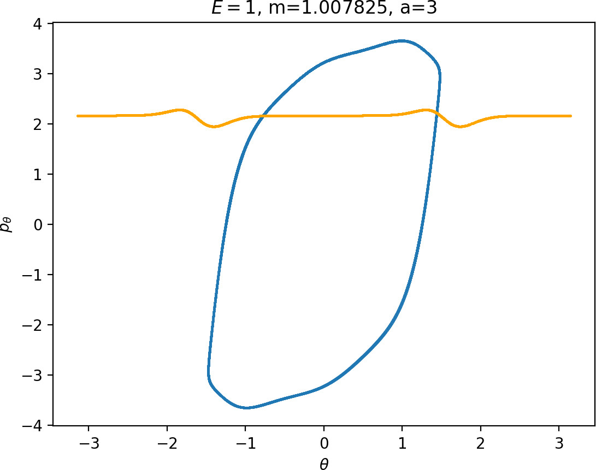

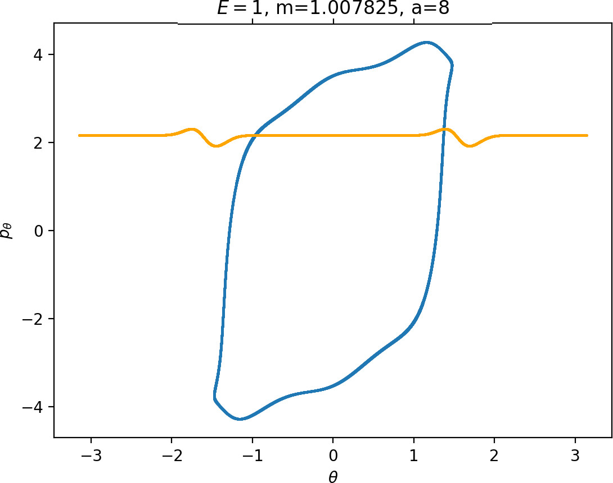{#fig:middleE1aa}

### Upper bound on roaming

Below we give the upper bound on roaming, which is the ratio of the
minimum of the areas $\gamma^{u+}_{i}\setminus\gamma^{s-}_{o}$ and
$\gamma^{s-}_{o}\setminus\gamma^{u+}_{i}$ to the energy surface volume
for $r=\infty$. As explained above, the area
$\gamma^{u+}_{i}\setminus\gamma^{s-}_{o}$ contains all isomerisation and
roaming trajectories, while $\gamma^{s-}_{o}\setminus\gamma^{u+}_{i}$
contains all roaming and nonreactive trajectories. The energy surface
volume at $r=\infty$ corresponds to all trajectories in the system with
the exception of stable islands, which are not relevant in the context
of roaming. This measure does not account for isomerisation
trajectories, because these are cut off when they re-enter one of the
wells. Since all trajectories with the exception of stable islands must
eventually leave the wells and the interaction region, we effectively
avoid double-counting. Values of the upper bound can be found in Table
(#tab:1) as well as
in Figure (#fig:corrroam).

We do not provide values for $E=0.5$ and $m>4$ due to the large radius
of $\Gamma^o$; for $E=1$, $a=8$ and $m<0.9$ due to a bifurcation of
$\Gamma^i$ around $m=0.856$ after which DS$^i$ no longer delimits the
corresponding potential well in a reasonable manner and similarly for
$E=2$ and $a=8$.

As the values in Table (#tab:1) show, the prominence of roaming does not evolve in a
simple manner. In agreement with conclusions in Sections
(#sec:inner),
(#sec:outer),
(#sec:small), the
proportion of roaming decreases or even disappears for very large and
very small masses of the free atom and we known it also recedes in
favour of isomerisation with increasing $a$. Unlike the area of
$\gamma^{u+}_{i}\setminus\gamma^{s-}_{o}$, which grows monotonically
both in $m$ and $a$, our upper bound on roaming being the smaller of
$\gamma^{u+}_{i}\setminus\gamma^{s-}_{o}$ and
$\gamma^{s-}_{o}\setminus\gamma^{u+}_{i}$ does not. Figure (#fig:corrroam) suggest that while there is an optimum at a
reasonable mass for $a=1$ and occasionally $a=2$, the bound otherwise
decreases with $m$ with an optimum at a value of $m$ smaller than
considered in this work.

The strange evolution of the bound with respect to $a$, which is shown
in Figure (#fig:corrroam), is probably due to the inaccuracy of the
bound. Overall it seems that the proportion of roaming mostly decreases,
which is due to prevalence of isomerisation as $a$ increases.

An estimate of the amount of roaming in the system can be obtained via
an approximation of the proportion of nonreactive trajectories in
$\gamma^{s-}_{o}\setminus\gamma^{u+}_{i}$ either via a computationally
expensive brute force method or from the intersection of invariant
manifolds with a surface $\theta=const$ that does not suffer from
transition between spherical and toric local geometries. Such an
estimate is outside of the scope of this work.

 $E=0.5$                                          

|     \      | $0.7$  | $0.8$  | $0.9$ |  $m_H$  |  $2$  |   $3$  |   $4$   |  $5$  |   $6$  |   $7$  |   $8$  |  $m$ |
|----------| ------- |------- |------- |------- |------- |------- |------- |------- |------- |------- |------- |-----|
|   $1$   |  0.203 |  0.214 |  0.222 | 0.229 | 0.257 | 0.260 | 0.259 |
|   $2$   |  0.270 |  0.264 |  0.259 | 0.254 | 0.218 | 0.196 | 0.180 |
|   $3$   |  0.200 |  0.196 |  0.192 | 0.189 | 0.162 | 0.145 | 0.132 |
|   $4$   |  0.166 |  0.163 |  0.161 | 0.158 | 0.138 | 0.124 | 0.113 |
|   $5$   |  0.154 |  0.152 |  0.150 | 0.148 | 0.132 | 0.119 | 0.110 |
|   $6$   |  0.154 |  0.153 |  0.152 | 0.150 | 0.137 | 0.125 | 0.116 |
|   $7$   |  0.163 |  0.162 |  0.162 | 0.161 | 0.148 | 0.137 | 0.127 |
|   $8$   |  0.183 |  0.182 |  0.180 | 0.178 | 0.163 | 0.151 | 0.141 |
|   $a$   | - | - | -  | - | - | - | - |

$E=1$                                           

|       \    | $0.7$  | $0.8$  | $0.9$ |  $m_H$  |  $2$  |   $3$  |   $4$   |  $5$  |   $6$  |   $7$  |   $8$  |  $m$ |
|----------| ------- |------- |------- |------- |------- |------- |------- |------- |------- |------- |------- |-----|
|   $1$    | 0.063 | 0.069 | 0.074 | 0.078 | 0.091 | 0.091 | 0.087 | 0.084 | 0.080 | 0.077 | 0.074|
|   $2$    | 0.274 | 0.269 | 0.264 | 0.258 | 0.222 | 0.200 | 0.184 | 0.171 | 0.162 | 0.155 | 0.148|
|   $3$    | 0.205 | 0.200 | 0.196 | 0.192 | 0.163 | 0.145 | 0.132 | 0.122 | 0.115 | 0.108 | 0.103|
|   $4$    | 0.172 | 0.168 | 0.165 | 0.161 | 0.138 | 0.123 | 0.112 | 0.103 | 0.096 | 0.091 | 0.086|
|   $5$    | 0.161 | 0.158 | 0.155 | 0.152 | 0.132 | 0.118 | 0.108 | 0.100 | 0.094 | 0.089 | 0.084|
|   $6$    | 0.163 | 0.160 | 0.157 | 0.155 | 0.137 | 0.124 | 0.114 | 0.106 | 0.100 | 0.095 | 0.091|
|   $7$    | 0.173 | 0.170 | 0.168 | 0.165 | 0.147 | 0.135 | 0.125 | 0.117 | 0.111 | 0.106 | 0.102|
|   $8$    |   -     |   -    | 0.185 | 0.181 | 0.161 | 0.148 | 0.139 | 0.131 | 0.125 | 0.120 | 0.116|
|   $a$   | - | - | - | - | - | - | - | - |

$E=2$                                           

|       \    | $0.7$  | $0.8$  | $0.9$ |  $m_H$  |  $2$  |   $3$  |   $4$   |  $5$  |   $6$  |   $7$  |   $8$  |  $m$ |
|----------| ------- |------- |------- |------- |------- |------- |------- |------- |------- |------- |------- |-----|
|   $1$    | 0.000 | 0.001 | 0.003 | 0.004 | 0.008 | 0.007 | 0.005 | 0.003 | 0.002 | 0.001 | 0.000|
|   $2$    | 0.160 | 0.177 | 0.192 | 0.205 | 0.224 | 0.202 | 0.186 | 0.174 | 0.164 | 0.157 | 0.151|
|   $3$    | 0.206 | 0.201 | 0.197 | 0.192 | 0.162 | 0.143 | 0.129 | 0.119 | 0.112 | 0.105 | 0.100|
|   $4$    | 0.173 | 0.169 | 0.165 | 0.162 | 0.135 | 0.119 | 0.107 | 0.098 | 0.092 | 0.086 | 0.081|
|   $5$    | 0.163 | 0.160 | 0.156 | 0.152 | 0.129 | 0.113 | 0.103 | 0.095 | 0.088 | 0.083 | 0.079|
|   $6$    | 0.166 | 0.163 | 0.159 | 0.156 | 0.133 | 0.119 | 0.108 | 0.100 | 0.094 | 0.089 | 0.085|
|   $7$    | 0.177 | 0.173 | 0.170 | 0.166 | 0.144 | 0.129 | 0.119 | 0.111 | 0.105 | 0.100 | 0.096|
|   $a$   | - | - | - | - | - | - | - | - |

![Ratio of the minimum of the areas $\gamma^{u+}_{i}\setminus\gamma^{s-}_{o}$ and $\gamma^{s-}_{o}\setminus\gamma^{u+}_{i}$ to the measure of all trajectories in the system (for details see text) for $E=0.5,1,2$ and various values of $m$ and $a$.]{#tab:1}

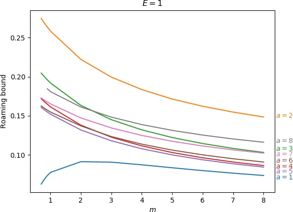
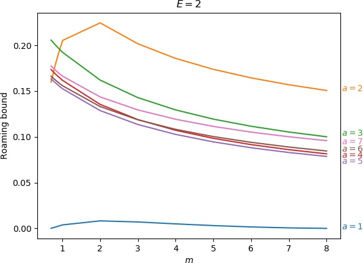{#fig:corrroam}

From a quantitative perspective we established an upper bound on the
prominence of roaming in Chesnavich's CH$_4^+$ model. The bound only
highlights the intricacy of roaming as a type of dynamics on the verge
between isomerisation and nonreactivity. It relies on a generous access
to the potential wells to allow reactions as well as a prominent area of
high potential that aids sufficient transfer of energy from angular
motion to radial motion to prevent isomerisation.

We conclude that it is not possible to choose realistic values of $m$
and $a$, such that roaming becomes the dominant form of dissociation
such as found in acetaldehyde [@Heazlewood08]. Therefore the dominance
of roaming must be due to other properties of the system than only mass
of the free atom and strength of potential coupling of the degrees of
freedom. Our investigation shows that roaming is prone to being
dominated by other types of dynamics. Therefore the path to dominance of
roaming lies in, as our investigation shows, potential wells that are
easily accessible by being 'open' in the angular direction to discourage
nonreactivity, yet are separated by a sufficiently high isomerisation
barrier.

# References