<!-- #region -->

# Two Degree-of-Freedom Chesnavich Model with Isokinetic thermostat

## Introduction 

The roaming mechanism for chemical reactions was introduced in reference
to the description of the photodissociation of formaldehyde
. After excitation of the
formaldehyde molecule by a laser pulse, a single CH bond begins to
stretch. Rather than proceed directly to dissociation, the hydrogen atom
rotates around the molecular fragment in a region of the potential
energy surface where it is subject to weak forces. The corresponding
motion of the hydrogen atom was termed 'roaming'. At a later stage the
roaming hydrogen atom encounters the bound hydrogen atom and undergoes
an abstraction reaction. The resulting H$_2$ molecule then separates
from the CO fragment. This reaction is then said to occur by the roaming
mechanism.

Since the pioneering formaldehyde studies a similar roaming mechanism
has been observed to occur in a number of chemical reactions. Many of
these reactions are described in several review
articles.

Essentially all of these roaming reactions have been studied at constant
total energy. The goal of this chapter is to study analogous roaming
reaction mechanisms at constant kinetic energy. Specifically, we study
Chesnavich's model for an ion-molecule reaction subjected to a
Hamiltonian isokinetic thermostat.

Chesnavich's empirical model for the ion-molecule reaction $\text{CH}_4^+$
$\rightleftharpoons$ $\text{CH}_3^++\text{H}$ was introduced in reference . A
detailed derivation of this model can be found in reference .
Chesnavich's model captures many of the essential aspects of the roaming
mechanism. It describes the situation where a hydrogen atom separates
from the rigid $\text{CH}_3^+$ core and, instead of dissociating, roams in a
region of nearly constant potential only to return to the core. While
Chesnavich's model does not accurately describe the intramolecular
abstraction and subsequent dissociation, it has nevertheless provided
significant insight into the roaming process, see, for example,
refernces .

In the present work we apply a Hamiltonian version of the isokinetic
thermostat to Chesnavich's model. This thermostat is not as widely used
as the Nosé-Hoover thermostat, and its many variants, but the
non-Hamiltonian version of the isokinetic thermostat has been developed
and applied to a variety of problems of interest in chemistry by Minary
et al. . In this thermostat, the particle
momenta are subject to a nonholonomic constraint that keeps the kinetic
energy constant. The resulting dynamics (if ergodic) generates a
canonical distribution in configuration space, where the associated
temperature is related to the value of the conserved kinetic energy
. A Hamiltonian version of the isokinetic thermostat was
given by Dettmann  (see also
).

The Hamiltonian isokinetic thermostat dynamics explored in our chapter is
relatively unfamiliar, although, as noted, there has been some relevant
earlier work in the chemical literature . The
basic theory  shows that Hamiltonian dynamics
in terms of a set of variables related to the physical variables by a
*noncanonical* tranformation, together with the use of the exponentiated
potential results in a canonical distribution in the physical
configuration variables (assuming, as usual, ergodic dynamics). The
unfamiliar aspect of the dynamics lies in the imposition of a
nonholonomic constraint on the original variables; namely, constant
kinetic energy. Again, the general theory shows that the effective
temperature is proprtional to the value of the conserved kinetic energy.

It is in this sense that the nonholonomic dynamics explored here for the
Chesnavich model is effectively at constant temperature. We do not claim
that this dynamics is the same as obtained using a Boltzmann
distribution for the physical momenta; nevertheless, one point of this chapter is that the phase space structure of the nonholonomic system can
in this case be analyzed using methods employed for the microcanonical
case, and an analogous roaming mechanism explored.

For our purposes the Hamiltonian formulation of the isokinetic
thermostat then has several advantages. There has been considerable
development in our understanding of phase space structures governing
chemical reaction dynamics in recent years, see, for example, references.
 This phase space structure approach has been applied to the
Hamiltonian isokinetic thermostat formalism
. In this chapter we continue
these developments in our study of the Hamiltonian phase space structure
associated with the roaming mechanism as exhibited in Chesnavich's model
subjected to a Hamiltonian isokinetic thermostat.

## Development of the Problem 

### Thermostatted Hamiltonian

We consider a Hamiltonian system 

\begin{equation}
H(q,p) = T(q,p) + \Phi(q),
\label{eq:Ham}
\end{equation}

where the position-dependent kinetic energy $T(q,p)$ is
a quadratic form of the momenta and $\Phi(q)$ is a potential energy. The
aim of the isokinetic thermostat is to constrain $T$ to a constant value
$T_0^2>0$.

We define the isokinetic Hamiltonian $\mathcal{K}$ by

$$\mathcal{K}(q,\pi) = e^{\Phi}T(q,\pi) - e^{-\Phi}T_0^2.$$

Via the
non-canonical transformation, 

\begin{equation}
\pi=e^{-\Phi}p
\label{eq:transf}
\end{equation}

 the level set $\mathcal{K}=0$ corresponds to
constant kinetic energy $T=T_0^2$ in the system of Equations \eqref{eq:Ham}. Note
that since $T$ is a quadratic form of the momenta, from Equation \eqref{eq:transf} we have

$$T(q,\pi)=T(q,e^{-\Phi}p)=e^{-2\Phi}T(q,p),$$

 and hence
 
$$e^{\Phi}T(q,\pi) - e^{-\Phi}T_0^2=e^{-\Phi}\left(T(q,p) - T_0^2\right).$$

Due to the Hamiltonian structure of the system, $\dot{\mathcal{K}}=0$
along the solutions of Hamilton's equations

\begin{equation}
\begin{split}
 \dot{q}&=\frac{\partial \mathcal{K}}{\partial \pi}=e^{\Phi}\frac{\partial T(q,\pi)}{\partial \pi},\\
 \dot{\pi}&=-\frac{\partial \mathcal{K}}{\partial q}= -e^{\Phi}\frac{\partial \Phi}{\partial q}T(q,\pi) -e^{\Phi}\frac{\partial T(q,\pi)}{\partial q} -e^{-\Phi}\frac{\partial \Phi}{\partial q}T_0^2.
 \end{split}
 \label{eq:eqKham}
\end{equation}

### Time scaling 

In this section, we show that the dynamics defined by equations \eqref{eq:eqKham} produce equivalent dynamics regardless of the
value of $T_0^2$. We prove that a suitable scaling of time and momenta
transforms \eqref{eq:eqKham} into equations with $T_0=1$.

Consider the scaling of time and momenta by

\begin{equation}
s=T_0t, \quad \Pi=\frac{\pi}{T_0}.
 \label{eq:tpscale}
\end{equation}

From Equation \eqref{eq:tpscale} and 

\begin{equation}
ds=T_0dt,
 \label{eq:timescale}
\end{equation}

it follows that

\begin{equation}
\begin{split}
 \frac{dq}{ds}&=\frac{dt}{ds}\frac{dq}{dt}=\frac{1}{T_0}\dot{q},\\
 \frac{d\Pi}{ds}&=\frac{dt}{ds}\frac{d\Pi}{d\pi}\frac{d\pi}{dt}=\frac{1}{T^2_0}\dot{\pi}.  
 \end{split}
 \label{eq:derivs}
\end{equation}

Using Equations \eqref{eq:eqKham}, \eqref{eq:derivs} and

\begin{equation}
T(q,\Pi)=\frac{1}{T^2_0}T(q,\pi),
 \label{eq:Pitopi}
\end{equation}

we can write the equations of motion in $s$ and $\Pi$ as 

\begin{align*}
 \frac{dq}{ds}&=\frac{1}{T_0}e^{\Phi}\frac{\partial T(q,\pi)}{\partial \pi}={T_0}e^{\Phi}\frac{\partial T(q,\Pi)}{\partial \pi}=e^{\Phi}\frac{\partial T(q,\Pi)}{\partial \Pi},\\
 \frac{d\Pi}{ds}&=-e^{\Phi}\frac{\partial \Phi}{\partial q}\frac{1}{T^2_0}T(q,\pi) -e^{\Phi}\frac{1}{T^2_0}\frac{\partial T(q,\pi)}{\partial q} -e^{-\Phi}\frac{\partial \Phi}{\partial q}\frac{1}{T^2_0}T_0^2,\\
 &= -e^{\Phi}\frac{\partial \Phi}{\partial q}T(q,\Pi) -e^{\Phi}\frac{\partial T(q,\Pi)}{\partial q} -e^{-\Phi}\frac{\partial \Phi}{\partial q}. 
 \end{align*}

These equations correspond to the isokinetic Hamiltonian with $T_0=1$

$$\mathcal{K}_1(q,\Pi) = e^{\Phi}T(q,\Pi) - e^{-\Phi},$$

 which is related to $\mathcal{K}$ via

$$\mathcal{K}_1(q,\Pi) = \frac{1}{T^2_0}\mathcal{K}(q,\pi).$$
 Clearly
the dynamics of $\mathcal{K}$ and $\mathcal{K}_1$ is equivalent and only
differs by scaling by a constant factor.

### Chesnavich's Model and Roaming 

In this section we introduce Chesnavich's model for the ion-molecule
reaction $\text{CH}_4^+$ $\rightleftharpoons$ $\text{CH}_3^+$ $+$ H and recall known
results about roaming in this system. The model was introduced by
Chesnavich  to investigate the transition from
vibration/librational motion of the H-atom in a deep potential well
representing $\text{CH}_4^+$ to nearly-free rotation in a flat and rotationally
symmetric region representing the dissociated CH$_3^++$H.

### Chesnavich's Model Hamiltonian 

Chesnavich's $\text{CH}_4^+$ model is a Hamiltonian system with 2 degrees of
freedom, consisting of a rigid $\text{CH}_3^+$ molecule and a mobile H atom.
The system is defined by the Hamiltonian

\begin{equation}
H(r,\theta,p_r, p_\theta) = \frac{1}{2} \frac{p_r^2}{\mu} + \frac{1}{2}p_\theta^2 \left(\frac{1}{\mu r^2}+\frac{1}{I_{CH_3}}\right) + U(r,\theta),
\label{eq:chesHam}
\end{equation}

where $(r, \theta, \phi)$ are polar coordinates
describing the position of the H-atom in a body-fixed frame attached to
the $\text{CH}_3^+$ core (coordinate $\phi$ is ignorable in this model). The
reduced mass of the system $\mu=\frac{m_{CH_3}m_{H}}{m_{CH_3}+m_{H}}$,
where $m_{H}=1.007825$ u and $m_{CH_3}=3m_{H}+12.0$ u, and the moment of
inertia of the rigid body $\text{CH}_3^+$ $I_{CH_3}=2.373409$ uÅ$^2$.

The potential $U(r,\theta)$ consists of a radial long range potential
$U_{CH}$ and a short range potential $U_{coup}$ that models the short
range anisotropy of the rigid $\text{CH}_3^+$ body.

\begin{equation}
\label{eq:U}
 U(r,\theta ) = U_{CH} (r) + U_{coup} (r,\theta).
\end{equation}

It is characterised
by two deep wells corresponding to bound $\text{CH}_4^+$, two areas of high
potential and a flat area beyond them as shown in Fig. [fig:1](#fig:pot).

<figcaption style="text-align:center;font-size:14px"><b>fig:1 </b><em>Contour plot of Chesnavich's potential energy surface $U$ for $a=1$. Dashed lines correspond to $U<0$, solid lines correspond to $U\geq0$. Contours correspond to values of potential shown on the colorbar right, with some values indicated in the plot.</em></figcaption>

The long range potential is

\begin{equation}
\label{eq:UCH}
 U_{CH} (r) =  \frac{D_e}{c_1 - 6} \left( 2 (3-c_2) e^{c_1 (1-x)}  - \left( 4 c_2 - c_1 c_2 + c_1 \right) x^{-6} - (c_1 - 6) c_2 x^{-4} \right),
\end{equation}

with parameter values as used in the original work
:$x = \frac{r}{r_e}$, dissociation energy $D_e=47$
kcal/mol, equilibrium bond length $r_e=1.1$ Å, $c_1=7.37$ and
$c_2=1.61$. The short range hindered rotor potential $U_{coup}$ is
defined by

\begin{equation}
\label{eq:Ucoup}
 U_{coup} (r,\theta) = \frac{U_e e^{-a(r-r_e)^2}}{2} (1 - \cos 2 \theta ),
\end{equation}

where $U_e=55$ kcal/mol is the equilibrium barrier height. The distance
at which transition occurs from rotation to vibration is determined by
the parameter $a$ (in Å$^{-2}$). Various values of $a$ have been
considered in previous works, namely $a=1$
,
$a=4$  and a range of values
$0.7\leq a\leq 8$. 

The $\text{CH}_3^+$ is a symmetric top in Chesnavich's model. Although the
range of coordinate $\theta$ is $0 \leq \theta \leq \pi$, in the planar
(zero overall angular momentum) version of the model the range of
$\theta$ is extended to $0 \leq \theta \leq 2 \pi$, and the potential
has four-fold symmetry

\begin{equation}
U(r,\theta)=U(r,-\theta)=U(r,\pi-\theta)=U(r,\pi+\theta).
\label{eq:sym}
\end{equation}

The potential admits four pairs of equilibrium points pairwise related
by symmetry \eqref{eq:sym}, as listed in Tab. [tab:1](#tab:equil) and shown in Fig. [fig:1](#fig:pot).

 |  Energy (kcal mol$^{-1}$) |  $r$ (Å) |  $\theta$ (radians)  |     Significance    |          Label   |
 | --------------------------| ---------| --------------------| ----------------------| ---------------------|
 |           $-47$           |   $1.1$   |        $0$         |     potential well      |      $q_0^+$|
 |            $-0.63$           |  $3.45$  |       $\pi/2$    |     isomerisation saddle   |      $q_1^+$|
 |            $22.27$           |  $1.63$  |       $\pi/2$    |        local maximum       |      $q_2^+$|
 |            $8$           |  $1.1$  |       $\pi/2$    |     isomerisation saddle |  $\widetilde{q}_1^+$|

<figcaption style="text-align:center;font-size:14px"><b>tab:1 </b><em>Equilibrium points of the potential $U(r, \theta)$.</em></figcaption>

## Revealing Phase Space Structures 
### Roaming in Chesnavich's Model 

As mentioned in Section [sec:1](#sec:intro), we are interested in the roaming mechanism
wherein the hydrogen atom separates from the $\text{CH}_3^+$ core only to
return to the vicinity of the core before dissociating. Here we review
the dynamical definition of roaming as introduced in
, which is based on periodic orbits as invariant
structures having dynamical relevance.

In the relevant energy interval $0\leq E\leq 5$, there are three
important families of periodic orbits . At any
given fixed energy $0\leq E\leq 5$, there are three pairs of important
periodic orbits present in this system, pairwise related by symmetry of \eqref{eq:sym}, as
shown in Fig. [fig:2](#fig:orbitse5). Therefore we refer to a continuum of periodic
orbits parametrised by energy as a family of periodic orbits. We will
refer to these families as the inner ($\Gamma^i$), middle ($\Gamma^a$)
and outer ($\Gamma^o$) periodic orbits. It is important to note that
none of the orbits is directly related to a saddle point of the system.

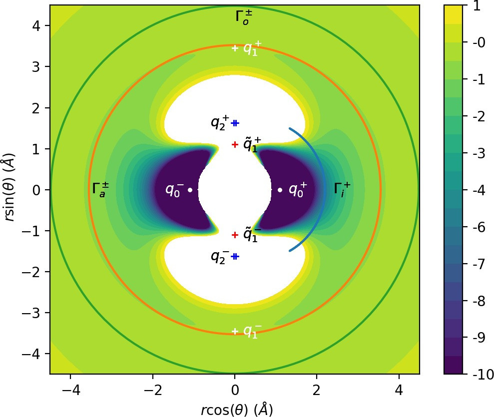

<figcaption style="text-align:center;font-size:14px"><b>fig:2 </b><em>Configuration space projections of inner ($\Gamma^i$), middle ($\Gamma^a$) and outer ($\Gamma^o$) periodic orbits for $E=5$.</em></figcaption>

Their significance is as follows:

-   $\Gamma^i$: Delimits the potential wells that correspond to $\text{CH}_4^+$
    isomers. The orbits oscillate around the axes $\theta=0$ and
    $\theta=\pi$.

-   $\Gamma^a$: Two rotational orbits with opposite orientation - one
    clockwise, one counter-clockwise that are crucial for defining
    roaming.

-   $\Gamma^o$: Centrifugal barrier delimiting the region of dissociated
    states. Two rotational orbits with opposite orientation - one
    clockwise, one counter-clockwise.

Roaming was shown  to disappear for $E\geq 2.5$. In
the energy interval $0< E< 2.5$, all of the above-mentioned periodic
orbits are unstable. Define the dividing surfaces using DS$^i$, DS$^a$
and DS$^o$ as the set of all phase space points
$(r,\theta,p_r, p_\theta)$ that satisfy
$$H(r,\theta,p_r, p_\theta)=E,$$

and their configuration space projections $(r,\theta)$ coincide with the
configuration space projections of $\Gamma^i$, $\Gamma^a$ and $\Gamma^o$
respectively. Due to the instability of the orbits, the resulting
dividing surfaces do not admit local recrossing.

A roaming trajectory is then defined as a trajectory that crosses DS$^a$
an odd number of times between leaving the potential well and
dissociating. Trajectories that return to their region of origin cross
DS$^a$ an even number of times - isomerising trajectories returning to
either of the potential wells, nonreactive trajectories return to
dissociated states.

As explained in reference , the oscillatory nature of $\Gamma^i$ implies
that DS$^i$ consists of two spheres, while the rotational nature of
$\Gamma^a$ and $\Gamma^o$ means that DS$^a$ and DS$^o$ are
tori. Each sphere can be divided using the
corresponding periodic orbit into two hemispheres and each torus can be
divided using both corresponding periodic orbits into two
annuli. All hemispheres and annuli are surfaces of
unidirectional flux, for example all trajectories leaving the potential
well cross the same (outward) hemisphere of DS$^i$, while all
trajctories entering the potential well cross the other (inward)
hemisphere of DS$^i$.

Roaming can hereby be reformulated as a transport problem in phase
space. Every trajectory leaving the well must cross the outward
hemisphere of DS$^i$ and every trajectory that dissociates must cross
the outward annulus of DS$^o$. Dissociation of a $\text{CH}_4^+$ molecule is
therefore equivalent to the transport of trajectories from the outward
hemisphere of DS$^i$ to the outward annulus of DS$^o$. Roaming involves
crossing the inward annulus of DS$^a$, because between two crossings of
the outward annulus trajectories must cross the inward annulus and vice
versa.

Transport of trajectories in the neighbourhood of an unstable periodic
orbit (or NHIM in general) is governed by invariant manifolds of this
orbit
. It
was shown that the roaming
phenomenon involves a heteroclinic intersection of the invariant
manifolds of $\Gamma^i$ and $\Gamma^o$. The condition
$H(r,\theta=0,p_r>0, p_\theta=0)$ defines an invariant subsystem that
consists of precisely one dissociating trajectory for every fixed $E>0$.
Therefore if the invariant manifolds of $\Gamma^i$ and $\Gamma^o$ do not
intersect, the former are contained in interior of the latter and each
trajectory leaving the potential well dissociates immediately. An
intersection assures that some trajectories leaving the well do not
dissociate immediately and return to DS$^a$ as illustrated in Fig. [fig:3](#fig:DSa). This
allows for roaming and isomerisation.

<figcaption style="text-align:center;font-size:14px"><b>fig:3 </b><em>Intersection of invariant manifolds of $\Gamma^i$ (blue) and $\Gamma^o$ (orange) with the outward annulus of DS$^a$ for $E=1$. Trajectories that just left the potential well are shown in blue, immediately dissociating trajectories in orange. Roaming and isomerising trajectories in the blue area just left the well and do not dissociate immediately, while roaming and dissociating trajectories in the orange are dissociate immediately but did not just leave the potential wells.</em></figcaption>

### Hamiltonian and periodic orbits for thermostatted Chesnavich model

The isokinetic Hamiltonian $\mathcal{K}$ for Chesnavich's model is
defined as follows:

\begin{equation}
\mathcal{K}(r,\pi_r,\theta,\pi_\theta) = \frac{1}{2}e^{U}\left(\frac{\pi_r^2}{\mu}+\pi_\theta^2\left(\frac{1}{\mu r^2}+\frac{1}{I_{CH_3}}\right)\right) - \frac{1}{2}e^{-U},
\label{eq:chesKHam}
\end{equation}

where $U=U(r,\theta)$ is Chesnavich's potential energy and

\begin{equation}
\pi_r=e^{-U}p_r,\quad \pi_\theta=e^{-U}p_\theta.
 \label{eq:isotransf}
\end{equation}

The level set $\mathcal{K}=0$ corresponds to the surface of constant kinetic energy

\begin{equation}
\frac{1}{2}\frac{p_r^2}{\mu}+\frac{1}{2}p_\theta^2\left(\frac{1}{\mu r^2}+\frac{1}{I_{CH_3}}\right)=\frac{1}{2},
 \label{eq:constantT}
\end{equation}

in system Equation \eqref{eq:chesHam}. Equations of motion in the isokinetic system
are

\begin{equation}
\begin{split}
 \dot{r}&=\frac{\partial \mathcal{K}}{\partial {\pi}_r}=e^{U}\frac{\pi_r}{\mu},\\
%  
 \dot{\pi}_r&=-\frac{\partial \mathcal{K}}{\partial r}= -\frac{1}{2}e^{U}\frac{\partial U}{\partial r}\left(\frac{\pi_r^2}{\mu}+\pi_\theta^2\left(\frac{1}{\mu r^2}+\frac{1}{I_{CH_3}}\right)\right)  + \frac{1}{2}e^{U} \frac{2}{\mu r^3}\pi_\theta^2 -\frac{1}{2}e^{-U}\frac{\partial U}{\partial r},\\
%  
 \dot{\theta}&=\frac{\partial \mathcal{K}}{\partial {\pi}_\theta}=e^{U}\pi_\theta\left(\frac{1}{\mu r^2}+\frac{1}{I_{CH_3}}\right),\\
%  
 \dot{\pi}_\theta&=-\frac{\partial \mathcal{K}}{\partial \theta}=
 -\frac{1}{2}e^{U}\frac{\partial U}{\partial \theta}\left(\frac{\pi_r^2}{\mu}+\pi_\theta^2\left(\frac{1}{\mu r^2}+\frac{1}{I_{CH_3}}\right)\right) -\frac{1}{2}e^{-U}\frac{\partial U}{\partial \theta}.
 \label{eq:chesKHameq}
 \end{split}
\end{equation}

To achieve greater numerical precision, it is preferable to integrate
the equations of motion in $(r,p_r,\theta,p_\theta)$ coordinates instead
of $(r,\pi_r,\theta,\pi_\theta)$. Equations \eqref{eq:chesKHameq} transform using \eqref{eq:isotransf} to

\begin{equation}
\begin{split}
  \dot{r}&=\frac{p_r}{\mu},\\
%  
 \dot{p}_r&= p_r\left(\frac{\partial U}{\partial r}\dot{r}+\frac{\partial U}{\partial \theta}\dot{\theta}\right) + \frac{1}{\mu r^3}p_\theta^2 -\frac{\partial U}{\partial r},\\
%  
 \dot{\theta}&=p_\theta\left(\frac{1}{\mu r^2}+\frac{1}{I_{CH_3}}\right),\\
%  
 \dot{p}_\theta&= p_\theta\left(\frac{\partial U}{\partial r}\dot{r}+\frac{\partial U}{\partial \theta}\dot{\theta}\right) -\frac{\partial U}{\partial \theta}, 
 \label{eq:chesKHameqreduced}
 \end{split}
\end{equation}

where we used the isokinetic constraint \eqref{eq:constantT} equivalent to $\mathcal{K}=0$.

The potential $- \frac{1}{2}e^{-U}$ has the same critical points and
characteristics as $U$, but the wells are considerably deeper and have
steeper walls. In contrast to the microcanonical case, the isokinetic
model only possesses two periodic orbits with period $2\pi$ and due to
constant nonzero kinetic energy does not admit self-retracing orbits
(also referred to as brake orbits) such as $\Gamma^i$ introduced in
Section [sec:6](#sec:roamingChes){reference-type="ref"
reference="sec:roamingChes"}. One of the periodic orbits delimits the
potential wells, see Fig. [fig:4](#fig:disI); we therefore refer to it as the inner orbit.

<figcaption style="text-align:center;font-size:14px"><b>fig:4 </b><em>Inner periodic orbit on the potential energy surface $- \frac{1}{2}e^{-U}$.</em></figcaption>

The outer orbit, beyond which trajectories do not return and corresponds
to the dissociated state of the molecule, is associated with a
centrifugal barrier. It is rotationally symmetric and has a radius
$r\approx13.43$. Its existence can be proven using a similar argument as
in the original system : suppose $r$ is sufficiently
large so that $U$ is effectively independent of $\theta$. Denote
$r_{po}$ the solution of

$$\frac{1}{\mu r_{po}^3}p_\theta^2 -\frac{\partial U}{\partial r}=0.$$

Then the equations \eqref{eq:chesKHameqreduced} admit a rotationally symmetric
periodic orbit with $\dot{\theta}=const$, provided

\begin{align*}
  \dot{r}&=0,\\
 \dot{p}_r&=0.
\end{align*}

This is satisfied by the initial condition $r=r_{po}$,
$p_r=0$ and $p_\theta$ given implicitly by $\mathcal{K}=0$ for any
$\theta$. The existence of $r_{po}$ is guaranteed for the potential $U$
and any other potential with leading order term $-cr^{-(2+\varepsilon)}$
for large $r$, with $c>0$ and $\varepsilon>0$.

Both these orbits are unstable, with the largest eigenvalue of the inner
orbit under the return map being of the order $10^{21}$. This large
instability poses a serious challenge to calculation of its invariant
manifolds that guide trajectories in phase space.

## Implications for Reaction Dynamics
### Classification of trajectories and roaming in the isokinetic Chesnavich model 

In this section we investigate dynamics in phase space and show the
presence of roaming in the thermostatted Chesnavich model. Due to the
strength of instability of the inner periodic orbit, we visualise phase
space structures using escape times and Lagrangian
descriptors on surfaces of section
rather than calculating invariant manifolds themselves.

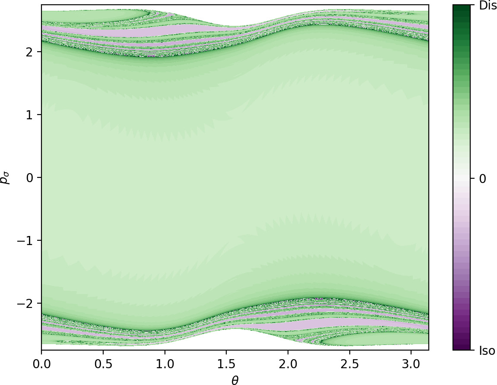
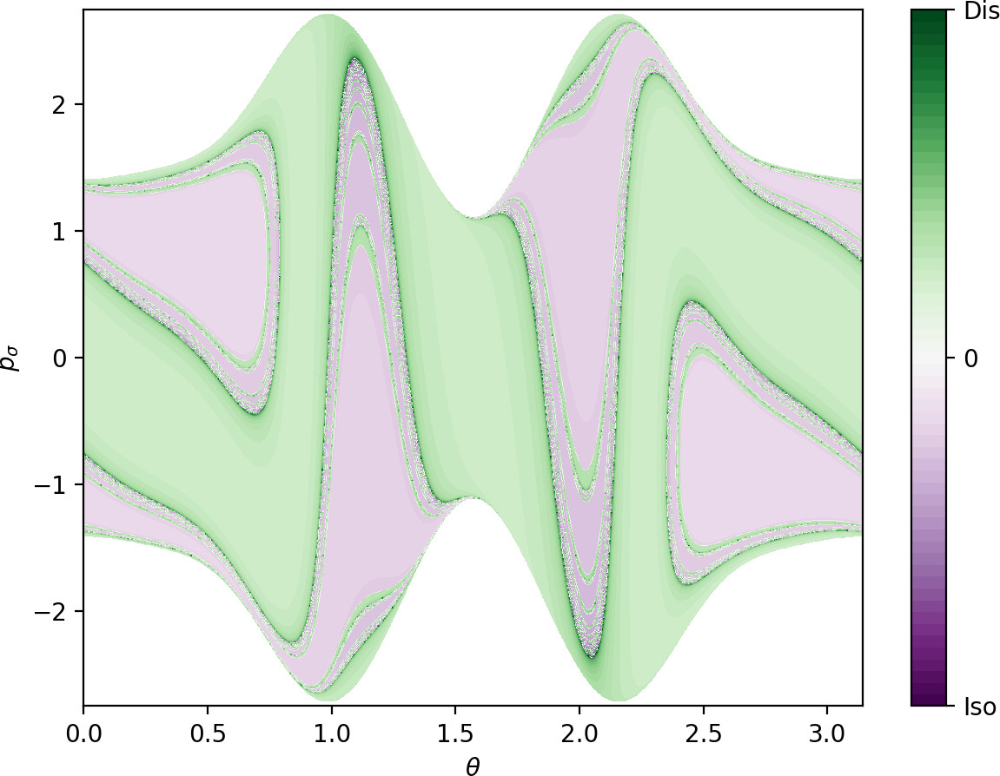

<figcaption style="text-align:center;font-size:14px"><b>fig:5 </b><em>Escape times for initial conditions on the outward annulus of DS$^a$ in Chesnavich's model (left) and on the outward annulus of the inner DS in the isokinetic model (right). Short isomerisation times are shown in light purple, long isomerisation times in dark purple, short dissociation times in light green and long dissociation times in dark green.</em></figcaption>

The two most natural surfaces of section for this system are: (i)
$\theta=0$, $\dot{\theta}>0$ and (ii) the outward annulus of the inner
dividing surface (DS). The latter surface of section is constructed as
follows: let the configuration space projection of the inner periodic
orbit be parametrised by

\begin{equation}
r=\bar{r}(\theta).
 \label{eq:disI}
\end{equation}

Then all points in phase space satisfying \eqref{eq:disI} form
a surface with coordinates $\theta$ and the canonically conjugate momentum

$$p_\sigma=p_\theta+\bar{r}'(\theta)p_r.$$

We remark that this surface is, similarly to DS$^a$ and DS$^o$ in Sec. [sec:6](#sec:roamingChes), a torus. On this torus, the value of
$p_r^2$ is given implicitly by $\theta$, $p_\sigma$ and \eqref{eq:constantT} and the sign of $p_r$ is chosen so that

$$\dot{r}>\bar{r}'(\theta),$$

hence the outward direction on the inner
DS.

The escape time is defined as the time a trajectory takes to escape the
interaction region and reach a dissociated state beyond the outer orbit
or either of the wells. Escape time plots obtained for initial
conditions on the inner DS in the isokinetic model and on DS$^a$ in the
Hamiltonian Chesnavich model are shown in Fig. [fig:5](#fig:DSescape). The dynamics on DS$^a$ is explained in Sec.
[sec:6](#sec:roamingChes). We can see that while the surfaces share a
toroidal geometry, the distributions of escape times of trajectories on
them are quite dissimilar. Most of the trajectories in the
microcanonical case escape in the same manner as the prototypical
dissociation trajectory $\theta=p_\sigma=0$ and more complicated escape
dynamics are located near the edges of the surface of section. On the
other hand, escape times for the isokinetic model reflect the effects of
the constant kinetic energy constraint - note the nearly uniform
dissociation around the local maximum at $\theta=\pi/2$ and nearly
uniform isomerisation regions around $\theta=1$ and $\theta=2$.

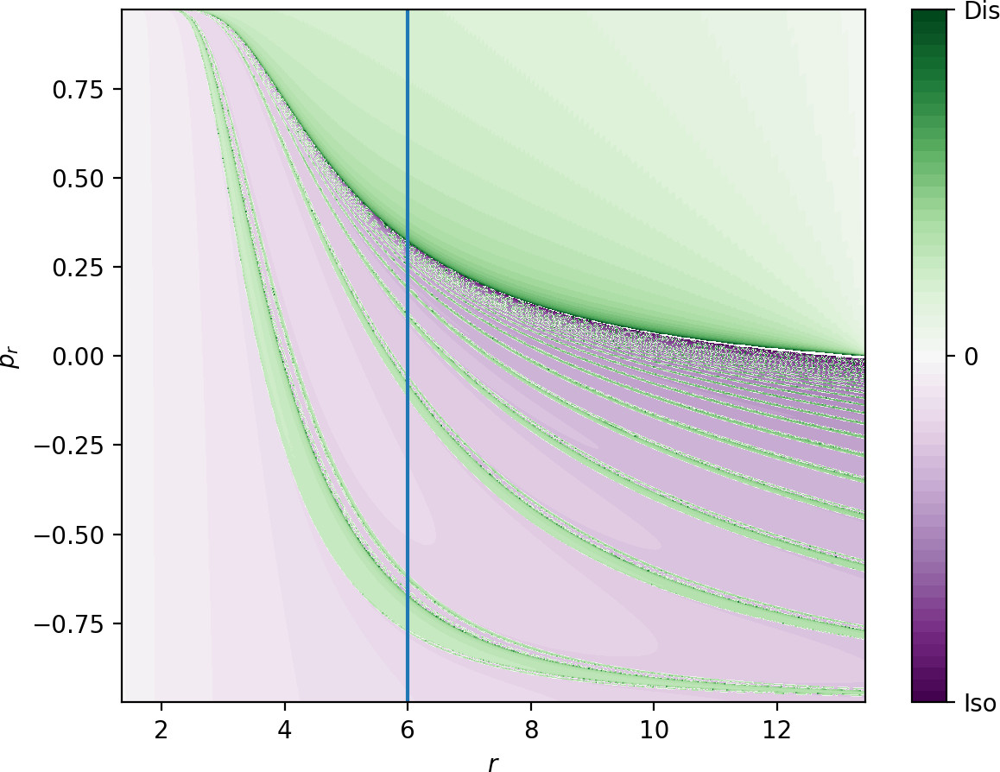
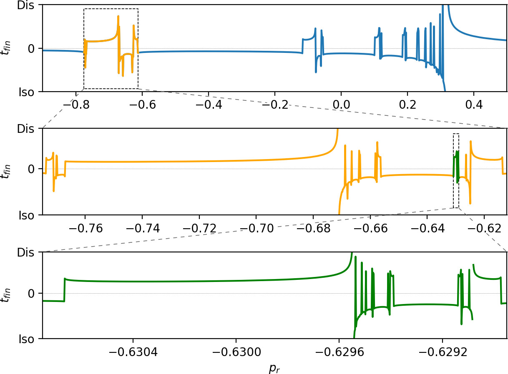

<figcaption style="text-align:center;font-size:14px"><b>fig:6 </b><em>Escape times for initial conditions on $\theta=0$, $\dot{\theta}>0$ and a the profile of the surface for $r=6$ with details of the fractal structure. Short isomerisation times are shown in light purple, long isomerisation times in dark purple, short dissociation times in light green and long dissociation times in dark green.</em></figcaption>

The boundary between dissociating and isomerising trajectories, as well
as between direct dissociation and more complicated dynamics, consists
of invariant manifolds. Fig. [fig:6](#fig:thetaescape) shows escape times on the surface of
section $\theta=0$, $\dot{\theta}>0$. Note the singularity in the plot
separating a homogeneous area of relatively fast dissociation for large
values of $p_r$ from more complicated dynamics for lower values of
$p_r$. The singularity can also be seen in the line plot showing escape
times on $r=6$, $\theta=0$, $\dot{\theta}>0$.

As it is the case in the microcanonical system, directly dissociating
trajectories are guided by the stable invariant manifold of the outer
periodic orbit across the phase space bottleneck associated with the
outer periodic orbit. Directly dissociating trajectories are located
above the stable invariant manifold in Fig. [fig:6](#fig:thetaescape). All trajectories below the manifold
correspond to roaming, isomerizing or nonreactive trajectories. As
argued in Sec. [sec:6](#sec:roamingChes), if there are trajectories on the inner DS
that do not dissociate, the invariant manifolds of the inner and outer
orbits must intersect. Fig. [fig:5](#fig:DSescape) shows regions of isomerization, therefore the
manifolds intersect and all dissociating trajectories in the fractal
structures of complicated dynamics on the inner DS correspond to roaming
trajectories.

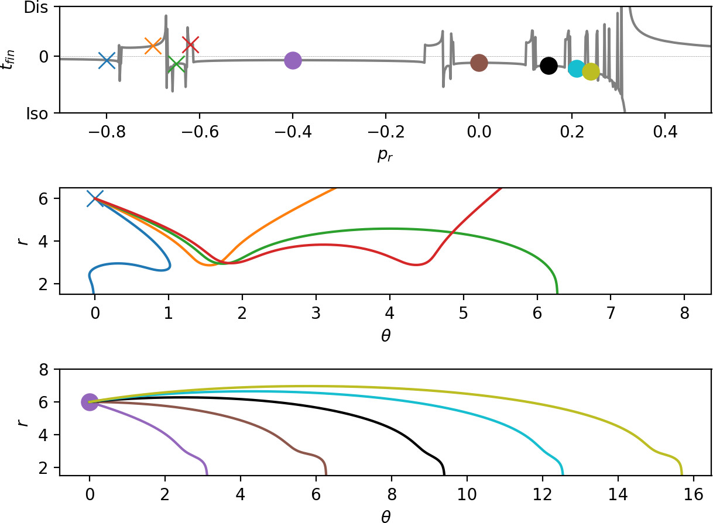

<figcaption style="text-align:center;font-size:14px"><b>fig:7 </b><em>Representative trajectories for different classes along $\theta=0$, $\dot{\theta}>0$, $r=6$.</em></figcaption>

The bands of isomerizing and dissociating trajectories form a fractal
structure and can be classified by the number of rotations in $\theta$
before escaping from the interaction region. These too are separated by
invariant manifolds on the inner and outer periodic orbits. The fractal
structure from Fig. [fig:6](#fig:thetaescape) can be understood using the configuration
space projections of representative trajectories shown in Fig. [fig:7](#fig:timetraj). In general, trajectories exhibit two
dynamical 'motifs': they can perform a rotation at large $r$ or interact
with the areas of high potential near the local maxima at small $r$.
Interaction with areas of high potential leads to escape out of the
interaction region, capture in one of the potential wells, rotation in
the same direction or rotation in the opposite direction. Trajectories
are grouped by the sequence of these motifs in the fractal structure,
for example trajectories that rotation by $\pi/2$ and then dissociate or
isomerise (see second panel in Fig. [fig:7](#fig:timetraj)) are close to each other and well separated
from trajectories that rotate by $\pi$. Each class could be denoted by a
sequence of integers denoting the number of rotations (see third panel
in Fig. [fig:7](#fig:timetraj)) between interactions with the areas of high
potential.

In this way we can find trajectories that perform any possible
combination of rotations in the flat area of the interaction region and
return any given number of times to the areas of high potential. In
other words, regardless of the lack of self-retracing orbits in the
interaction region, the scale of complicated dynamics exhibited by the
isokinetic system is the same as in the microcanonical system.

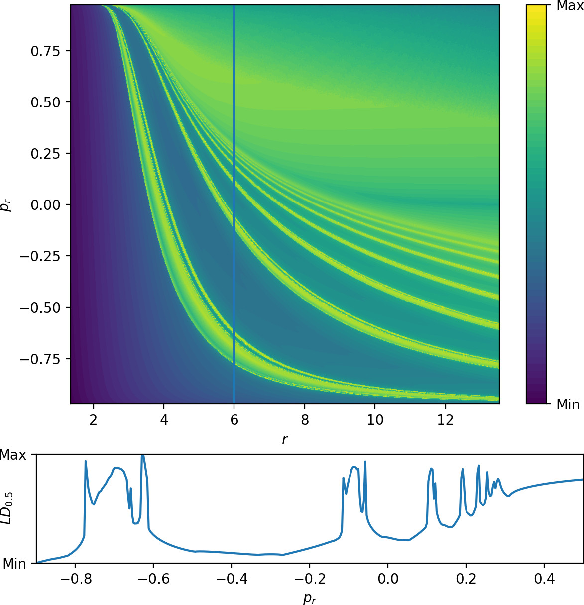
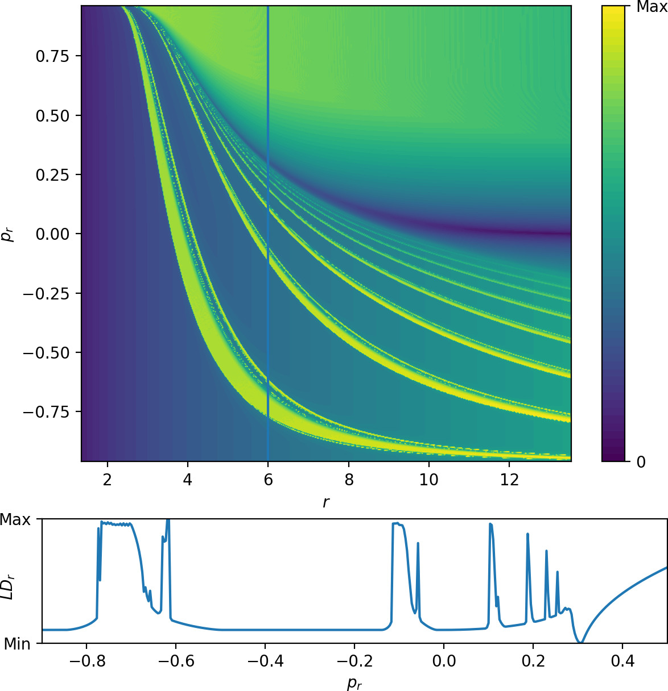

<figcaption style="text-align:center;font-size:14px"><b>fig:8 </b><em>Lagrangian descriptors \eqref{eq:ld05} (top) and \eqref{eq:ldr} (bottom) for initial conditions on $\theta=0$, $\dot{\theta}>0$ and their profiles for $r=6$.</em></figcaption>

It is important to note that the same results can be obtained using
Lagrangian descriptors as shown in
Fig. [fig:8](#fig:thetald). We present the plot for the forward Lagrangian
descriptor

\begin{equation}
\int\limits^{40}_{0} \left(|\dot{r}|^{\frac{1}{2}}+|\dot{p_r}|^{\frac{1}{2}}+|\dot{\theta}|^{\frac{1}{2}}+|\dot{p_\theta}|^{\frac{1}{2}}\right) dt,
 \label{eq:ld05}
\end{equation}

with a cut-off at $r=1.1$ for numerical reasons. As opposed to escape times, this Lagrangian descriptor is well defined on
invariant manifolds and attains a local minimum on them. Note that the
invariant manifolds are visible for an integration time less than six
times the period of the inner periodic orbit. The invariant manifolds
are even more pronounced for the radial gain Lagrangian descriptor

\begin{equation}
\int\limits^{40}_{0} |\dot{r}| dt.
 \label{eq:ldr}
\end{equation}

### Using Lagrangian descriptors to analyse the Roaming mechanism

The goal of this chapter is to extend our previous study of the
analogous roaming reaction mechanisms at constant kinetic energy
. We do this by applying a Hamiltonian
isokinetic thermostat
 to Chesnavich's
model. Use of the isokinetic thermostat means that we are effectively
investigating roaming at constant temperature. A detailed study of
Chesnavich's model subjected to the Hamiltonian isokinetic thermostat is
given in . In that work it was found that
certain of the periodic orbits that govern the roaming dynamics are
highly unstable: their Lyapunov exponents are $\sim 10^{21}$. In such a
situation detection of the periodic orbits, as well as the computation
of their stable and unstable manifolds, becomes problematic using
traditional approaches.

In this section we show that the method of Lagrangian descriptors (introduced in the Prologue)

can be used to compute stable and unstable manifolds of such highly
unstable periodic orbits. We applying this approach to Chesnavich's
model subjected to a Hamiltonian isokinetic thermostat and show that the
method of Lagrangian descriptors reveals the dynamical origin of the
roaming mechanism in this setting.

Complementary to existing applications of Lagrangian descriptors as an
exploratory method, we use Lagrangian descriptors to find invariant
manifolds in a system where some invariant structures have already been
identified. In the present case we use the parametrisation of a periodic
orbit to construct a Lagrangian descriptor that will be locally
minimised by its invariant manifolds.

For a Hamiltonian system with $2$ degrees of freedom and
$(q_1,p_1,q_2,p_2)$ as phase space coordinates, a $1$ dimensional
periodic orbit $\Gamma$ can be viewed as an intersection of three
hypersurfaces: the surface of constant energy it lives on and two other
distinct hypersurfaces that parametrise $\Gamma$,
$f_1(q_1,p_1,q_2,p_2)=0$ and $f_2(q_1,p_1,q_2,p_2)=0$. For a system with
zero total angular momentum, these equations can correspond to the
configuration space projection and parametrisation of one of the
momenta.

The integral 

\begin{equation}
\int\limits^{\infty}_{0} |\dot{f_i}(q_1,p_1,q_2,p_2)| dt,
 \label{eq:LDinfty}
\end{equation}

 then vanishes along the periodic orbit for
$i=1,2$.

As $t\rightarrow\infty$, $f_1,f_2\rightarrow 0$ along the periodic orbit
stable invariant manifolds. Consequently of all points on the energy
surface, \eqref{eq:LDinfty} is locally minimised by those that lie on the
stable invariant manifold of $\Gamma$. Necessarily this statement
remains true for the finite time integral

$$\int\limits^{\tau}_{0} |\dot{f_i}(q,p)| dt,\qquad i=1,2,$$

provided $\tau>0$ is large enough. We can use the same argument for the unstable
invariant manifold and the Lagrangian descriptor

$$\int\limits^{0}_{-\tau} |\dot{f_i}(q,p)| dt,\qquad i=1,2.$$

Depending on the strength of instability of $\Gamma$, small values of
$\tau$ may suffice to find an approximate location of the invariant
manifolds and to establish whether or not they intersect, which is a
crucial characteristic for the presence of roaming.

### Roaming in the Isokinetic Chesnavich Model

In previous sections, we established the presence of roaming and
classified dynamical behaviour using escape time analysis and Lagrangian
descriptors. Classes of qualitatively different dynamical behaviour are
separated by invariant manifolds, since these guide trajectories across
phase space bottlenecks.

Due to the large instability of the inner orbit, it was not previously
possible to compute its invariant manifolds to create an analogue of
Fig. [fig:3](#fig:DSa).
The Lagrangian descriptors defined in Sec. (#sec:newLD) uncover
trajectories in the proximity of invariant manifolds and we thereby
avoid having to compute invariant manifolds at all.

As for the microcanonical version of Chesnavich's model, we are
interested in the following manifolds:

-   the unstable manifold of the inner orbit $W_i^u$, which guides
    trajectories out of the wells into the interaction region between
    DS$^i$ and DS$^o$,

-   the stable manifold of the outer orbit $W_o^s$, which guides
    trajectories out of the interaction region towards dissociation.

We now construct the Lagrangian descriptors described in Sec. (#sec:newLD). The inner
periodic orbit is parametrised by

$$f_1(r, \theta) = r-\bar{r}(\theta)=0,$$

where

$$\bar{r}(\theta)=c_0+c_1\cos(2\theta)+c_2\cos(4\theta)+c_3\cos(6\theta)+c_4\cos(8\theta)+c_5\cos(10\theta),$$

with constants

\begin{align*}
  c_0&=2.78147867,\ c_1=0.98235111,\ c_2=-0.17161848,\\
  c_3&=-0.00486657,\ c_4=0.01628185,\ c_5=-0.00393858,
\end{align*}

and

$$f_2(\theta, p_r) = p_r-\bar{p}_r(\theta)=0,$$

where $\bar{p}_r(\theta)$ is a function defined for
$\theta\in (-\frac{\pi}{2},\frac{\pi}{2}]$ and periodically extended to
$\theta\in\mathbb{R}$, given by

$$\bar{p}_r(\theta)=d_0\theta + d_1\theta^3 + d_2\theta^5 + d_3\theta^7 + d_4\theta^9 + d_5\theta^{11},$$

with constants

\begin{align*}
  d_0&=-1.06278495,\ d_1=-0.42089795,\ d_2=1.38849679,\\
  d_3&= -1.11654771,\ d_4=0.40789372,\ d_5=-0.05122644.
\end{align*}

Note that the periodic orbit need only be parametrised for a single value of $\mathcal{K}$, $\mathcal{K}= 0$.

To identify $W_i^u$, we use the Lagrangian descriptor

\begin{equation}
LD_i=\int\limits^{0}_{-\tau} |\dot{r}-\bar{r}^{'}(\theta)\dot{\theta}| dt.
\label{eq:LDi}
\end{equation}

Note that we obtain identical results using

$$\int\limits^{0}_{-\tau} |\dot{p}_r-\bar{p}_r^{'}(\theta)\dot{\theta}| dt.$$

We approximate the outer periodic orbit by a constant radius
$r=13.4309241401910709$ and its stable invariant manifold $W_o^s$
locally minimises 
\begin{equation}
LD_o=\int\limits^{\tau}_{0} |\dot{r}| dt.
 \label{eq:LDo}
\end{equation}
<!-- #endregion -->

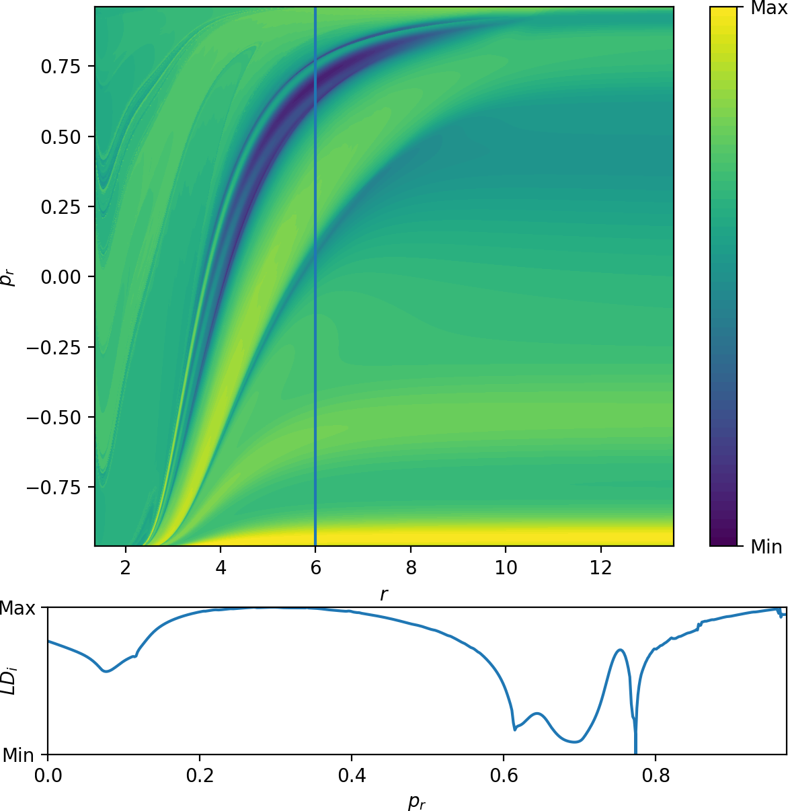
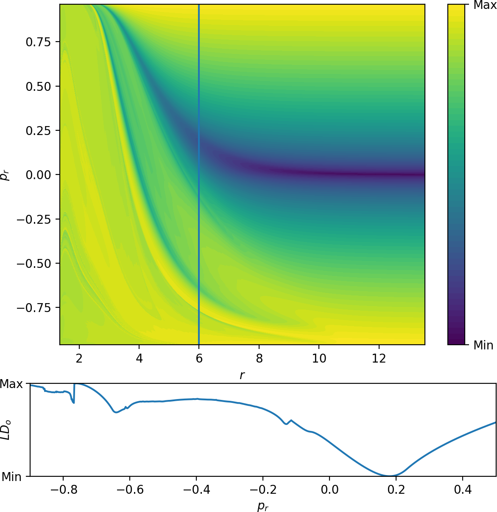

<figcaption style="text-align:center;font-size:14px"><b>fig:9 </b><em>Lagrangian descriptors $LD_i$ \eqref{eq:LDi} for $\tau=8$ (top) and $LD_o$ \eqref{eq:LDo} for $\tau=8$ (bottom) for initial conditions on $\theta=0$, $\dot{\theta}>0$ and their profiles for $r=6$.</em></figcaption>

In , we found that singularities in the escape
time plot matched significant changes in Lagrangian descriptor plots.
Both these features indicated the presence of invariant manifolds. In
Fig. [fig:9](#fig:manifs_th0) we show $LD_i$ \eqref{eq:LDi} and $LD_o$ \eqref{eq:LDo}
on the surface $\theta=0$, $\dot{\theta}>0$, where the latter is similar
to the plots in  and the former shows similar
features reflected about $p_r=0$ due to the opposite time direction in
the definition of $LD_i$. Both plots show LD values on a uniform
$400\times400$ grid. A higher density improves accuracy but does not
yield additional qualitative information. The accompanying sections for
$r=6$ illustrate the nature of the local minima.

The presence of roaming is only possible if $W_i^u$ and $W_o^s$
intersect . Fig. [fig:9](#fig:manifs_th0) provides direct evidence of the intersection
- the two panels show $W_i^u$ and $W_o^s$ using different Lagrangian
descriptors on the same surface of section. These manifolds necessarily
intersect.

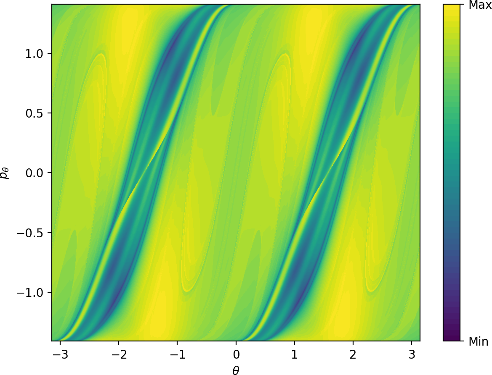
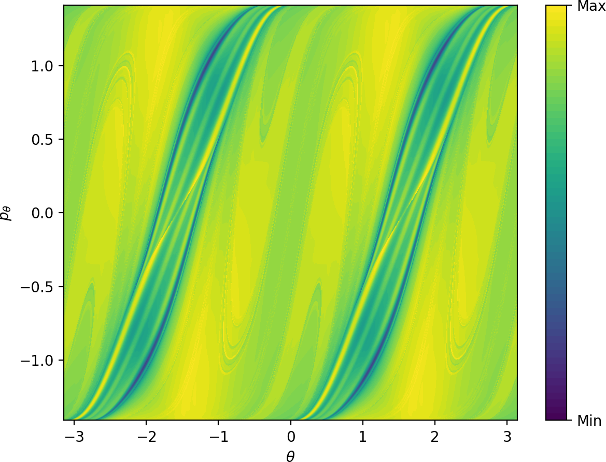

<figcaption style="text-align:center;font-size:14px"><b>fig:10 </b><em>Lagrangian descriptor \eqref{eq:LDi} for $\tau=6$ (top) and $\tau=8$ (bottom) for initial conditions on $r=3.6$, $\dot{r}>0$.</em></figcaption>

Further information on the geometry of the intersection of $W_i^u$ and
$W_o^s$ can be seen using a surface of section analogous to the outward
annulus of DS$^a$ used in the Hamiltonian case.

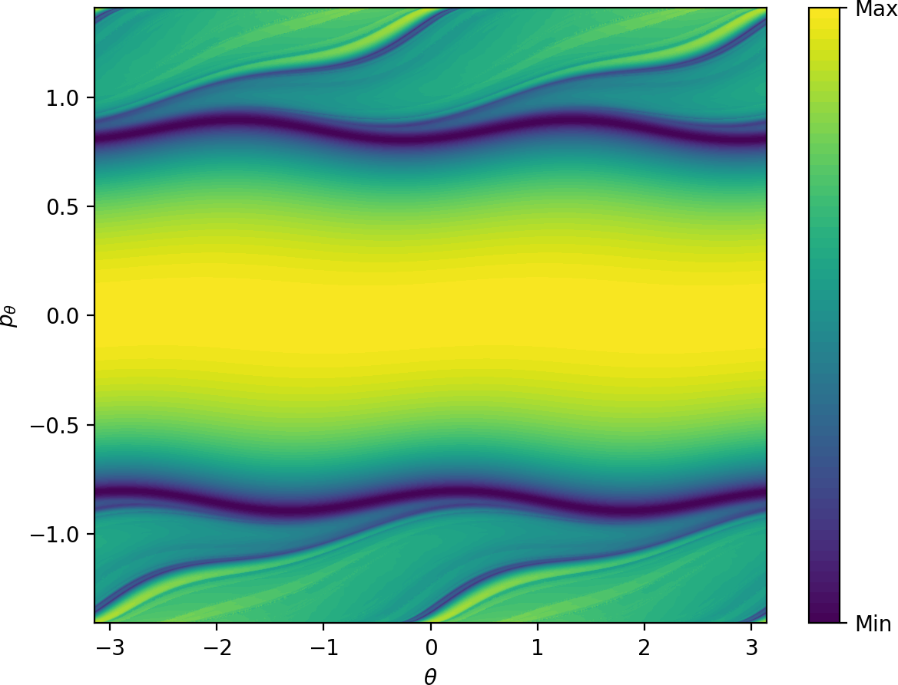

<figcaption style="text-align:center;font-size:14px"><b>fig:11 </b><em>Lagrangian descriptor $LD_o$ \eqref{eq:LDo} for $\tau=10$ (top) and for $\tau=20$ (bottom) for initial conditions on $r=3.6$, $\dot{r}>0$.</em></figcaption>

Due to the absence of other $2\pi$-periodic orbits, one cannot expect to
easily obtain a surface of section that is transversal to the flow. For
simplicity, we use a surface of section defined by the condition
$r=3.6$, $\dot{r}>0$. Figures
[fig:10](#fig:manifsI_r36) and
[fig:11](#fig:manifsO_r36) show $LD_i$
\eqref{eq:LDi} and $LD_o$ \eqref{eq:LDo}
on this surface. Areas of low values of $LD_i$ and $LD_o$ correspond to
trajectories that are asymptotic to the respective periodic orbits. Note
that the structures are well defined visually for times that are of the
same order of magnitude as the periodic orbits themselves - periods of
the inner and outer orbits are $11.84$ and $9.61$ respectively.

Similarly to the microcanonical case, the toriodal cylinder $W_o^s$
intersects $r=3.6$, $\dot{r}>0$ transversally in two circles, one with
$p_\theta>0$, one with $p_\theta<0$.

$W_i^u$ has the same geometry as $W_o^s$, but it does not intersect the
surface of section transversally. This can be seen by the manifold
attaining maximal $p_\theta$ permitted by kinetic energy $\frac{1}{2}$,
when $p_r$ vanishes and $\dot{r}>0$ is violated. As a result, instead of
two circles, the two unstable invariant manifolds intersect the surface
of section in four S-shapes. The initial condition $\theta=p_\theta=0$
leads to radial dissociation, and it is surrounded by trajectories that
originate in the well. This area is bounded by two of the S-shapes - the
S-shape passing closest to $\theta=1$, $p_\theta=0$ corresponds to the
inner periodic orbit with $p_\theta>0$. The S-shape closest to
$\theta=-1$, $p_\theta=0$ corresponds to the inner periodic orbit with
$p_\theta<0$. The other S-shapes are related by symmetry.

 and $LD_o$ for $\tau=20$ shown in Fig [fig:11][fig:11](#fig:manifsO_r36) that separate different classes of dynamics. For details see text.](figures/manif_intersection400_labels.png)

<figcaption style="text-align:center;font-size:14px"><b>fig:12 </b><em>Approximations of invariant manifolds on $r=3.6$, $\dot{r}>0$ extracted from $LD_i$ for $\tau=6$ shown in Fig. [fig:10][fig:10](#fig:manifsI_r36) and $LD_o$ for $\tau=20$ shown in Fig [fig:11][fig:11](#fig:manifsO_r36) that separate different classes of dynamics. For details see text.</em></figcaption>

Fig. [fig:12](#fig:intersection) shows superposed manifolds approximated
from $LD_i$ ($\tau=6$) and $LD_o$ ($\tau=20$) values. Minima of $LD_o$
for fixed values of $\theta$ reveal $W_o^s$ immediately.

Due to the high instability of the inner orbit, locating $W_i^u$ using
minima of $LD_i$ requires a very dense sampling with a correspondingly
high computational cost. (Note how narrow the interval for finding the
minimum on the profile of $LD_i$ on $\theta=0$, $r=6$ in Fig. [fig:9](#fig:manifs_th0) is.) Instead we can take advantage of the
steepnes of the gradient near the invariant manifold and consider maxima
of $\Delta_\theta LD_i$ on a $400\times400$ grid for fixed $p_\theta$
values. This way we recover the four S-shapes due to $W_i^u$. Applying a
cutoff at high values of $LD_i$ before calculating $\Delta_\theta LD_i$
delivers a cleaner image; in Fig. [fig:12](#fig:intersection) we used a cutoff at
$\frac{1}{2}(\text{max}_{LD_i}+\text{min}_{LD_i})$.

Aside from $W_i^u$, Fig. [fig:12](#fig:intersection) shows traces of two nearly linear segments
near $W_i^u$ pointing towards the points $\theta=\frac{\pi}{2}$,
$p_\theta=0$ and $\theta=\frac{3\pi}{2}$, $p_\theta=0$ on the surface of
section. These are initial conditions of trajectories asymptotic to the
manifolds $\theta=\frac{\pi}{2}$, $p_\theta=0$, $p_r>0$ and
$\theta=\frac{3\pi}{2}$, $p_\theta=0$, $p_r>0$. (Due to conservation of
kinetic energy, these manifolds are distinct from
$\theta=\frac{\pi}{2}$, $p_\theta=0$, $p_r<0$ and
$\theta=\frac{3\pi}{2}$, $p_\theta=0$, $p_r<0$.)

Having identified $W_i^u$ and $W_o^s$, we can observe that these
invariant manifolds guide trajectories in the same way as in the
microcanonical model. Fig. [fig:12](#fig:intersection) is analogous to Fig. [fig:3](#fig:DSa). The
area between the two circles of $W_o^s$ is crossed by trajectories that
are led by $W_o^s$ to dissociation. The area containing
$\theta=p_\theta=0$ between two of the S-shapes of $W_i^u$ is crossed by
trajectories that originate in the well.

Clearly the intersection of these two areas contains directly
dissociating initial conditions. The complement between two of the
S-shapes contains isomerising and roaming trajectories; in fact it is
here the trajectories cross the surface of section for the first time
after leaving the well. Similarly we observe a band between the two
circles of $W_o^s$ which is crossed by trajectories that do not just
leave the well. These may be roaming trajectories that originate in the
well and recross the surface or nonreactive trajectories that never
enter the well at all. This band marks the last crossing of the surface
by these trajectories before dissociation. The remaining area
corresponds to trajectories that stay in the interaction region before
entering one of the wells or dissociating.

It is important to note that all classes of dynamics are separated by an
intricate fractal structure made up of invariant manifolds, as shown in
. The structure becomes visible when integrating
any Lagrangian descriptor over a long time interval, see the details of
Fig. [fig:10](#fig:manifsI_r36) and [fig:11](#fig:manifsO_r36).

# References


