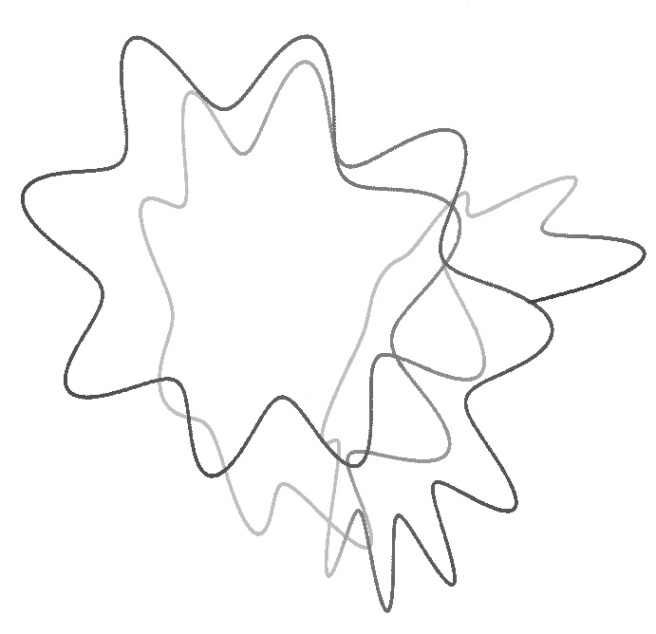

<h1 style="font-size:50px;text-align:center">Chemical Reactions</h1>
<h1 style="font-size:40px;text-align:center"><em>A Journey into Phase Space</em></h1>

# Authors

Makrina Agaoglou, Broncio Aguilar-Sanjuan, Victor Jose García-Garrido, Rafael García-Meseguer, Francisco González-Montoya, Matthaios Katsanikas, Vladimír Krajňák, Shibabrat Naik, Stephen Wiggins.

# Contributing

Guidelines on how to contribute to this package can be found  [here](https://github.com/champsproject/chem_react_dyn/blob/docs/docs/contributing.md) along with the code of conduct [here](https://github.com/champsproject/chem_react_dyn/blob/docs/docs/CODE_OF_CONDUCT.md) for engaging with the fellow contributors.

# Copyright and License
Copyright 2019

All content is under Creative Commons Attribution [CC-BY 4.0](https://creativecommons.org/licenses/by/4.0/legalcode.txt) and all the python scripts are under [BSD-3 clause](https://github.com/champsproject/chem_react_dyn/blob/docs/docs/LICENSE).
